# Python学习笔记

## 第一章 计算机基础

### 1.1 硬件

计算机基本的硬件由：cpu / 内存 / 主板 /硬盘 / 网卡 / 显卡 等组成，只有硬件但硬件之间无法进行交流和通信

### 1.2 操作系统

操作系统用于协调和控制硬件之间进行工作，常见的操作系统有那些：

- windows
- linux
  - centos [公司线上一般用]
- mac

### 1.3  解释器或编译器

编程语言的开发者写的一个工具，将用户写的代码转换成010101交给操作系统去执行。

#### 1.3.1 解释型和编译型语言

解释型语言类似于：实时编译，代表：Python / PHP / Ruby / Perl

编译型语言类似于: 写完之后，整体再进行编译， 代表： C / C++ / Java / Go.....

### 1.4 软件（应用程序）

软件又称为应用程序，就是我们在电脑上使用的工具，类似于：记事本 / 图片查看器 / 游戏

### 1.5 进制

对于计算机而言无论是文件存储 / 网络传输输入本质上都是：二进制（1010101101），如： 电脑上存储视频/图片/文件都是二进制；QQ/微信聊天发送的表情/文字/语音/视频 也全部都是二进制。

进制：

- 二进制，计算机内部
- 8进制
- 10进制，人来进行使用一般情况下计算机可以获取10进制，然后在内部会自动转换成二进制并操作。
- 16进制，一般用于表示二进制（用更短的内容表示更多的数据），一般是：\x 开头。

| 二进制 | 八进制 | 十进制 | 十六进制 |
| ------ | ------ | ------ | -------- |
| 0      | 0      | 0      | 0        |
| 1      | 1      | 1      | 1        |
| 10     | 2      | 2      | 2        |
| 11     | 3      | 3      | 3        |
| 100    | 4      | 4      | 4        |
| 101    | 5      | 5      | 5        |
| 110    | 6      | 6      | 6        |
| 111    | 7      | 7      | 7        |
| 1000   | 10     | 8      | 8        |
| 1001   | 11     | 9      | 9        |
| 1010   | 12     | 10     | A        |
| 1011   | 13     | 11     | B        |
| 1100   | 14     | 12     | C        |
| 1101   | 15     | 13     | D        |
| 1110   | 16     | 14     | E        |
| 1111   | 17     | 15     | F        |


## 第二章 Python入门

### 2.1 环境的安装

- 解释器： py2/ py3 （环境变量）
- 开发工具：pycharm

### 2.2 编码

#### 2.2.1 编码基础

- ascii (八位表示一个字符)
- unicode （4个字节，32位表示一个字符）
- utf-8 （用尽量少的字节表示，中文占3个字节）
- gbk
- gb2312

#### 2.2.2 python编码相关

对于python默认解释器编码：

- py2：ascii
- py3：utf-8

如果想要修改默认编码，则可以使用：

```python
# -*- coding:utf-8 -*-
```

注意：对于操作文件时，要按照：以什么编码写入，就要用什么编码去打开。

###   2.3 变量

问：为什么要有变量?

为某个值创建一个‘外号’，以后在使用的时候通过此外号就可以直接调用。

## 第三章 数据类型

### 3.1  整型（int）

#### 3.1.1 整型的长度

py2中有：int/long

py3中有：int（int/long）

#### 3.1.2 整除

py2和py3中整除是不一样的。

### 3.2 布尔（bool）

布尔值就是用于表示真假。True和False

其他类型转换成布尔值：

- str
- ....

对于：None /  ‘’ / 0 .....>false

### 3.3 字符串（str）

字符串是写代码中最常见的，python内存中的字符串是按照：unicode 编码存储，对于字符串是不可变的。

字符串自己有很多方法，如：

1.大写

````py
v = 'ALEX'
v1 = v.upper()
print(v1)
v2 = v.isupper() # 判断是否全部是大写
print(v2)
````


2.小写

```py
v = 'ALEX'
v1 = v.lower()
print(v1)
v2 = v.islower() # 判断是否全部是大写
print(v2)
```


3.判断是否是数字

```py
v = '1'
# v = '二'
# v = '②'
v1 = v.isdigit()    # '1'->True; '二' -> False '②'-> True
v2 = v.isdecimal()  # '1'->True; '二' -> False '②'-> False
v3 = v.isnumeric()  # '1'->True; '二' -> True  '②'-> True     能识别的字符最全
print(v1,v2,v3)

##############应用############
v = ['alex','eric','tony']
for i in v:
    print(i)
num = input('请输入序号：')
if num.isdecimal():
    num = int(num)
    print(v[num])
else:
    print('你输入的不是字符串')
```

4.去两侧的空白 \t \n 字符

```py
v1 = ' alex '
print(v1.strip())

v2 = 'alex \t'
print(v2.strip())

v3 = 'alex \n'
print(v3.strip())

v4 = ' aalexa'
print(v4.strip('a'))


```

5 .替换 replace

6.开头/结尾

7.编码，把字符串转换成二进制

8.format / format_map

```py
v = '我是{0}，谢谢{1}'.format('alex',19)
print(v)

v = '我是{x1}，谢谢{x2}'.format_map({'x1':'alex','x2':19})
print(v)
```


9.join 连字符

10.split 切割

### 3.4 列表

### 3.5  元组

### 3.6 集合

集合在python中也是一个数据类型,我们只用它自带的特性,其余的操作很少使用

集合在Pyhton中的关键字是set,也是以{}的形式展示 只不过集合是一个没有值得字典,为什么这么说呢??

因为集合中的元素要求是不可变的并且还是唯一的,我们就利用它是唯一来做去重

```python
lst = [1,3,4,112,23,1,3,1,41,12,3,1]
print(set(lst))  # 这样就没有重复的元素出现了,我们在将集合抓换成列表
list(set(lst)) # 这样就把没有重复的集合转成列表了
print(list(set(lst)))
```

集合是无序,可变的数据类型,说到可变我们就知道集合是能够增加和删除等操作的,我们来看看怎么操作

#### set集合增删改查

增加

```python
s = {"刘嘉玲", '关之琳', "王祖贤"}
s.add("郑裕玲")
print(s)
s.add("郑裕玲") # 重复的内容不会被添加到set集合中
print(s)
s = {"刘嘉玲", '关之琳', "王祖贤"}
s.update("麻花藤") # 迭代更新
print(s)
s.update(["张曼⽟", "李若彤","李若彤"])
print(s)
```

删除　　

```python
s = {"刘嘉玲", '关之琳', "王祖贤","张曼⽟", "李若彤"}
item = s.pop() # 随机弹出⼀个.
print(s)
print(item)
s.remove("关之琳") # 直接删除元素
# s.remove("⻢⻁疼") # 不存在这个元素. 删除会报错
print(s)
s.clear() # 清空set集合.需要注意的是set集合如果是空的. 打印出来是set() 因为要和
dict区分的.
print(s) # set()
```

修改

```python
# set集合中的数据没有索引. 也没有办法去定位⼀个元素. 所以没有办法进⾏直接修改.
# 我们可以采⽤先删除后添加的⽅式来完成修改操作
s = {"刘嘉玲", '关之琳', "王祖贤","张曼⽟", "李若彤"}
# 把刘嘉玲改成赵本⼭
s.remove("刘嘉玲")
s.add("赵本⼭")
print(s)
```

查询　　

```python
# set是⼀个可迭代对象. 所以可以进⾏for循环
for el in s:
 print(el)
```

常⽤操作　　

```python
s1 = {"刘能", "赵四", "⽪⻓⼭"}
s2 = {"刘科⻓", "冯乡⻓", "⽪⻓⼭"}
# 交集
# 两个集合中的共有元素
print(s1 & s2) # {'⽪⻓⼭'}
print(s1.intersection(s2)) # {'⽪⻓⼭'}
# 并集
print(s1 | s2) # {'刘科⻓', '冯乡⻓', '赵四', '⽪⻓⼭', '刘能'}
print(s1.union(s2)) # {'刘科⻓', '冯乡⻓', '赵四', '⽪⻓⼭', '刘能'}
# 差集
print(s1 - s2) # {'赵四', '刘能'} 得到第⼀个中单独存在的
print(s1.difference(s2)) # {'赵四', '刘能'}
# 反交集
print(s1 ^ s2) # 两个集合中单独存在的数据 {'冯乡⻓', '刘能', '刘科⻓', '赵四'}
print(s1.symmetric_difference(s2)) # {'冯乡⻓', '刘能', '刘科⻓', '赵四'}
s1 = {"刘能", "赵四"}
s2 = {"刘能", "赵四", "⽪⻓⼭"}
# ⼦集
print(s1 < s2) # set1是set2的⼦集吗? True
print(s1.issubset(s2))
# 超集
print(s1 > s2) # set1是set2的超集吗? False
print(s1.issuperset(s2))
```

set集合本⾝是可以发⽣改变的. 是不可hash的. 我们可以使⽤frozenset来保存数据. frozenset是不可变的. 也就是⼀个可哈希的数据类型

```python
s = frozenset(["赵本⼭", "刘能", "⽪⻓⼭", "长桂"])
dic = {s:'123'} # 可以正常使⽤了
print(dic)
```

这个不是很常⽤. 了解⼀下就可以了

### 3.7 字典

列表可以存储大量的数据类型，但是只能按照顺序存储，数据与数据之间关联性不强。

所以咱们需要引入一种容器型的数据类型，解决上面的问题，这就需要dict字典。

字典(dict)是python中唯⼀的⼀个映射类型.他是以{ }括起来的键值对组成.

在dict中key是 唯⼀的.在保存的时候, 根据key来计算出⼀个内存地址. 然后将key-value保存在这个地址中.

这种算法被称为hash算法, 所以, 切记, 在dict中存储的key-value中的key必须是可hash的

可以改变的都是不可哈希的, 那么可哈希就意味着不可变. 这个是为了能准确的计算内存地址⽽规定的.

已知的可哈希(不可变)的数据类型: int, str, tuple, bool 不可哈希(可变)的数据类型: list, dict, set

```
语法:{'key1':1,'key2':2}
```

注意: key必须是不可变(可哈希)的. value没有要求.可以保存任意类型的数据

```python
# 合法
dic = {123: 456, True: 999, "id": 1, "name": 'sylar', "age": 18, "stu": ['帅
哥', '美⼥'], (1, 2, 3): '麻花藤'}
print(dic[123])
print(dic[True])
print(dic['id'])
print(dic['stu'])
print(dic[(1, 2, 3)])

# 不合法
# dic = {[1, 2, 3]: '周杰伦'} # list是可变的. 不能作为key
# dic = {{1: 2}: "哈哈哈"} # dict是可变的. 不能作为key
dic = {{1, 2, 3}: '呵呵呵'} # set是可变的, 不能作为key
```

注意:dict保存的数据不是按照我们添加进去的顺序保存的. 是按照hash表的顺序保存的. ⽽hash表 不是连续的. 所以不能进⾏切片⼯作. 它只能通过key来获取dict中的数据

#### 1.1 字典增删改查

##### 1.1.1 增

```python
dic = {}

dic['name'] = '汪峰'
dic['age'] = 18
print(dic)

结果:
{'name': '汪峰', 'age': 18}
# 如果dict中没有出现这个key,就会将key-value组合添加到这个字典中

# 如果dict中没有出现过这个key-value. 可以通过setdefault设置默认值
s1 = dic.setdefault('王菲')
print(s1)
print(dic)
结果:
None    
# 返回的是添加进去的值
{'王菲': None}  
# 我们使用setdefault这个方法 里边放的这个内容是我们字典的健,这样我们添加出来的结果
就是值是一个None

dic.setdefault('王菲',歌手)    
# 这样就是不会进行添加操作了,因为王菲在dic这个字典中存在
# 总结: 当setdefault中第一个参数存在这个字典中就就不进行添加操作,否则就添加

dic1 = {}
s2 = dic1.setdefault('王菲','歌手')
print(s2)
print(dic1)
结果: 
歌手
{'王菲': '歌手'}
```

##### 1.1.2删

```python
dic = {'剑圣':'易','哈啥给':'剑豪','大宝剑':'盖伦'}
s = dic.pop('哈啥给')   # pop删除有返回值,返回的是被删的值
print(s)

print(dic)    # 打印删除后的字典
dic.popitem()  # 随机删除  python3.6是删除最后一个
print(dic)

dic.clear()  # 清空
```

##### 1.1.3改　　

```python
dic = {'剑圣':'易','哈啥给':'剑豪','大宝剑':'盖伦'}
dic['哈啥给'] = '剑姬'   # 当哈哈给是字典中的健这样写就是修改对应的值,如果不存在就是添加

print(dic)
dic.update({'key':'v','哈啥给':'剑姬'})

# 当update中的字典里没有dic中键值对就添加到dic字典中,如果有就修改里边的对应的值
print(dic)
```

##### 1.1.4 查

```
dic = {'剑圣':'易','哈啥给':'剑豪','大宝剑':'盖伦'}
s = dic['大宝剑']        #通过健来查看,如果这个健不在这个字典中.就会报错
print(s)

s1 = dic.get('剑圣')     #通过健来查看,如果这个健不在这个字典中.就会返回None
print(s1)

s2 = dic.get('剑姬','没有还查你是不是傻')  # 我们可以在get查找的时候自己定义返回的结果
print(s2)
```

**练习**

```
dic = {'k1': "v1", "k2": "v2", "k3": [11,22,33]}
请在字典中添加一个键值对，"k4": "v4"，输出添加后的字典
请在修改字典中 "k1" 对应的值为 "alex"，输出修改后的字典
请在k3对应的值中追加一个元素 44，输出修改后的字典
请在k3对应的值的第 1 个位置插入个元素 18，输出修改后的字典
```

#### 1.2 字典其他操作

##### 1.2.1 获取字典所有的键

```
key_list = dic.keys()    
print(key_list)

结果:
dict_keys(['剑圣', '哈啥给', '大宝剑'])
# 一个高仿列表,存放的都是字典中的key
```

##### 1.2.2 获取字典所有的值

```
value_list = dic.values()
print(value_list)

结果:
dict_values(['易', '剑豪', '盖伦'])
#一个高仿列表,存放都是字典中的value
```

##### 1.2.3 获取字典的键值对

```
key_value_list = dic.items()
print(key_value_list)
结果:
dict_items([('剑圣', '易'), ('哈啥给', '剑豪'), ('大宝剑', '盖伦')])

# 一个高仿列表,存放是多个元祖,元祖中第一个是字典中的键,第二个是字典中的值
```

**练习**

循环打印字典的值

循环打印字典的键

循环打印元祖形式的键值对

```
dic = {'剑圣':'易','哈啥给':'剑豪','大宝剑':'盖伦'}

for i in dic:
    print(i)

for i in dic.keys():
    print(i)

```

循环打印字典中的键

```
dic = {'剑圣':'易','哈啥给':'剑豪','大宝剑':'盖伦'}
for i in dic:
    print(dic[i])

for i in dic.values():   
    print(i)

```

循环打印字典中的值和值

```
dic = {'剑圣':'易','哈啥给':'剑豪','大宝剑':'盖伦'}
for i in dic.items():
    print(i)

```

循环打印元祖形式的键值对

#### 1.3 解构

```
a,b = 1,2
print(a,b)
结果:
1 2

a,b = ('你好','世界')
print(a,b)
结果:
你好 世界

a,b = ['你好','大飞哥']
print(a,b)
结果:
你好 世界

a,b = {'汪峰':'北京北京','王菲':'天后'}
print(a,b)
结果:
汪峰 王菲

```

解构可以将内容分别赋值到变量当中,我们使用解构就能够快速的将值使用

##### 1.3.1 循环字典获取键和值

```
for k,v in dic.items():
    print('这是键',k)
    print('这是值',v)

结果:
这是键 剑圣
这是值 易
这是键 哈啥给
这是值 剑豪
这是键 大宝剑
这是值 盖伦
```

#### 1.4 字典的嵌套

```
dic = {
    'name':'汪峰',
    'age':48,
    'wife':[{'name':'国际章','age':38}],
    'children':['第一个熊孩子','第二个熊孩子']
}
```

获取汪峰的妻子名字

```
d1 = dic['wife'][0]['name']
print(d1)
```

获取汪峰的孩子们

```
d2 = dic['children']
print(d2)
```

获取汪峰的第一个孩子

```
d3 = dic['children'][0]
print(d3)
```

**练习**

```
dic1 = {
 'name':['alex',2,3,5],
 'job':'teacher',
 'oldboy':{'alex':['python1','python2',100]}
 }
1，将name对应的列表追加⼀个元素’wusir’。
2，将name对应的列表中的alex⾸字⺟⼤写。
3，oldboy对应的字典加⼀个键值对’⽼男孩’,’linux’。
4，将oldboy对应的字典中的alex对应的列表中的python2删除
```

### 深浅拷贝

往往到了深浅拷贝的时候,就是大家最容易蒙的地方,这个比较重要为什么这么说呢,因为面试的时候必问

都认真听,争取一遍就过,一般面试的时候都结合着赋值一起问

我们先说赋值,赋值就是一个容器有多个标签

```
lst = [1,2,3,[6,7,8]]
```

我们在程序这样写,当成程序执行完这两行的时候,内容空间发生的变化就是下图:


一个列表用两个标签,通过标签lst 找到的和标签lst1找到的是同一个,图中的那些一长串数字就是内存地址,Python中是通过内存地址来查看值

```
lst1 = lst
lst[-1].append(9)
```


我们通过lst这个标签找到这个列表然后添加一个9,再通过lst1找到这个列表也就多了一个9 因为lst和lst1都是贴在一个地方

我们再来说说浅拷贝,浅拷贝就是只拷贝第一层的元素

看例子:

```python
lst = [1,2,3,[6,7,8]]
# lst2 = lst[:] # 浅拷贝
lst2 = lst.copy()
```


**图中橙色的是新开辟的空间,浅蓝色的是数字类型,红色的列表类型**

这样就是浅拷贝,浅拷贝只把原列表中记录的内存地址拿到一个新开辟的列表中

```python
lst = [1,2,3,[6,7,8]]
lst2 = lst[:]
lst.append(9)
```

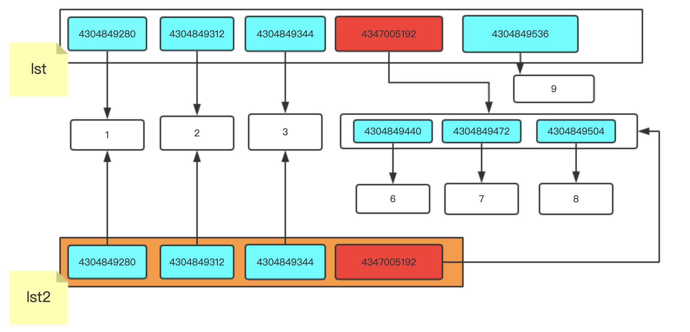

为什么lst1中没有添加,是因为咱们先进行的浅拷贝,浅拷贝把原列表中有的内存地址复制了一份放到新开辟的空间中,后期对原列表添加的内容新列表是不会有的,再看看下边的例子

```python
lst = [1,2,3,[6,7,8]]
lst2 = lst.copy()
lst[1] = "22"

```

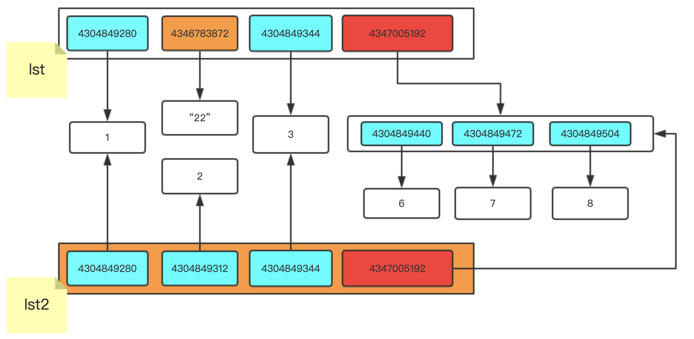

我们修改成字符串"22" 就是在列表中将以前的内存地址更换成新开辟的空间地址

```python
lst = [1,2,3,[6,7,8]]
lst1 = lst.copy()
lst[-1].append(9)
```


因为我们对里边的列表进行修改,列表本身就是可变的数据类型,我们通过原列表修改最里层的小列表,小列表进行变化,新开辟的列表里存放就是小列表中的内存地址.在去查看的时候就有变动

我们接下来,来看看深拷贝是怎样的操作

```python
import copy
lst = [1,2,3,[6,7,8,9]]
lst2 = copy.deepcopy(lst)

```


我们通过上图可以发现浅拷贝和深拷贝在最后列表的位置内存地址不一样,深拷贝是自己单独开辟了一个新的空间,我们现在修改原列表和新开辟的列表没有任何影响.

通过上面的各种测试,总结以下规律:

- 赋值:
  - 两个或多个变量名指向同一个内存地址,有一个操作内存地址的值进行改变,其余的变量名在查看的时候都进行更改
- 浅拷贝:
  - 只拷贝列表中第一层的内存地址,原列表修改了不可变数据类型,新开辟的列表不进行变动,因为只是在原列表中将内存地址进行修改了,新开辟的列表中的内存地址还是用的之前的内存地址
  - 原列表对可变数据类型进行了添加,新开辟的列表中存放就是可变数据类型的地址,在去查看的时候就发现进行更改了
- 深拷贝:
  - 不管你修改原数据的不可变类型还是可变类型,新开辟的空间中都不会进行改变,因为可变数据类型新开辟了一个空间
  - 

### 3.8 公共功能

- 求长度    len()
- 索引        [number]
- 切片        [number,nuimber]
- 步长        [number,nuimber,number]
- for循环

### 3.9 嵌套


## 第四章 文件操作

### 4.1 文件的基本操作'

```py
obj = open('路径',mode = '模式',encoding = '编码')
obj.write()
obj.read()
obj.close()

```

### 4.2 打开模式

- r / w / a
- r+ / w+ / a+
- rb / wb / ab 
- r+b / w+b / a+b

### 4.3 操作

- read()  全部读到内存

- read(1) 

  - 1表示一个字符

    ```python
    obj = open('a.txt',mode = 'r',encoding = 'utf-8')
    data = obj.read(1) # 一个字符
    obj.close()
    print(data)
    ```

  - 1表示一个字节

    ```python
    obj = open('a.txt',mode = 'rb')
    data = obj.read(1) # 一个字节
    obj.close()
    print(data)
    
    ```

  - write(字符串)

    ```python
    obj = open('a.txt',mode = 'w',encoding = 'utf-8')
    obj.write('中文')
    obj.close()
    
    
    ```

  - write(二进制)

    ```python
    obj = open('a.txt',mode = 'wb')
    v = '中文'.encode('utf-8')
    obj.write(v)
    obj.close
    
    ```

  - seek(光标字节位置),无论模式是否带B，都是按照字节进行处理。

    ```python
    obj = open('a.txt',mode = 'r',encoding = 'utf-8')
    obj.seek(3) # 跳转到指定字节
    data = obj.read()
    obj.close()
    print(data)
    ```

  - tell() 获取当前光标所在的字节位置

    ```python
    obj = open('a.txt',mode = 'rb')
    obj.seek(3) # 跳转到指定字节位置
    obj.read()
    data = obj.tell()
    print(data)
    obj.close
    ```

  - flush() 强制将内存中的数据写入硬盘

    ```python
    v = open('a.txt',mode = 'a',encoding = 'utf-8')
    while True:
        val = input('请输入:')
        v.write(val)
        v.flush()
    v.close()
    
    ```

### 4.4 关闭文件

手动关闭文件

```python
v = open('a.txt',mode = 'a',encoding = 'utf-8')
v.close()
```

自动关闭文件

```python
with open('a.txt',mode = 'a',encoding = 'utf-8') as v:
    data = v.raad()
    # 缩进中的代码执行完毕后，自动关闭文件
 
```

### 4.5 文件的修改

```python
with open('a.txt',mode = 'r',encoding = 'utf-8') as f1:
    data = f1.read()
new_data =data.replace('被替换的字符串'，'替换成的字符串')
with open('a.txt',mode='w',encoding = 'utf-8') as f1:
    data = f1.write(new_data)
    
```

大文件修改

```python
f1 = open('a.txt',mode = 'r',encoding = 'utf-8') #初始大文件
f2 = open('b.txt',mode = 'w',encoding = 'utf-8') #另外打开一个空白文件
for line in f1:
    new_line = line.replace('被替换的字符串'，'替换成的字符串')
    f2.write(new_line)
f1.close()
f2.close()
```

```python
with open('a.txt',mode = 'r',encoding = 'utf-8') as f1,open('b.txt',mode = 'w',encoding = 'utf-8') as f2:
    for line in f1:
        new_line = line.replace('被替换的字符串'，'替换成的字符串')
        f2.write(new_line)
```


## 第五章 函数

### #三元运算（三目运算）

```python
v = 前面 if 条件（条件为真前面 条件为假后边） else 后面
```

```python
# 让用户输入值，如果值是整数，则转换为整数，否则赋值为None
data = input('请输入')
value = int(data) if data.isdecimal() else None
```

注意：先做成来，再思考如何简化。

### 函数

函数之前的代码统称为面向过程编程 缺点：可读性差 可重用性差。

```python
# 面向过程编程
user_input = input('请输入角色：')
if user_input == '管理员':
    pass # 给管理员发邮件 ：10行代码
elif user_input == '业务员':
    pass # 给管理员发邮件 ：10行代码
elif user_input == '老板':
    pass # 给管理员发邮件 ：10行代码
```

发送邮件：

```python
import smtplib
from email.mime.text import MIMEText
from email.utils import formataddr

msg = MIMEText('hello word','plain','utf-8')
msg['From'] = formataddr(['python','732336318@qq.com'])
msg['To'] = formataddr(['导演','2731650266@qq.com'])
msg['Subject'] = '亲爱的导演'
server = smtplib.SMTP('smtp.qq.com', 25)
server.login('732336318@qq.com','brawjlffjubnbecc')
server.sendmail('732336318@qq.com',['2731650266@qq.com',],msg.as_string())
server.quit()
```

函数式编程

```python
def send_email():
    import smtplib
    from email.mime.text import MIMEText
    from email.utils import formataddr

    msg = MIMEText('hello word','plain','utf-8')
    msg['From'] = formataddr(['python','732336318@qq.com'])
    msg['To'] = formataddr(['导演','2731650266@qq.com'])
    msg['Subject'] = '亲爱的导演'
    server = smtplib.SMTP('smtp.qq.com', 25)
    server.login('732336318@qq.com','brawjlffjubnbecc')
    server.sendmail('732336318@qq.com',['2731650266@qq.com',],msg.as_string())
    server.quit()

user_input = input('请输入角色：')
if user_input == '管理员':
    send_email():
elif user_input == '业务员':
    end_email():
elif user_input == '老板':
    send_email():
```

对于函数式编程：

- 本质：将N行代码拿到别处并给他起个名字，以后通过名字就可以找到这段代码并执行。
- 场景：
  - 代码重复执行
  - 代码量特别多超过了一屏，可以选择通过函数进行代码的分割。

###  5.1 函数的基本结构

```python
def 函数名():
    #函数的内容
    pass

#函数的执行
函数名（）

```

```python
def get_list_first_data():
    v = [11,22,33,44]
    print(v[0])
    pass
get_list_first_data()

```

### 5.2  函数的参数

```python
def get_list_first_data(aaa): # 此时的aaa叫形式参数
    v = [11,22,33,44]
    print(v[aaa])
    pass
get_list_first_data(0)    # 调用函数时传递的叫实际参数
get_list_first_data(1)
get_list_first_data(2)
get_list_first_data(3)
```

### 5.3 函数的返回值

```python
def func(arg):
    # .....
    return 9 # 返回值为9

```

### 一.函数的动态参数

之前我们说过传参,如果我们在传参数的时候不很清楚有哪些的时候,或者说给一个函数传了很多参数,我们就要写很多,很麻烦怎么办呢,我们可以考虑使用动态参数

形参的第三种:动态参数

首先我们来回顾下位置参数

```
def eat(a,b,c):

    print('我想吃%s%s%s'%(a,b,c))

eat('大米饭','中米饭','小米饭')
```

现在有个问题,你们看我这体型也知道吃的不止这些,数量也没有写,这时我们就要用到动态参数　　

#### 1.1 动态接收位置参数


在参数位置用*表示接受任意参数

```
def eat(*args):

    print('我想吃',args)

eat('大米饭','中米饭','小米饭')  # 收到的结果是一个tuple元祖
```

动态接收参数的时候要注意: 动态参数必须在位置参数后面

```
def eat(*args,a,b):

    print('我想吃',args,a,b)

eat('大米饭','中米饭','小米饭')

结果:

TypeError: eat() missing 2 required keyword-only arguments: 'a' and 'b'
# eat函数在调用的时候发现缺少俩个位置参数没有进行传递
```

通过上述代码发现一个问题就是,我们明明给了多个参数,为什么还会提示参数未传递呢?

原因就是因为这个*在搞鬼* *把所有的位置参数都给接受了,所有会报错.我们尝试着把a,b放在*的前面试试

```
def eat(a,b,*args):

    print('我想吃',args,a,b)

eat('大米饭','中米饭','小米饭')

结果:

我想吃 ('小米饭',) 大米饭 中米饭
```

动态接收参数的时候要注意:动态参数必须在位置参数后面

那默认值参数呢?

```
def eat(a,b,c='白菜',*args):

    print('我想吃',a,b,c,args)

eat('豆腐','粉条','猪肉','大葱')

结果:

我想吃 豆腐 粉条 猪肉 ('大葱',)  # 我们定义好的白菜没有生效,被猪肉给覆盖了
```

我们发现默认值参数写在动态参数前面,默认值的参数是不会生效的

```
def eat(a,b,*args,c='白菜'):

    print('我想吃',a,b,args,c)

eat('猪肉','粉条','豆腐','大葱')

结果:

我想吃 猪肉 粉条 ('豆腐', '大葱') 白菜  # 这样默认参数就生效了
```

这个时候如果你不给出关键字传参,那么你的默认值是永远都生效的　　

注意: 形参的顺序: 位置参数 , 动态参数 , 默认参数

#### 1.2 动态接收关键字参数

在python中可以动态的位置参数,但是*这种情况只能接收位置参数无法接收关键字参数,在python中使用**来接收动态关键字参数

```
def func(**kwargs):

    print(kwargs)     

func(a=1, b=2, c=3)

结果:

{'a': 1, 'b': 2, 'c': 3}

```

动态关键字参数最后获取的是一个dict字典形式　　

顺序的问题, 在函数调用的时候, 如果先给出关键字参数, 则整个参数列表会报错.

```
def func(a,b,c,d):

    print(a,b,c,d)

func(1,2,c=3,4)

结果:

  File "D:/python_object/path2/test.py", line 806

    func(1,2,c=3,4)              ^

SyntaxError: positional argument follows keyword argument

```

关键参数必须要放在位置参数后边,由于实参是这个顺序,所以形参接收的时候也是这个顺序.也就是说位置参数必须在关键字参数前面.动态接收关键字参数也要在后面

最终顺序:

　　位置参数 > *args(动态位置参数) > 默认值参数 > **kwargs(动态默认参数)

　　这四种参数可以任意的使用

如果想接收所有的参数:

```
def func(*args,**kwargs):

    print(args,kwargs)

func(1,23,5,a=1,b=6)

```

动态参数还可以这样传参:

```
lst = [1,4,7]

# 方法一

def func(*args):

    print(args)

func(lst[0],lst[1],lst[2])


# 方法二

def func(*args):

    print(args)

func(*lst)  
# 在实参的位置上用*将lst(可迭代对象)按照顺序打散

# 在形参的位置上用*把收到的参数组合成一个元祖

```

字典也可以进行打散,不过需要**

```
dic = {'a':1,'b':2}

def func(**kwargs):

    print(kwargs)

func(**dic)
```

### 二. 函数的注释

```
def eat(food,drink):

    '''

    这里描述这个函数是做什么的.例如这函数eat就是吃

    :param food:  food这个参数是什么意思

    :param drink: drink这个参数是什么意思

    :return:  执行完这个函数想要返回给调用者什么东西

    '''

    print(food,drink)

eat('麻辣烫','肯德基')
```

在外部查看函数的注释 函数名._*doc_*

```
print(eat.__doc__)  #函数名.__doc__

结果:
    这里描述这个函数是做什么的.例如这函数eat就是吃

    :param food:  food这个参数是什么意思

    :param drink: drink这个参数是什么意思

    :return:  执行完这个函数想要返回给调用者什么东西
```

### 三 .名称空间

在python解释器开始执行之后, 就会在内存中开辟一个空间, 每当遇到一个变量的时候, 就把变量名和值之间的关系记录下来, 但是当遇到函数定义的时候, 解释器只是把函数名读入内存, 表示这个函数存在了, 至于函数内部的变量和逻辑, 解释器是不关心的. 也就是说一开始的时候函数只是加载进来, 仅此而已, 只有当函数被调用和访问的时候, 解释器才会根据函数内部声明的变量来进行开辟变量的内部空间. 随着函数执行完毕, 这些函数内部变量占用的空间也会随着函数执行完毕而被清空.

```
def fun():   
    a = 10   
    print(a)
fun()
print(a)    # a不存在了已经..
```

 我们给存放名字和值的关系的空间起一个名字叫: 命名空间. 我们的变量在存储的时候就 是存储在这片空间中的.

 命名空间分类:

  1. 全局命名空间--> 我们直接在py文件中, 函数外声明的变量都属于全局命名空间

  2. 局部命名空间--> 在函数中声明的变量会放在局部命名空间

  3. 内置命名空间--> 存放python解释器为我们提供的名字, list, tuple, str, int这些都是内置命名空间　　

**加载顺序:**

  　　1. 内置命名空间

    　　2. 全局命名空间

 　　3. 局部命名空间(函数被执行的时候)

**取值顺序:**

  1. 局部命名空间

  2. 全局命名空间

  3. 内置命名空间

```
a = 10
def func():  
    a = 20   
    print(a)

func()  # 20
```

作用域: 作用域就是作用范围, 按照生效范围来看分为 全局作用域 和 局部作用域

　　 全局作用域: 包含内置命名空间和全局命名空间. 在整个文件的任何位置都可以使用(遵循 从上到下逐⾏执行).

　　 局部作用域: 在函数内部可以使用.

作⽤域命名空间:

```
 　　1. 全局作⽤用域:    全局命名空间 + 内置命名空间  
 　　2. 局部作⽤用域:    局部命名空间   
```

我们可以通过globals()函数来查看全局作⽤用域中的内容,也可以通过locals()来查看局部作 ⽤用域中的变量量和函数信息

```
a = 10
def func():   
    a = 40   
    b = 20   
    print("哈哈")   
    print(a, b)        
    print(globals())    # 打印全局作用域中的内容   
    print(locals())     # 打印局部作用域中的内容
func()
```

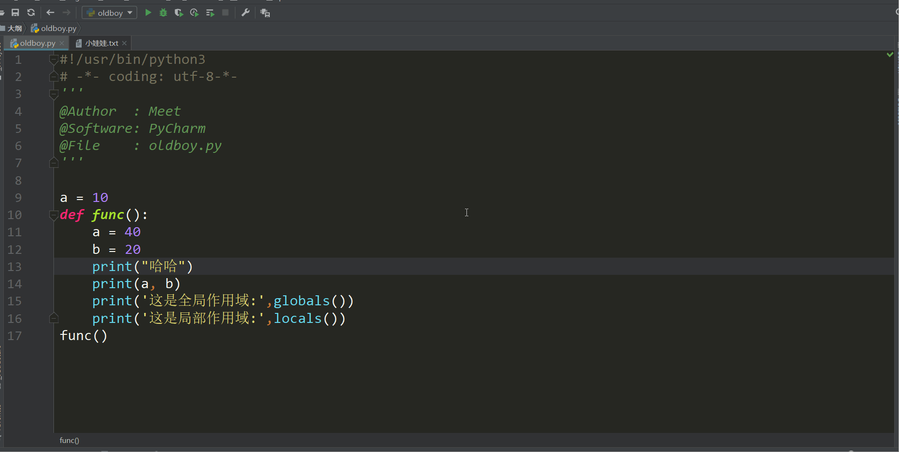

### 四. 函数的嵌套

1. 只要遇见了()就是函数的调用. 如果没有()就不是函数的调用
2. 函数的执行顺序

```
def fun1():   
    print(111)  
def fun2():   
    print(222)   
    fun1()   
fun2()
print(111)
```

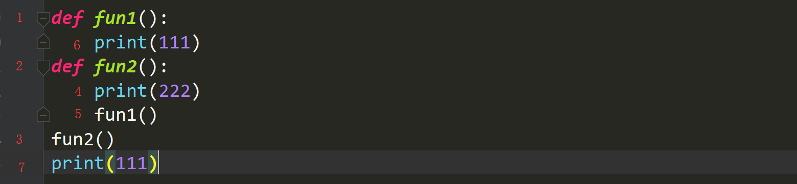

```
def fun2():   
    print(222)   
    def fun3():       
        print(666)   
    print(444)   
    fun3()   
    print(888)
print(33)
fun2()
print(555)

```

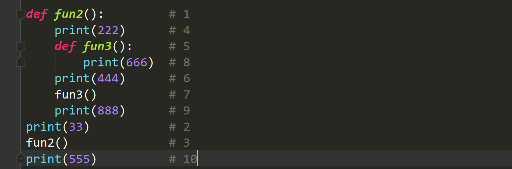

### 五 .gloabal、nonlocal

首先我们写这样一个代码, 首先在全局声明一个变量, 然后再局部调用这个变量, 并改变这 个变量的值

```
a = 100
def func():   
    global a    # 加了个global表示不再局部创建这个变量了. 而是直接使用全局的a   
    a = 28   
print(a)
func()
print(a)
```

global表示. 不再使用局部作用域中的内容了. 而改用全局作用域中的变量

#### 5.1global 宗旨

在函数内部修改全局的变

量,如果全局中不存在就创建一个变量

```
lst = ["麻花藤", "刘嘉玲", "詹姆斯"]
def func():   
    lst.append("⻢云")   
    # 对于可变数据类型可以直接进⾏访问
　　 print(lst)
func()
print(lst)
```

#### 5.2 nonlocal宗旨

nonlocal 只修改上一层变量,如果上一层中没有变量就往上找一层,只会找到函数的最外层,不会找到全局进行修改

```
a = 10
def func1():   
    a = 20   
    def func2():
        nonlocal a       
        a = 30       
        print(a)  
    func2()   
    print(a)
func1()


结果:
加了nonlocal
30
30

不加nonlocal
30
20
```

再看, 如果嵌套了很多层, 会是一种什么效果:

```
a = 1
def fun_1():   
    a = 2   
    def fun_2():       
        nonlocal a       
        a = 3       
        def fun_3():           
            a = 4           
            print(a)       
        print(a)       
        fun_3()       
        print(a)   
    print(a)   
    fun_2()   
    print(a)
print(a)
fun_1()
print(a)
```

这样的程序如果能分析明白. 那么作用域, global, nonlocal就没问题了

### 匿名函数

匿名函数，顾名思义就是没有名字的函数，那么什么函数没有名字呢？这个就是我们以后面试或者工作中经常用匿名函数 lambda，也叫一句话函数。

现在有一个需求：你们写一个函数，此函数接收两个int参数，返回和值。

```
def func(a,b):
    return a+b
print(func(3,4))
```

那么接下来我们用匿名函数完成上面的需求：

```
func = lambda a,b: a+b
print(func(3, 4))  # 7
```

我们分析一下上面的代码：

语法:

　　函数名 = lambda 参数:返回值

 1）此函数不是没有名字，他是有名字的，他的名字就叫做lambda

 2）lambda 是定义匿名函数的关键字，相当于函数的def.

 3）lambda 后面直接加形参，形参加多少都可以，只要用逗号隔开就行。

```
func = lambda a,b,*args,sex= 'alex',c,**kwargs: kwargs
print(func(3, 4,c=666,name='alex'))  # {'name': 'alex'}
# 所有类型的形参都可以加，但是一般使用匿名函数只是加位置参数，其他的用不到。
```

 4）返回值在冒号之后设置，返回值和正常的函数一样,可以是任意数据类型。(但是想要返回多个元素要以容器的形式返回)

 5）匿名函数不管多复杂.只能写一行.且逻辑结束后直接返回数据

接下来做几个匿名函数的小题：

写匿名函数：接收一个可切片的数据，返回索引为0与2的对应的元素（元组形式）。

```
func = lambda x:(x[0],x[2])
print(func('afafasd'))

```

写匿名函数：接收两个int参数，将较大的数据返回。

```
func = lambda x,y: x if x > y else y
print(func(3,100))

```

### 内置函数I

 本节我们讲内置函数。 首先来说，函数就是以功能为导向，一个函数封装一个功能，那么Python将一些常用的功能（比如len）给我们封装成了一个一个的函数，供我们使用，他们不仅效率高（底层都是用C语言写的），而且是拿来即用，避免重复早轮子，那么这些函数就称为内置函数，到目前为止python给我们提供的内置函数一共是68个，由于时间关系以及考虑这些函数的不同重要性我们会挑常用的重要的内置函数去讲，就是下面红色黄色背景的内置函数，剩下的内置函数你们参照着我的博客自己课下练习一下即可。

 由于我们这没有表格的功能，我把这些内置函数进行分类：

黄色一带而过：all() any() bytes() callable() chr() complex() divmod() eval() exec() frozenset() globals() hash() help() id() input() int() iter() locals() next() oct() ord() pow() repr() round()

红色重点讲解：abs() format()enumerate() filter() map() max() min() open() range() print() len() list() dict() str() float() reversed() set() sorted() sum() tuple() type() zip() dir()

蓝色未来会讲： classmethod() delattr() getattr() hasattr() issubclass() isinstance() object() property() setattr() staticmethod() super()

上面的黄色，红色的内置函数是在这两天讲完的（讲过的就不讲了），蓝色的讲完面向对象会给大家补充，剩余还有一些课上就不讲了，课下练习一下就可以。

eval：执行字符串类型的代码，并返回最终结果。

```
eval('2 + 2')  # 4
n=81
eval("n + 4")  # 85
eval('print(666)')  # 666

```

exec:执行字符串类型的代码。

```
s = '''
for i in [1,2,3]:
    print(i)
'''
exec(s)

```

以上两个内置函数很强大 工作中禁止使用

hash：获取一个对象（可哈希对象：int，str，Bool，tuple）的哈希值。

```
print(hash(12322))
print(hash('123'))
print(hash('arg'))
print(hash('alex'))
print(hash(True))
print(hash(False))
print(hash((1,2,3)))

'''
-2996001552409009098
-4637515981888139739
1
2528502973977326415
'''

```

help：函数用于查看函数或模块用途的详细说明。

```
print(help(list))
print(help(str.split))

```

callable：函数用于检查一个对象是否是可调用的。如果返回True，仍然可能调用失败；但如果返回False，调用对象ojbect绝对不会成功。

```
name = 'alex'
def func():
    pass
print(callable(name))  # False
print(callable(func))  # True

```

int：函数用于将一个字符串或数字转换为整型。

```
print(int())  # 0
print(int('12'))  # 12
print(int(3.6))  # 3
print(int('0100',base=2))  # 将2进制的 0100 转化成十进制。结果为 4

```

float：函数用于将整数和字符串转换成浮点数。

complex：函数用于创建一个值为 real + imag * j 的复数或者转化一个字符串或数为复数。如果第一个参数为字符串，则不需要指定第二个参数。。

```
print(float(3))  # 3.0
print(complex(1,2))  # (1+2j)

```

bin：将十进制转换成二进制并返回。

oct：将十进制转化成八进制字符串并返回。

hex：将十进制转化成十六进制字符串并返回。

```
print(bin(10),type(bin(10)))  # 0b1010 <class 'str'>
print(oct(10),type(oct(10)))  # 0o12 <class 'str'>
print(hex(10),type(hex(10)))  # 0xa <class 'str'>

```

divmod：计算除数与被除数的结果，返回一个包含商和余数的元组(a // b, a % b)。

round：保留浮点数的小数位数，默认保留整数。

pow：求x**y次幂。（三个参数为x**y的结果对z取余）

```
print(divmod(7,2))  # (3, 1)
print(round(7/3,2))  # 2.33
print(round(7/3))  # 2
print(round(3.32567,3))  # 3.326
print(pow(2,3))  # 两个参数为2**3次幂
print(pow(2,3,3))  # 三个参数为2**3次幂，对3取余。

```

bytes：用于不同编码之间的转化。

```
# s = '你好'
# bs = s.encode('utf-8')
# print(bs)
# s1 = bs.decode('utf-8')
# print(s1)
# bs = bytes(s,encoding='utf-8')
# print(bs)
# b = '你好'.encode('gbk')
# b1 = b.decode('gbk')
# print(b1.encode('utf-8'))

```

ord:输入字符找当前字符编码的位置

chr:输入当前编码的位置数字找出其对应的字符

```
# ord 输入字符找该字符编码的位置
# print(ord('a'))
# print(ord('中'))

# chr 输入位置数字找出其对应的字符
# print(chr(97))
# print(chr(20013))

```

repr:返回一个对象的string形式（原形毕露）。

```
# %r  原封不动的写出来
# name = 'taibai'
# print('我叫%r'%name)

# repr 原形毕露
print(repr('{"name":"alex"}'))
print('{"name":"alex"}')

```

all：可迭代对象中，全都是True才是True

any：可迭代对象中，有一个True 就是True

```
# all  可迭代对象中，全都是True才是True
# any  可迭代对象中，有一个True 就是True
# print(all([1,2,True,0]))
# print(any([1,'',0]))

```

### 内置函数Ⅱ

**红色重点讲解**：enumerate() open() range() len() str() list() tuple() dict() set() print() sum() abs() dir() zip() format() reversed() filter() map() sorted() max() min() reduce()

昨天，我们已经比较重要的内置函数讲完了，那么今天我们要讲的是最重要的内置函数和高阶函数，这些内置函数是面试与工作中经常用到的，所以，今天的这些内置函数，我们一定要全部记住，并且熟练使用。

#### 内置函数:

**str() 将字节转换成字符串**

```python
byte_str = bytes("你好",encoding="utf")
print(byte_str)
print(str(byte_str,encoding="utf-8"))

```

**list() 将可迭代对象转换成列表**

```python
print(list("alex"))

```

**tuple() 将可迭代对象转换成元组**

```python
print(tuple([1,2,3,4]))

```

**dict() 将元组和列表转换成字典**

```python
print(dict([(1,2),(3,4)]))
print(dict(((1,2),(3,4))))

```

**set() 将可迭代对象转换成一个集合**

```python
print(set("alex"))

```

**print() 屏幕输出。**

```python
''' 源码分析
def print(self, *args, sep=' ', end='\n', file=None): # known special case of print
    """
    print(value, ..., sep=' ', end='\n', file=sys.stdout, flush=False)
    file:  默认是输出到屏幕，如果设置为文件句柄，输出到文件
    sep:   打印多个值之间的分隔符，默认为空格
    end:   每一次打印的结尾，默认为换行符
    flush: 立即把内容输出到流文件，不作缓存
    """
'''
print(111,222,333,sep='*')  # 111*222*333
print(111,end='')
print(222)  #两行的结果 111222

f = open('log','w',encoding='utf-8')
print('写入文件',fle=f,flush=True)

```

**sum() 求和**

sum求和必须是可迭代对象,对象中的元素必须都为整型,字符串类型不能使用

```python
print(sum([1,2,3]))
print(sum([1,2,3],100))  100是起始值,就是从100开始进行求和

```

**abs() 返回绝对值**

```
i = -5
print(abs(i))  # 5

```

**dir() 查看当前对象具有什么方法**

```Python
print(dir(list))

```

**zip() 拉链方法。**函数用于将可迭代的对象作为参数,将对象中对应的元素打包成一个个元组,

然后返回由这些元祖组成的内容,如果各个迭代器的元素个数不一致,则按照长度最短的返回，

```python
lst1 = [1,2,3]
lst2 = ['a','b','c','d']
lst3 = (11,12,13,14,15)
for i in zip(lst1,lst2,lst3):
    print(i)

结果:
(1, 'a', 11)
(2, 'b', 12)
(3, 'c', 13)
```

**format() 格式转换**

```python
# 对齐方式:
print(format(122,">20")) 
print(format(122,"<20"))
print(format(122,"^20"))

# 进制转换:
将十进制转换成二进制
print(format(12,"b"))
print(format(12,"08b"))

将十进制转换成八进制
print(format(12,"o"))
print(format(12,"08o"))

将二进制转换成十进制
print(format(0b11001,"d"))

将十进制转换成十六进制
print(format(17,"x"))
print(format(17,"08x"))
```

**reversed() 将一个序列翻转, 返回翻转序列的迭代器 reversed 示例:**

```
l = reversed('你好')  # l 获取到的是一个生成器
print(list(l))
ret = reversed([1, 4, 3, 7, 9])
print(list(ret))  # [9, 7, 3, 4, 1]

```

#### 高阶函数:

**filter**筛选过滤

```
语法: filter(function,iterable)

function: 用来筛选的函数,在filter中会自动的把iterable中的元素传递给function,然后根据function返回的True或者False来判断是否保留此项数据

iterable:可迭代对象

lst = [{'id':1,'name':'alex','age':18},
        {'id':1,'name':'wusir','age':17},
        {'id':1,'name':'taibai','age':16},]

ls = filter(lambda e:e['age'] > 16,lst)

print(list(ls))

结果:
[{'id': 1, 'name': 'alex', 'age': 18},
 {'id': 1, 'name': 'wusir', 'age': 17}]

```

**map映射**

```
映射函数

语法: map(function,iterable) 可以对可迭代对象中的每一个元素进映射,分别取执行function

计算列表中每个元素的平方,返回新列表

lst = [1,2,3,4,5]

def func(s):

    return  s*s

mp = map(func,lst)

print(mp)

print(list(mp))


改写成lambda

lst = [1,2,3,4,5]

print(list(map(lambda s:s*s,lst)))


计算两个列表中相同位置的数据的和

lst1 = [1, 2, 3, 4, 5]

lst2 = [2, 4, 6, 8, 10]

print(list(map(lambda x, y: x+y, lst1, lst2)))

结果:

[3, 6, 9, 12, 15]
```

**sorted**排序函数

```
语法:sorted(iterable,key=None,reverse=False)

iterable : 可迭代对象

key: 排序规则(排序函数),在sorted内部会将可迭代对象中的每一个元素传递给这个函数的参数.根据函数运算的结果进行排序

reverse :是否是倒序,True 倒序 False 正序

lst = [1,3,2,5,4]
lst2 = sorted(lst)
print(lst)    #原列表不会改变
print(lst2)   #返回的新列表是经过排序的


lst3 = sorted(lst,reverse=True)
print(lst3)   #倒叙

结果:
[1, 3, 2, 5, 4]
[1, 2, 3, 4, 5]
[5, 4, 3, 2, 1]

字典使用sorted排序

dic = {1:'a',3:'c',2:'b'}
print(sorted(dic))   # 字典排序返回的就是排序后的key

结果:
[1,2,3]


和函数组合使用

# 定义一个列表,然后根据一元素的长度排序
lst = ['天龙八部','西游记','红楼梦','三国演义']

# 计算字符串的长度
def func(s):
    return len(s)
print(sorted(lst,key=func))

# 结果:
# ['西游记', '红楼梦', '天龙八部', '三国演义']


和lambda组合使用

lst = ['天龙八部','西游记','红楼梦','三国演义']

print(sorted(lst,key=lambda s:len(s)))

结果:
['西游记', '红楼梦', '天龙八部', '三国演义']


lst = [{'id':1,'name':'alex','age':18},
    {'id':2,'name':'wusir','age':17},
    {'id':3,'name':'taibai','age':16},]

# 按照年龄对学生信息进行排序

print(sorted(lst,key=lambda e:e['age']))

结果:
[{'id': 3, 'name': 'taibai', 'age': 16}, {'id': 2, 'name': 'wusir', 'age': 17}, {'id': 1, 'name': 'alex', 'age': 18}]
```

**max() 最大值与最小值用法相同**

**min() 求最小值**

```
print(min([1,2,3]))  # 返回此序列最小值

ret = min([1,2,-5,],key=abs)  # 按照绝对值的大小，返回此序列最小值
print(ret)
# 加key是可以加函数名，min自动会获取传入函数中的参数的每个元素，然后通过你设定的返回值比较大小，返回最小的传入的那个参数。
print(min(1,2,-5,6,-3,key=lambda x:abs(x)))  # 可以设置很多参数比较大小
dic = {'a':3,'b':2,'c':1}
print(min(dic,key=lambda x:dic[x]))

# x为dic的key，lambda的返回值（即dic的值进行比较）返回最小的值对应的键
```

**reduce 累计算**

```
from functools import reduce
def func(x,y):
    return x + y

# reduce 的使用方式:
# reduce(函数名,可迭代对象)  # 这两个参数必须都要有,缺一个不行

ret = reduce(func,[3,4,5,6,7])
print(ret)  # 结果 25
reduce的作用是先把列表中的前俩个元素取出计算出一个值然后临时保存着,
接下来用这个临时保存的值和列表中第三个元素进行计算,求出一个新的值将最开始
临时保存的值覆盖掉,然后在用这个新的临时值和列表中第四个元素计算.依次类推

注意:我们放进去的可迭代对象没有更改
以上这个例子我们使用sum就可以完全的实现了.我现在有[1,2,3,4]想让列表中的数变成1234,就要用到reduce了.
普通函数版
from functools import reduce

def func(x,y):

    return x * 10 + y
    # 第一次的时候 x是1 y是2  x乘以10就是10,然后加上y也就是2最终结果是12然后临时存储起来了
    # 第二次的时候x是临时存储的值12 x乘以10就是 120 然后加上y也就是3最终结果是123临时存储起来了
    # 第三次的时候x是临时存储的值123 x乘以10就是 1230 然后加上y也就是4最终结果是1234然后返回了

l = reduce(func,[1,2,3,4])
print(l)


匿名函数版
l = reduce(lambda x,y:x*10+y,[1,2,3,4])
print(l)


在Python2.x版本中recude是直接 import就可以的, Python3.x版本中需要从functools这个包中导入

龟叔本打算将 lambda 和 reduce 都从全局名字空间都移除, 舆论说龟叔不喜欢lambda 和 reduce

最后lambda没删除是因为和一个人给龟叔写了好多封,进行交流然后把lambda保住了.
```

参考资料:

https://www.processon.com/view/link/5b4ee15be4b0edb750de96ac

### 闭包

由于闭包这个概念比较难以理解，尤其是初学者来说，相对难以掌握，所以我们通过示例去理解学习闭包。

给大家提个需求，然后用函数去实现：完成一个计算不断增加的系列值的平均值的需求。

例如：整个历史中的某个商品的平均收盘价。什么叫平局收盘价呢？就是从这个商品一出现开始，每天记录当天价格，然后计算他的平均值：平均值要考虑直至目前为止所有的价格。

比如大众推出了一款新车：小白轿车。

第一天价格为：100000元，平均收盘价：100000元

第二天价格为：110000元，平均收盘价：（100000 + 110000）/2 元

第三天价格为：120000元，平均收盘价：（100000 + 110000 + 120000）/3 元

........

```
series = []
def make_averager(new_value):
    series.append(new_value)
    total = sum(series)
    return total / len(series)

print(make_averager(100000))
print(make_averager(110000))
print(make_averager(120000))

```

从上面的例子可以看出，基本上完成了我们的要求，但是这个代码相对来说是不安全的，因为你的这个series列表是一个全局变量，只要是全局作用域的任何地方，都可能对这个列表进行改变。

```
series = []
def make_averager(new_value):
    series.append(new_value)
    total = sum(series)
    return total / len(series)

print(make_averager(100000))
print(make_averager(110000))
series.append(666)  # 如果对数据进行相应改变，那么你的平均收盘价就会出现很大的问题。
print(make_averager(120000))

```

那么怎么办呢？有人说，你把他放在函数中不就行了，这样不就是局部变量了么？数据不就相对安全了么？

```
def make_averager(new_value):
    series = []
    series.append(new_value)
    total = sum(series)
    return total / len(series)


print(make_averager(100000))  # 100000.0
print(make_averager(110000))  # 110000.0
print(make_averager(120000))  # 120000.0

```

这样计算的结果是不正确的,那是因为执行函数，会开启一个临时的名称空间，随着函数的结束而消失，所以你每次执行函数的时候，都是重新创建这个列表，那么这怎么做呢？这种情况下，就需要用到我们讲的闭包了，我们用闭包的思想改一下这个代码。

```
def make_averager():

    series = []
    def averager(new_value):
        series.append(new_value)
        total = sum(series)
        return total/len(series)

    return averager

avg = make_averager()
print(avg(100000))
print(avg(110000))
print(avg(120000))

```

**大家仔细看一下这个代码，我是在函数中嵌套了一个函数。那么avg 这个变量接收的实际是averager函数名，也就是其对应的内存地址，我执行了三次avg 也就是执行了三次averager这个函数。那么此时你们有什么问题？**

肯定有学生就会问，那么我的make_averager这个函数只是执行了一次，为什么series这个列表没有消失？反而还可以被调用三次呢？这个就是最关键的地方，也是闭包的精华所在。我给大家说一下这个原理，以图为证：

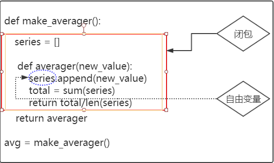

 上面被红色方框框起来的区域就是闭包，被蓝色圈起来的那个变量应该是make_averager()函数的局部变量，它应该是随着make_averager()函数的执行结束之后而消失。但是他没有，是因为此区域形成了闭包，series变量就变成了一个叫自由变量的东西，averager函数的作用域会延伸到包含自由变量series的绑定。也就是说，每次我调用avg对应的averager函数 时，都可以引用到这个自用变量series，这个就是闭包。

**闭包的定义：**

1. 闭包是嵌套在函数中的函数。
2. 闭包必须是内层函数对外层函数的变量（非全局变量）的引用。

如何判断判断闭包？举例让同学回答：

```
# 例一：
def wrapper():
    a = 1
    def inner():
        print(a)
    return inner
ret = wrapper()

# 例二：
a = 2
def wrapper():
    def inner():
        print(a)
    return inner
ret = wrapper()


# 例三：

def wrapper(a,b):
    def inner():
        print(a)
        print(b)
    return inner
a = 2
b = 3
ret = wrapper(a,b)
```

以上三个例子，最难判断的是第三个，其实第三个也是闭包，如果我们每次去研究代码判断其是不是闭包，有一些不科学，或者过于麻烦了，那么有一些函数的属性是可以获取到此函数是否拥有自由变量的，如果此函数拥有自由变量，那么就可以侧面证明其是否是闭包函数了（**了解**）：

```
def make_averager():

    series = []
    def averager(new_value):
        series.append(new_value)
        total = sum(series)
        return total/len(series)

    return averager
avg = make_averager()
# 函数名.__code__.co_freevars 查看函数的自由变量
print(avg.__code__.co_freevars)  # ('series',)
当然还有一些参数，仅供了解：

# 函数名.__code__.co_freevars 查看函数的自由变量
print(avg.__code__.co_freevars)  # ('series',)
# 函数名.__code__.co_varnames 查看函数的局部变量
print(avg.__code__.co_varnames)  # ('new_value', 'total')
# 函数名.__closure__ 获取具体的自由变量对象，也就是cell对象。
# (<cell at 0x0000020070CB7618: int object at 0x000000005CA08090>,)
# cell_contents 自由变量具体的值
print(avg.__closure__[0].cell_contents)  # []
```

**闭包的作用**：保存局部信息不被销毁，保证数据的安全性。

**闭包的应用**：

1. 可以保存一些非全局变量但是不易被销毁、改变的数据。
2. 装饰器。

### 推导式

本节我们讲列表推导式,生成器表达式以及其他推导式，我认为推导式就是构建比较有规律的列表,生成器，字典等一种简便的方式。那么他如何简便呢？看下面的例题：

#### 列表推导式

**这里让学生自己做一下**，首先我们先看一下这样的代码,给出一个列表,通过循环,想列表中添加1~10:

```
li = []

for i in range(10):

    li.append(i)

print(li)

```

那么按照上面的要求我们用列表推导式写一下：

```
ls = [i for i in range(10)]

print(ls)

```

怎么样？一行搞定，上面这个代码就是列表推导式，接下来我们将列表推导式进行一个分类：

**列表推导式分为两种模式：**

 1.循环模式：[变量(加工的变量) for 变量 in iterable]

 2.筛选模式: [变量(加工的变量) for 变量 in iterable if 条件]

当然还有多层循环的，这个我们一会就会讲到，那么我们先来看循环模式。

##### 循环模式

刚才我们看到的就是循环模式，那么有同学会问到，什么叫' 加工的变量'? 这个也比较简单，接下来我们做几道题：

1. 将10以内所有整数的平方写入列表。

```
l1 = [i*i for i in range(1,11)]
print(l1)

```

1. 100以内所有的偶数写入列表.

```
l1 = [i for i in range(2,101,2)]
print(l1)

```

1. 从python1期到python24期写入列表lst

```
lst = [f'python{i}' % i for i in range(1,25)]

print(lst)

```

上面那个格式化输出的变量f'python{i}'，就是加工的变量。

上面做的那三个就是循环模式，比较简单，接下来我们研究筛选模式。

##### 筛选模式

筛选模式就是在上面的基础上加上一个判断条件，将满足条件的变量留到列表中。

**带着同学们做一个题：**

将这个列表中大于3的元素留下来。

```
l1 = [4, 3, 2, 6, 5, 5, 7, 8] 
print([i for i in l1 if i > 3])

```

通过我给大家的演示，大家做几道题：

1. 三十以内可以被三整除的数。

   ```
    multiples = [i for i in range(30) if i % 3 is 0]
    print(multiples)
   
   ```

2. 过滤掉长度小于3的字符串列表，并将剩下的转换成大写字母

   ```
    l = ['wusir', 'laonanhai', 'aa', 'b', 'taibai']
    # print([i.upper() for i in l if len(i) > 3])
   
   ```

3. 找到嵌套列表中名字含有两个‘e’的所有名字（**有难度**）

   ```
    names = [['Tom', 'Billy', 'Jefferson', 'Andrew', 'Wesley', 'Steven', 'Joe'],
             ['Alice', 'Jill', 'Ana', 'Wendy', 'Jennifer', 'Sherry', 'Eva']]
   
    print([name for lst in names for name in lst if name.count('e') >= 2])  
    # 注意遍历顺序，这是实现的关键
   
   ```

列表推导式基本上讲完了，当然今天会做一些有关列表推导式的题，让大家更加深入的了解。

##### 生成器表达式

生成器表达式和列表推导式的语法上一模一样,只是把[]换成()就行了。比如将十以内所有数的平方放到一个生成器表达式中

```
gen = (i**2 for i in range(10))
print(gen)
# 结果: <generator object <genexpr> at 0x0000026046CAEBF8>

```

生成器表达式也可以进行筛选

```
# 获取1-100内能被3整除的数
gen = (i for i in range(1,100) if i % 3 == 0)
for num in gen:
    print(num)

```

**生成器表达式和列表推导式的区别:**

1. 列表推导式比较耗内存,所有数据一次性加载到内存。而生成器表达式遵循迭代器协议，逐个产生元素。
2. 得到的值不一样,列表推导式得到的是一个列表.生成器表达式获取的是一个生成器
3. 列表推导式一目了然，生成器表达式只是一个内存地址。

 无论是生成器表达式，还是列表推导式，他只是Python给你提供了一个相对简单的构造方式，因为使用推导式非常简单，所以大多数都会为之着迷，这个一定要慎重，推导式只能构建相对复杂的并且有规律的对象，对于没有什么规律，而且嵌套层数比较多（for循环超过三层）这样就不建议大家用推导式构建。

生成器的惰性机制: 生成器只有在访问的时候才取值,说白了.你找他要才给你值.不找他要.他是不会执行的.

##### 其他相关的推导式（了解）

#### 字典推导式

根据名字应该也能猜到,推到出来的是字典

```
lst1 = ['jay','jj','meet']
lst2 = ['周杰伦','林俊杰','郭宝元']
dic = {lst1[i]:lst2[i] for i in range(len(lst1))}
print(dic)

```

#### 集合推导式

集合推导式可以帮我们直接生成一个集合,集合的特点;无序,不重复 所以集合推导式自带去重功能

```
lst = [1,2,3,-1,-3,-7,9]
s = {abs(i) for i in lst}
print(s)

```

### 迭代器

#### 可迭代对象

##### 可迭代对象定义

 对于迭代器来说，我们更熟悉的应该是可迭代对象，之前无论是源码还是讲课中或多或少我们提到过可迭代对象这个词。之前为了便于大家理解可迭代对象，可能解释的不是很正确，所以今天我们正式的聊一聊什么是可迭代对象。从字面意思来说，我们先对其进行拆解：什么是对象？Python中一切皆对象，之前我们讲过的一个变量，一个列表，一个字符串，文件句柄，函数名等等都可称作一个对象，其实一个对象就是一个实例，就是一个实实在在的东西。那么什么叫迭代？其实我们在日常生活中经常遇到迭代这个词儿，更新迭代等等，迭代就是一个重复的过程，但是不能是单纯的重复（如果只是单纯的重复那么他与循环没有什么区别）每次重复都是基于上一次的结果而来。比如你爹生你，你生你爹，哦不对，你生你儿子，你儿子生你孙子等等，每一代都是不一样的；还有你使用过得app，微信，抖音等，隔一段时间就会基于上一次做一些更新，那么这就是迭代。可迭代对象从字面意思来说就是一个可以重复取值的实实在在的东西。

 那么刚才我们是从字面意思分析的什么是可迭代对象，到目前为止我们接触到的可迭代对象有哪些呢？

 str list tuple dic set range 文件句柄等，那么int，bool这些为什么不能称为可迭代对象呢？虽然在字面意思这些看着不符合，但是我们要有一定的判断标准或者规则去判断该对象是不是可迭代对象。

 **在python中，但凡内部含有\**iter\**方法的对象，都是可迭代对象**。

##### 查看对象内部方法

 该对象内部含有什么方法除了看源码还有什么其他的解决方式么？当然有了， 可以通过dir() 去判断一个对象具有什么方法

```
s1 = 'alex'
print(dir(s1))

```

dir()会返回一个列表，这个列表中含有该对象的以字符串的形式所有方法名。这样我们就可以判断python中的一个对象是不是可迭代对象了：

```
s1 = 'alex'
i = 100
print('__iter__' in dir(i))  # False
print('__iter__' in dir(s1))  # True

```

##### 小结

 从字面意思来说：可迭代对象就是一个可以重复取值的实实在在的东西。

 从专业角度来说：但凡内部含有__iter__方法的对象，都是可迭代对象。

 可迭代对象可以通过判断该对象是否有__iter__方法来判断。

 可迭代对象的优点：

 可以直观的查看里面的数据。

 可迭代对象的缺点：

 1.占用内存。

 2.可迭代对象不能迭代取值（除去索引，key以外）。

 那么这个缺点有人就提出质疑了，即使抛去索引,key以外，这些我可以通过for循环进行取值呀！对，他们都可以通过for循环进行取值，其实for循环在底层做了一个小小的转化，就是先将可迭代对象转化成迭代器，然后在进行取值的。那么接下来，我们就看看迭代器是个什么鬼。

#### 迭代器

##### 迭代器的定义

 从字面意思来说迭代器，是一个可以迭代取值的工具，器：在这里当做工具比较合适。

 从专业角度来说：迭代器是这样的对象：实现了无参数的__next__方法，返回序列中的下一个元素，如果没有元素了，那么抛出StopIteration异常.python中的迭代器还实现了__iter__方法，因此迭代器也可以迭代。 出自《流畅的python》

 那么对于上面的解释有一些超前，和难以理解，不用过于纠结，我们简单来说：**在python中，内部含有__Iter__方法并且含有__next__方法的对象就是迭代器。**

##### 如何判断该对象是否是迭代器

 ok，那么我们有了这个定义，我们就可以判断一些对象是不是迭代器或者可迭代对象了了，请判断这些对象：str list tuple dict set range 文件句柄 哪个是迭代器，哪个是可迭代对象：

```python
o1 = 'alex'
o2 = [1, 2, 3]
o3 = (1, 2, 3)
o4 = {'name': '宝元','age': 18}
o5 = {1, 2, 3}
f = open('file',encoding='utf-8', mode='w')
print('__iter__' in dir(o1))  # True
print('__iter__' in dir(o2))  # True
print('__iter__' in dir(o3))  # True
print('__iter__' in dir(o4))  # True
print('__iter__' in dir(o5))  # True
print('__iter__' in dir(f))  # True

print('__next__' in dir(o1))  # False
print('__next__' in dir(o2))  # False
print('__next__' in dir(o3))  # False
print('__next__' in dir(o4))  # False
print('__next__' in dir(o5))  # False
print('__next__' in dir(f))  # True
f.close()

```

通过以上代码可以验证，之前我们学过的这些对象，只有文件句柄是迭代器，剩下的那些数据类型都是可迭代对象。

##### 可迭代对象如何转化成迭代器：

```python
l1 = [1, 2, 3, 4, 5, 6]
obj = l1.__iter__()
# <list_iterator object at 0x000002057FE1A3C8>
# 或
obj = iter(l1)
print(obj)
# <list_iterator object at 0x102cc67f0>

```

##### 迭代器取值：

 可迭代对象是不可以一直迭代取值的（除去用索引，切片以及Key），但是转化成迭代器就可以了，迭代器是利用__next__()进行取值：

```
l1 = [1, 2, 3,]
obj = l1.__iter__()  # 或者 iter(l1)
# print(obj)  # <list_iterator object at 0x000002057FE1A3C8>
ret = obj.__next__()
print(ret)
ret = obj.__next__()
print(ret)
ret = obj.__next__()
print(ret)
ret = obj.__next__()  # StopIteration
print(ret)
# 迭代器利用next取值：一个next取对应的一个值，如果迭代器里面的值取完了，还要next，
# 那么就报StopIteration的错误。

```

##### while模拟for的内部循环机制：

 刚才我们提到了，for循环的循环对象一定要是可迭代对象，但是这不意味着可迭代对象就可以取值，因为for循环的内部机制是：将可迭代对象转换成迭代器，然后利用next进行取值，最后利用异常处理处理StopIteration抛出的异常。

```
l1 = [1, 2, 3, 4, 5, 6]
# 1 将可迭代对象转化成迭代器
obj = iter(l1)
# 2,利用while循环，next进行取值
while 1:
    # 3,利用异常处理终止循环
    try:
        print(next(obj))
    except StopIteration:
        break

```

##### 小结：

 从字面意思来说：迭代器就是可以迭代取值的工具。

 从专业角度来说：在python中，内部含有__Iter__方法并且含有__next__方法的对象就是迭代器。

 迭代器的优点：

 节省内存。 迭代器在内存中相当于只占一个数据的空间：因为每次取值都上一条数据会在内存释放，加载当前的此条数据。

 惰性机制。 next一次，取一个值，绝不过多取值。

 有一个迭代器模式可以很好的解释上面这两条：迭代是数据处理的基石。扫描内存中放不下的数据集时，我们要找到一种惰性获取数据项的方式，即按需一次获取一个数据项。这就是迭代器模式。

 迭代器的缺点：

 不能直观的查看里面的数据。

 取值时不走回头路，只能一直向下取值。

```python
l1 = [1, 2, 3, 4, 5, 6]
obj = iter(l1)

for i in range(2):
    print(next(obj))

for i in range(2):
    print(next(obj))

```

#### 可迭代对象与迭代器对比

 我们今天比较深入的了解了可迭代对象与迭代器，接下来我们说一下这两者之间比较与应用：

 **可迭代对象：**

 是一个私有的方法比较多，操作灵活（比如列表，字典的增删改查，字符串的常用操作方法等）,比较直观，但是占用内存，而且不能直接通过循环迭代取值的这么一个数据集。

 **应用**：当你侧重于对于数据可以灵活处理，并且内存空间足够，将数据集设置为可迭代对象是明确的选择。

 **迭代器：**

 是一个非常节省内存，可以记录取值位置，可以直接通过循环+next方法取值，但是不直观，操作方法比较单一的数据集。

 **应用**：当你的数据量过大，大到足以撑爆你的内存或者你以节省内存为首选因素时，将数据集设置为迭代器是一个不错的选择。（可参考为什么python把文件句柄设置成迭代器）。

### 生成器

#### 初识生成器

什么是生成器？这个概念比较模糊，各种文献都有不同的理解，但是核心基本相同。生成器的本质就是迭代器，在python社区中，大多数时候都把迭代器和生成器是做同一个概念。不是相同么？为什么还要创建生成器？生成器和迭代器也有不同，唯一的不同就是：迭代器都是Python给你提供的已经写好的工具或者通过数据转化得来的，（比如文件句柄，iter([1,2,3])。生成器是需要我们自己用python代码构建的工具。最大的区别也就如此了。

#### 生成器的构建方式

在python中有三种方式来创建生成器：

1. 通过生成器函数
2. 通过生成器推导式
3. python内置函数或者模块提供（其实1,3两种本质上差不多，都是通过函数的形式生成，只不过1是自己写的生成器函数，3是python提供的生成器函数而已）

#### 生成器函数

**我们先来研究通过生成器函数构建生成器。**

首先,我们先看一个很简单的函数:

```python
def func():
    print(11)
    return 22
ret = func()
print(ret)
# 运行结果:
11
22

```

将函数中的return换成yield，这样func就不是函数了，而是一个生成器函数

```
def func():
    print(11)
    yield 22

```

我们这样写没有任何的变化,这是为什么呢? 我们来看看函数名加括号获取到的是什么?

```
def func():
    print(11)
    yield 22
ret = func()
print(ret)

# 运行结果:
<generator object func at 0x000001A575163888>

```

为什么在函数中添加了yield在调用函数的时候就发现结果不是我们预想的结果呢,是因为当我们调用函数的时候函数体里的代码会进行执行当执行到yield的关键字的时候,发现我们是想声明一个生成器.程序就会返回一个生成器给咱们

那么生成器对象如何取值呢？

之前我们说了，生成器的本质就是迭代器.迭代器如何取值，生成器就如何取值。所以我们可以直接执行**next**()来执行以下生成器

```python
def func():
     print("111")
     yield 222
gener = func() # 这个时候函数不会执⾏. ⽽是获取到⽣成器
ret = gener.__next__() # 这个时候函数才会执⾏
print(ret)  # 并且yield会将func生产出来的数据 222 给了 ret。  

结果:
111
222

```

并且我的生成器函数中可以写多个yield。

```
def func():

    print("111")

    yield 222

    print("333")

    yield 444

gener = func()

ret = gener.__next__()

print(ret)

ret2 = gener.__next__()

print(ret2)

ret3 = gener.__next__()

# 最后⼀个yield执⾏完毕. 再次__next__()程序报错
print(ret3)

```

当程序运行完最后一个yield,那么后面继续运行**next**()程序会报错，一个yield对应一个next，next超过yield数量，就会报错，与迭代器一样。

 **yield与return的区别：**

 return一般在函数中只设置一个，他的作用是终止函数，并且给函数的执行者返回值。

 yield在生成器函数中可设置多个，他并不会终止函数，next会获取对应yield生成的元素。

**举例：**

我们来看一下这个需求：老男孩向楼下卖包子的老板订购了10000个包子.包子铺老板非常实在，一下就全部都做出来了　

```
def eat():

    lst = []

    for i in range(1,10000):

        lst.append('包子'+str(i))

    return lst

e = eat()

print(e)

```

这样做没有问题，但是我们由于学生没有那么多，只吃了2000个左右，剩下的8000个，就只能占着一定的空间，放在一边了。如果包子铺老板效率够高，我吃一个包子，你做一个包子，那么这就不会占用太多空间存储了，完美。

```
def eat():

    for i in range(1,10000):

        yield '包子'+str(i)

e = eat()

for i in range(200):
    next(e)

```

**这两者的区别:**

 第一种是直接把包子全部做出来，占用内存。

 第二种是吃一个生产一个，非常的节省内存，而且还可以保留上次的位置。

```
def eat():

    for i in range(1,10000):

        yield '包子'+str(i)

e = eat()

for i in range(200):
    next(e)

for i in range(300):
    next(e)
# 多次next包子的号码是按照顺序记录的。

```

#### send 方法（了解,不讲）

接下来我们再来认识一个新的东西,send方法

```
# next只能获取yield生成的值，但是不能传递值。
def gen(name):
    print(f'{name} ready to eat')
    while 1:
        food = yield
        print(f'{name} start to eat {food}')

dog = gen('alex')
next(dog)
next(dog)
next(dog)


# 而使用send这个方法是可以的。
def gen(name):
    print(f'{name} ready to eat')
    while 1:
        food = yield 222
        print(f'{name} start to eat {food}')

dog = gen('alex')
next(dog)  # 第一次必须用next让指针停留在第一个yield后面
# 与next一样，可以获取到yield的值
ret = dog.send('骨头')
print(ret)


def gen(name):
    print(f'{name} ready to eat')
    while 1:
        food = yield
        print(f'{name} start to eat {food}')

dog = gen('alex')
next(dog)
# 还可以给上一个yield发送值
dog.send('骨头')
dog.send('狗粮')
dog.send('香肠')

```

**send和next()区别:**

 相同点：

 send 和 next()都可以让生成器对应的yield向下执行一次。

 都可以获取到yield生成的值。

 不同点：

 第一次获取yield值只能用next不能用send（可以用send(None)）。

 send可以给上一个yield置传递值。

#### yield from

在python3中提供一种可以直接把可迭代对象中的每一个数据作为生成器的结果进行返回

```python
# 对比yield 与 yield from 
def func():
    lst = ['卫龙','老冰棍','北冰洋','牛羊配']
    yield lst
g = func()
print(g)
print(next(g))  # 只是返回一个列表

def func():
    lst = ['卫龙','老冰棍','北冰洋','牛羊配']
    yield from lst
g = func()
print(g)
# 他会将这个可迭代对象(列表)的每个元素当成迭代器的每个结果进行返回。
print(next(g))
print(next(g))
print(next(g))
print(next(g))
'''
yield from ['卫龙','老冰棍','北冰洋','牛羊配'] 
等同于：
    yield '卫龙'
    yield '老冰棍'
    yield '北冰洋'
    yield '牛羊配'

```

#### yield from 小坑

```python
def func():
    lst1 = ['卫龙', '老冰棍', '北冰洋', '牛羊配']
    lst2 = ['馒头', '花卷', '豆包', '大饼']
    yield from lst1
    yield from lst2


g = func()
for i in g:
    print(i)

```

返回的结果是将第一个列表的元素全部返回后,在返回第二个列表

### 装饰器

在讲解装饰器之前的时候我们先讲解一下开放封闭原则

#### 1. 开放封闭原则

 什么是开放封闭原则？有的同学问开放，封闭这是两个反义词这还能组成一个原则么？这不前后矛盾么？其实不矛盾。开放封闭原则是分情况讨论的。

 我们的软件一旦上线之后（比如你的软件主要是多个函数组成的）,那么这个软件对功能的扩展应该是开放的，比如你的游戏一直在迭代更新，推出新的玩法，新功能。但是对于源代码的修改是封闭的。你就拿函数举例，如果你的游戏源代码中有一个函数是闪躲的功能，那么你这个函数肯定是被多个地方调用的，比如对方扔手雷，对方开枪，对方用刀，你都会调用你的闪躲功能，那么如果你的闪躲功能源码进行改变了，或者调用方式改变了，当对方发起相应的动作，你在调用你的闪躲功能，就会发生问题。所以，开放封闭原则具体定义是这样：

 1.对扩展是开放的

 我们说，任何一个程序，不可能在设计之初就已经想好了所有的功能并且未来不做任何更新和修改。所以我们必须允许代码扩展、添加新功能。

 2.对修改是封闭的

 就像我们刚刚提到的，因为我们写的一个函数，很有可能已经交付给其他人使用了，如果这个时候我们对函数内部进行修改，或者修改了函数的调用方式，很有可能影响其他已经在使用该函数的用户。OK，理解了开封封闭原则之后，我们聊聊装饰器。

 什么是装饰器？从字面意思来分析，先说装饰，什么是装饰? 装饰就是添加新的，

 比如我现在不会飞，怎么才能让我会飞？给我额外增加一个翅膀，我就能飞了。那么你给我加一个翅膀，它会改变我原来的行为么？我之前的吃喝拉撒睡等生活方式都不会改变。它就是在我原来的基础上，添加了一个新的功能。

今天我们讲的装饰器（翅膀）是以功能为导向的，就是一个函数。

被装饰的对象：我本人，其实也是一个函数。

**所以装饰器最终最完美的定义就是：在不改变原被装饰的函数的源代码以及调用方式下，为其添加额外的功能。**

#### 2. 初识装饰器

接下来，我们通过一个例子来为大家讲解这个装饰器：

需求介绍：你现在xx科技有限公司的开发部分任职，领导给你一个业务需求让你完成：让你写代码测试小明同学写的函数的执行效率。

```
def index():
    print('欢迎访问博客园主页')

```

**版本1：**

 需求分析：你要想测试此函数的执行效率，你应该怎么做？应该在此函数执行前记录一个时间， 执行完毕之后记录一个时间，这个时间差就是具体此函数的执行效率。那么执行时间如何获取呢？ 可以利用time模块，有一个time.time()功能。

```
import time
print(time.time())

```

 此方法返回的是格林尼治时间，是此时此刻距离1970年1月1日0点0分0秒的时间秒数。也叫时间戳，他是一直变化的。所以要是计算index的执行效率就是在执行前后计算这个时间戳的时间，然后求差值即可。

```python
import time
def index():
    print('欢迎访问博客园主页')

start_time = time.time()
index()
end_time = time.time()
print(f'此函数的执行效率为{end_time-start_time}')

```

由于index函数只有一行代码，执行效率太快了，所以我们利用time模块的一个sleep模拟一下

```python
import time
def index():
    time.sleep(2)  # 模拟一下网络延迟以及代码的效率
    print('欢迎访问博客园主页')

start_time = time.time()
index()
end_time = time.time()
print(f'此函数的执行效率为{end_time-start_time}')

```

**版本1分析**：你现在已经完成了这个需求，但是有什么问题没有？ 虽然你只写了四行代码，但是你完成的是一个测试其他函数的执行效率的功能，如果让你测试一下，小张，小李，小刘的函数效率呢？ 你是不是全得复制：

```python
import time
def index():
    time.sleep(2)  # 模拟一下网络延迟以及代码的效率
    print('欢迎访问博客园首页')

def home(name):
    time.sleep(3)  # 模拟一下网络延迟以及代码的效率
    print(f'欢迎访问{name}主页')

start_time = time.time()
index()
end_time = time.time()
print(f'此函数的执行效率为{end_time-start_time}')

start_time = time.time()
home('太白')
end_time = time.time()
print(f'此函数的执行效率为{end_time-start_time}')

```

重复代码太多了，所以要想解决重复代码的问题，怎么做？我们是不是学过函数，函数就是以功能为导向，减少重复代码，好我们继续整改。

**版本2：**

```python
import time

def index():
    time.sleep(2)  # 模拟一下网络延迟以及代码的效率
    print('欢迎访问博客园主页')

def inner():
    start_time = time.time()
    index()
    end_time = time.time()
    print(f'此函数的执行效率为{end_time-start_time}')

inner()

```

但是你这样写也是有问题的，你虽然将测试功能的代码封装成了一个函数，但是这样，你只能测试小明同学的的函数index，你要是测试其他同事的函数呢？你怎么做？

```python
import time
def index():
    time.sleep(2)  # 模拟一下网络延迟以及代码的效率
    print('欢迎访问博客园主页')

def home(name):
    time.sleep(3)  # 模拟一下网络延迟以及代码的效率
    print(f'欢迎访问{name}主页')

def inner():
    start_time = time.time()
    index()
    home('太白')
    end_time = time.time()
    print(f'此函数的执行效率为{end_time-start_time}')

timer()

```

你要是像上面那么做，每次测试其他同事的代码还需要手动改，这样是不是太low了？所以如何变成动态测试其他函数？我们是不是学过函数的传参？能否将被装饰函数的函数名作为函数的参数传递进去呢？

**版本3：**

```python
import time
def index():
    time.sleep(2)  # 模拟一下网络延迟以及代码的效率
    print('欢迎访问博客园主页')

def home(name):
    time.sleep(3)  # 模拟一下网络延迟以及代码的效率
    print(f'欢迎访问{name}主页')

def timmer(func):  # func == index 函数
    start_time = time.time()
    func()  # index()
    end_time = time.time()
    print(f'此函数的执行效率为{end_time-start_time}')

timmer(index)

```

这样我将index函数的函数名作为参数传递给timmer函数，然后在timmer函数里面执行index函数，这样就变成动态传参了。好，你们现在将版本3的代码快速练一遍。 大家练习完了之后，发现有什么问题么？ 对比着开放封闭原则说： 首先，index函数除了完成了自己之前的功能，还增加了一个测试执行效率的功能，对不？所以也符合开放原则。 其次，index函数源码改变了么？没有，但是执行方式改变了，所以不符合封闭原则。 原来如何执行？ index() 现在如何执行？ inner(index),这样会造成什么问题？ 假如index在你的项目中被100处调用，那么这相应的100处调用我都得改成inner(index)。 非常麻烦，也不符合开放封闭原则。

**版本4：**实现真正的开放封闭原则：装饰器。

这个也很简单，就是我们昨天讲过的闭包，只要你把那个闭包的执行过程整清楚，那么这个你想不会都难。

```python
import time
def index():
    time.sleep(2)  # 模拟一下网络延迟以及代码的效率
    print('欢迎访问博客园主页')

def home(name):
    time.sleep(3)  # 模拟一下网络延迟以及代码的效率
    print(f'欢迎访问{name}主页')

```

你将上面的inner函数在套一层最外面的函数timer，然后将里面的inner函数名作为最外面的函数的返回值，这样简单的装饰器就写好了，一点新知识都没有加，这个如果不会就得多抄几遍，抄的时候要理解一下代码。

```python
def timer(func):  # func = index
    def inner():
        start_time = time.time()
        func()
        end_time = time.time()
        print(f'此函数的执行效率为{end_time-start_time}')
    return inner
# f = timer(index)
# f()

```

我们分析一下，代码，代码执行到这一行：f = timer(index) 先执行谁？看见一个等号先要执行等号右边， timer(index) 执行timer函数将index函数名传给了func形参。内层函数inner执行么？不执行，inner函数返回 给f变量。所以我们执行f() 就相当于执行inner闭包函数。 f(),这样既测试效率又执行了原函数，有没有问题？当然有啦！！版本4你要解决原函数执行方式不改变的问题，怎么做？ 所以你可以把 f 换成 index变量就完美了！ index = timer(index) index()带着同学们将这个流程在执行一遍，特别要注意 函数外面的index实际是inner函数的内存地址而不是index函数。让学生们抄一遍，理解一下，这个timer就是最简单版本装饰器，在不改变原index函数的源码以及调用方式前提下，为其增加了额外的功能，测试执行效率。

#### 3. 带返回值的装饰器

 你现在这个代码，完成了最初版的装饰器，但是还是不够完善，因为你被装饰的函数index可能会有返回值，如果有返回值，你的装饰器也应该不影响，开放封闭原则嘛。但是你现在设置一下试试：

```python
import time
def index():
    time.sleep(2)  # 模拟一下网络延迟以及代码的效率
    print('欢迎访问博客园主页')
    return '访问成功'

def timer(func):  # func = index
    def inner():
        start_time = time.time()
        func()
        end_time = time.time()
        print(f'此函数的执行效率为{end_time-start_time}')
    return inner

index = timer(index)
print(index())  # None

```

加上装饰器之后，他的返回值为None，为什么？因为你现在的index不是函数名index，这index实际是inner函数名。所以index() 等同于inner() 你的 '访问成功'返回值应该返回给谁？应该返回给index，这样才做到开放封闭，实际返回给了谁？实际返回给了func，所以你要更改一下你的装饰器代码，让其返回给外面的index函数名。 所以：你应该这么做：

```python
def timer(func):  # func = index
    def inner():
        start_time = time.time()
        ret = func()
        end_time = time.time()
        print(f'此函数的执行效率为{end_time-start_time}')
        return ret
    return inner

index = timer(index)  # inner
print(index())  # print(inner())

```

借助于内层函数inner，你将func的返回值，返回给了inner函数的调用者也就是函数外面的index，这样就实现了开放封闭原则，index返回值，确实返回给了'index'。

让同学们；练习一下。

#### 4. 被装饰函数带参数的装饰器

到目前为止，你的被装饰函数还是没有传参呢？按照我们的开放封闭原则，加不加装饰器都不能影响你被装饰函数的使用。所以我们看一下。

```python
import time
def index():
    time.sleep(2)  # 模拟一下网络延迟以及代码的效率
    print('欢迎访问博客园主页')
    return '访问成功'

def home(name):
    time.sleep(3)  # 模拟一下网络延迟以及代码的效率
    print(f'欢迎访问{name}主页')

def timer(func):  # func = index
    def inner():
        start_time = time.time()
        func()
        end_time = time.time()
        print(f'此函数的执行效率为{end_time-start_time}')
    return inner

# 要想timer装饰home函数怎么做？
home = timer(home)
home('太白')

```

上面那么做，显然报错了，为什么？ 你的home这个变量是谁？是inner，home('太白')实际是inner('太白')但是你的'太白'这个实参应该传给谁？ 应该传给home函数，实际传给了谁？实际传给了inner，所以我们要通过更改装饰器的代码，让其将实参'太白'传给home.

```python
import time
def index():
    time.sleep(2)  # 模拟一下网络延迟以及代码的效率
    print('欢迎访问博客园主页')
    return '访问成功'

def home(name):
    time.sleep(3)  # 模拟一下网络延迟以及代码的效率
    print(f'欢迎访问{name}主页')

def timer(func):  # func = home
    def inner(name):
        start_time = time.time()
        func(name)  # home(name) == home('太白')
        end_time = time.time()
        print(f'此函数的执行效率为{end_time-start_time}')
    return inner

# 要想timer装饰home函数怎么做？
home = timer(home)
home('太白')

```

这样你就实现了，还有一个小小的问题，现在被装饰函数的形参只是有一个形参，如果要是多个怎么办？有人说多少个我就写多少个不就行了，那不行呀，你这个装饰器可以装饰N多个不同的函数，这些函数的参数是不统一的。所以你要有一种可以接受不定数参数的形参接受他们。这样，你就要想到*args，**kwargs。

```python
import time
def index():
    time.sleep(2)  # 模拟一下网络延迟以及代码的效率
    print('欢迎访问博客园主页')
    return '访问成功'

def home(name,age):
    time.sleep(3)  # 模拟一下网络延迟以及代码的效率
    print(name,age)
    print(f'欢迎访问{name}主页')

def timer(func):  # func = home
    def inner(*args,**kwargs):  # 函数定义时，*代表聚合：所以你的args = ('太白',18)
        start_time = time.time()
        func(*args,**kwargs)  # 函数的执行时，*代表打散：所以*args --> *('太白',18)--> func('太白',18)
        end_time = time.time()
        print(f'此函数的执行效率为{end_time-start_time}')
    return inner

home = timer(home)
home('太白',18)

```

这样利用*的打散与聚合的原理，将这些实参通过inner函数的中间完美的传递到给了相应的形参。

好将上面的代码在敲一遍。

#### 5. 标准版装饰器

代码优化：语法糖

根据我的学习，我们知道了，如果想要各给一个函数加一个装饰器应该是这样：

```python
def home(name,age):
    time.sleep(3)  # 模拟一下网络延迟以及代码的效率
    print(name,age)
    print(f'欢迎访问{name}主页')

def timer(func):  # func = home
    def inner(*args,**kwargs):
        start_time = time.time()
        func(*args,**kwargs)
        end_time = time.time()
        print(f'此函数的执行效率为{end_time-start_time}')
    return inner

home = timer(home)
home('太白',18)

```

如果你想给home加上装饰器，每次执行home之前你要写上一句：home = timer(home)这样你在执行home函数 home('太白',18) 才是真生的添加了额外的功能。但是每次写这一句也是很麻烦。所以，Python给我们提供了一个简化机制，用一个很简单的符号去代替这一句话。

```python
def timer(func):  # func = home
    def inner(*args,**kwargs):
        start_time = time.time()
        func(*args,**kwargs)
        end_time = time.time()
        print(f'此函数的执行效率为{end_time-start_time}')
    return inner

@timer  # home = timer(home)
def home(name,age):
    time.sleep(3)  # 模拟一下网络延迟以及代码的效率
    print(name,age)
    print(f'欢迎访问{name}主页')

home('太白',18)

```

你看此时我调整了一下位置，你要是不把装饰器放在上面，timer是找不到的。home函数如果想要加上装饰器那么你就在home函数上面加上@home，就等同于那句话 home = timer(home)。这么做没有什么特殊意义，就是让其更简单化，比如你在影视片中见过野战军的作战时由于不方便说话，用一些简单的手势代表一些话语，就是这个意思。

**至此标准版的装饰器就是这个样子：**

```
def wrapper(func):
    def inner(*args,**kwargs):
        '''执行被装饰函数之前的操作'''
        ret = func
        '''执行被装饰函数之后的操作'''
        return ret
    return inner

```

这个就是标准的装饰器，完全符合代码开放封闭原则。这几行代码一定要背过，会用。

**此时我们要利用这个装饰器完成一个需求：简单版模拟博客园登录。** 此时带着学生们看一下博客园，说一下需求： 博客园登陆之后有几个页面，diary，comment，home，如果我要访问这几个页面，必须验证我是否已登录。 如果已经成功登录，那么这几个页面我都可以无阻力访问。如果没有登录，任何一个页面都不可以访问，我必须先登录，登录成功之后，才可以访问这个页面。我们用成功执行函数模拟作为成功访问这个页面，现在写三个函数，写一个装饰器，实现上述功能。

```python
login_status = {
    'username': None,
    'status': False,
}

def auth(func):
    def inner(*args,**kwargs):
        if login_status['status']:
            ret = func()
            return ret
        username = input('请输入用户名：').strip()
        password = input('请输入密码：').strip()
        if username == '太白' and password == '123':
            login_status['status'] = True
            ret = func()
            return ret
    return inner

@auth
def diary():
    print('欢迎访问日记页面')

@auth
def comment():
    print('欢迎访问评论页面')

@auth
def home():
    print('欢迎访问博客园主页')

diary()
comment()
home()

```

### 带参数的装饰器

我们看，装饰器其实就是一个闭包函数，再说简单点就是两层的函数。那么是函数，就应该具有函数传参功能。

```
login_status = {
    'username': None,
    'status': False,
}

def auth(func):
    def inner(*args,**kwargs):
        if login_status['status']:
            ret = func()
            return ret
        username = input('请输入用户名：').strip()
        password = input('请输入密码：').strip()
        if username == '太白' and password == '123':
            login_status['status'] = True
            ret = func()
            return ret
    return inner

```

**你看我上面的装饰器，不要打开，他可以不可在套一层：**

```
def auth(x):
    def auth2(func):
        def inner(*args,**kwargs):
            if login_status['status']:
                ret = func()
                return ret
            username = input('请输入用户名：').strip()
            password = input('请输入密码：').strip()
            if username == '太白' and password == '123':
                login_status['status'] = True
                ret = func()
                return ret
        return inner
    return auth

```

 举例说明：抖音：绑定的是微信账号密码。 皮皮虾：绑定的是qq的账号密码。 你现在要完成的就是你的装饰器要分情况去判断账号和密码，不同的函数用的账号和密码来源不同。 但是你之前写的装饰器只能接受一个参数就是函数名，所以你写一个可以接受参数的装饰器。

```
def auth2(func):
    def inner(*args, **kwargs):
        if login_status['status']:
            ret = func()
            return ret
        if 微信:
            username = input('请输入用户名：').strip()
            password = input('请输入密码：').strip()
            if username == '太白' and password == '123':
                login_status['status'] = True
                ret = func()
                return ret
        elif 'qq':
            username = input('请输入用户名：').strip()
            password = input('请输入密码：').strip()
            if username == '太白' and password == '123':
                login_status['status'] = True
                ret = func()
                return ret
    return inner

@auth2
def jitter():
    print('记录美好生活')


@auth2
def pipefish():
    print('期待你的内涵神评论')

```

**解决方式:**

```
def auth(x):
    def auth2(func):
        def inner(*args, **kwargs):
            if login_status['status']:
                ret = func()
                return ret

            if x == 'wechat':
                username = input('请输入用户名：').strip()
                password = input('请输入密码：').strip()
                if username == '太白' and password == '123':
                    login_status['status'] = True
                    ret = func()
                    return ret
            elif x == 'qq':
                username = input('请输入用户名：').strip()
                password = input('请输入密码：').strip()
                if username == '太白' and password == '123':
                    login_status['status'] = True
                    ret = func()
                    return ret
        return inner
    return auth2

@auth('wechat')  
def jitter():
    print('记录美好生活')

@auth('qq')
def pipefish():
    print('期待你的内涵神评论')

```

@auth('wechat') :分两步：

 **第一步先执行auth('wechat')函数，得到返回值auth2**

 **第二步@与auth2结合，形成装饰器@auth2 然后在依次执行。**

这样就是带参数的装饰器，参数可以传入多个，一般带参数的装饰器在以后的工作中都是给你提供的， 你会用就行，但是自己也一定要会写，面试经常会遇到


## 第六章 模块


### 1. 模块的定义与分类

#### 模块是什么？

 这几天，我们进入模块的学习。在学习模块之前，我们首先要知道，什么是模块？

 一个函数封装一个功能，你使用的软件可能就是由n多个函数组成的（先不考虑面向对象）。比如抖音这个软件，不可能将所有程序都写入一个文件，所以咱们应该将文件划分，这样其组织结构要好并且代码不冗余。假如分了10个文件，每个文件里面可能都有相同的功能（函数），怎么办？所以将这些相同的功能封装到一个文件中，那么这个存储着很多常用的功能的py文件，就是模块。 模块就是文件，存放一堆常用的函数，比如：我要在大草原上策马奔腾，应该怎么样？我应该骑马，你也要去浪，你是不是也要骑马。我们说一个函数就是一个功能，那么把一些常用的函数放在一个py文件中，这个文件就称之为模块，模块，就是一些列常用功能的集合体。

#### 为什么要使用模块?

1. 从文件级别组织程序，更方便管理, 随着程序的发展，功能越来越多，为了方便管理，我们通常将程序分成一个个的文件，这样做程序的结构更清晰，这时我们不仅仅可以把这些文件当做脚本去执行，还可以把他们当做模块来导入到其他的模块中，实现了功能的重复利用

2. 拿来主义，提升开发效率 同样的原理，我们也可以下载别人写好的模块然后导入到自己的项目中使用，这种拿来主义，可以极大地提升我们的开发效率，避免重复造轮子.

   **人们常说的脚本是什么？**

如果你在终端上编写的代码运行完后,退出python解释器然后重新进入，那么你之前定义的函数或者变量都将丢失，因此我们通常将程序写到文件中以便永久保存下来，需要时就通过python test.py方式去执行，此时test.py被称为脚本script。

所以，脚本就是一个python文件，比如你之前写的购物车，模拟博客园登录系统的文件等等。

#### 模块的分类

Python语言中，模块分为三类。

 第一类：内置模块，也叫做**标准库**。此类模块就是python解释器给你提供的，比如我们之前见过的time模块,os模块。标准库的模块非常多（200多个，每个模块又有很多功能），我们这几天就讲常用的十几种，后面课程中还会陆续的讲到。

 第二类：第三方模块，第三方库。一些python大神写的非常好用的模块，必须通过pip install 指令安装的模块，比如BeautfulSoup, Django,等等。大概有6000多个。

 第三类：自定义模块。我们自己在项目中定义的一些模块。

这几天，我们先学第一类和第三类模块，第二类模块会在我们并发编程开始逐渐的接触学习。

今天，我们先讲第三类，自定义模块。

我们先定义一个模块，定义一个模块其实很简单就是写一个文件，里面写一些代码（变量，函数）即可。此文件的名字为meet.py，文件内容如下：

```python
print('from the meet.py')
name = '郭宝元'

def read1():
    print('meet模块：',name)

def read2():
    print('meet模块')
    read1()

def change():
    global name
    name = "宝浪"

```

### 2. import

#### 2.1 import 使用

import 翻译过来是一个导入的意思。

这里一定要给同学强调哪个文件执行文件，和哪个文件是被执行模块。

 模块可以包含可执行的语句和函数的定义，这些语句的目的是初始化模块，它们只在模块名第一次遇到导入import语句时才执行（import语句是可以在程序中的任意位置使用的,且针对同一个模块import很多次,为了防止你重复导入，python的优化手段是：第一次导入后就将模块名加载到内存了，后续的import语句仅是对已经加载到内存中的模块对象增加了一次引用，不会重新执行模块内的语句），如下 import meet 只在第一次导入时才执行meet.py内代码,此处的显式效果是只打印一次'from the meet.py',当然其他的顶级代码也都被执行了,只不过没有显示效果.

```python
import meet
import meet
import meet
import meet
import meet

执行结果：只是打印一次：
from the meet.py

```

**重复导入会直接引用内存中已经加载好的结果**

#### 2.2 第一次导入模块执行三件事

 1.创建一个以模块名命名的名称空间。

 2.执行这个名称空间（即导入的模块）里面的代码。

 3.通过此模块名. 的方式引用该模块里面的内容（变量，函数名，类名等）。 这个名字和变量名没什么区别，都是‘第一类的’，且使用meet名字的方式可以访问meet.py文件中定义的名字，meet.名字与test.py中的名字来自两个完全不同的地方。

#### 2.3 被导入模块有独立的名称空间

 每个模块都是一个独立的名称空间，定义在这个模块中的函数，把这个模块的名称空间当做全局名称空间，这样我们在编写自己的模块时，就不用担心我们定义在自己模块中全局变量会在被导入时，与使用者的全局变量冲突。

示例：

```python
当前是test.py

import meet
name = 'alex'
print(name)
print(meet.name)

'''
运行结果:
from the meet.py
alex
郭宝元
'''

def read1():
    print(666)
meet.read1()

'''
运行结果:
from the meet.py
meet模块： 郭宝元
'''

name = '日天'
meet.change()
print(name)
print(meet.name)

'''
运行结果:
from the meet.py
日天
宝浪
'''

```

**让同学们将上面的代码练习一下。**

#### 2.4 为模块起别名

别名其实就是一个外号,我们小的时候，都喜欢给学生们起外号对吧。

**1. 好处可以将很长的模块名改成很短,方便使用.**

```
import tbjx as t
t.read1()

```

**2. 有利于代码的扩展和优化。**

```python
#mysql.py
def sqlparse():
    print('from mysql sqlparse')
#oracle.py
def sqlparse():
    print('from oracle sqlparse')
#test.py
db_type=input('>>: ')
if db_type == 'mysql':
    import mysql as db
elif db_type == 'oracle':
    import oracle as db

db.sqlparse()

```

#### 2.5 导入多个模块

 我们以后再开发过程中，免不了会在一个文件中，导入多个模块，推荐写法是一个一个导入。

```
import os,sys,json   # 这样写可以但是不推荐

推荐写法

import os
import sys
import json

```

**多行导入：易于阅读 易于编辑 易于搜索 易于维护。**

### 3 from ... import ...

#### 3.1 from ... import ... 使用

```
from ... import ... 的使用示例。

from meet import name, read1
print(name)
read1()
'''
执行结果：
from the meet.py
太白金星
meet模块： 郭宝元
'''

```

#### 3.2 from...import... 与import对比

 唯一的区别就是：使用from...import...则是将spam中的名字直接导入到当前的名称空间中，所以在当前名称空间中，直接使用名字就可以了、无需加前缀：tbjx.

from...import...的方式有好处也有坏处

 好处：使用起来方便了

 坏处：容易与当前执行文件中的名字冲突

示例演示：

1. **执行文件有与模块同名的变量或者函数名，会有覆盖效果。**

```python
name = 'oldboy'
from meet import name, read1, read2
print(name)  
'''
执行结果：
郭宝元
'''
----------------------------------------
from meet import name, read1, read2
name = 'oldboy'
print(name)  

'''
执行结果：
oldboy
'''
----------------------------------------
def read1():
    print(666)
from meet import name, read1, read2
read1()

'''
执行结果：
meet模块： 郭宝元
'''
----------------------------------------

from meet import name, read1, read2
def read1():
    print(666)
read1()

'''
执行结果：
meet模块： 666
'''

```

**2. 当前位置直接使用read1和read2就好了，执行时，仍然以meet.py文件全局名称空间**

```
#测试一：导入的函数read1，执行时仍然回到meet.py中寻找全局变量 'alex'
#test.py
from meet import read1
name = 'alex'
read1()
'''
执行结果:
from the meet.py
meet->read1->name = '郭宝元'
'''

#测试二:导入的函数read2，执行时需要调用read1(),仍然回到meet.py中找
#read1()

#test.py
from meet import read2
def read1():
    print('==========')
read2()

'''
执行结果:
from the meet.py
meet模块
meet模块： 郭宝元
'''

```

from … import也支持as

通过这种方式引用模块也可以对模块进行改名。

```python
from meet import read1 as read
read()

```

#### 3.4 一行导入多个

```
from tbjx import read1,read2,name

```

#### 3.5 from ... import *

 from meet import * 把meet中所有的不是以下划线(_)开头的名字都导入到当前位置

 大部分情况下我们的python程序不应该使用这种导入方式，因为*你不知道你导入什么名字，很有可能会覆盖掉你之前已经定义的名字。而且可读性极其的差，在交互式环境中导入时没有问题。

可以使用**all**来控制*（用来发布新版本），在meet.py中新增一行

```
__all__=['name','read1'] #这样在另外一个文件中用from spam import *就这能导入列表中规定的两个名字

```

#### 3.6 模块循环导入问题(了解)

 模块循环/嵌套导入抛出异常的根本原因是由于在python中模块被导入一次之后，就不会重新导入，只会在第一次导入时执行模块内代码

 在我们的项目中应该尽量避免出现循环/嵌套导入，如果出现多个模块都需要共享的数据，可以将共享的数据集中存放到某一个地方在程序出现了循环/嵌套导入后的异常分析、解决方法如下（**了解，以后尽量避免**）

示范文件内容如下

```python
#创建一个m1.py
print('正在导入m1')
from m2 import y
x='m1

#创建一个m2.py
print('正在导入m2')
from m1 import x
y='m2'

#创建一个run.py
import m1

#测试一
执行run.py会抛出异常
正在导入m1
正在导入m2
Traceback (most recent call last):
  File "/python项目/run.py", line 1, in <module>
    import m1
  File "/python项目/m1.py", line 2, in <module>
    from m2 import y
  File "/python项目/m2.py", line 2, in <module>
    from m1 import x
ImportError: cannot import name 'x'

#测试一结果分析
先执行run.py--->执行import m1，开始导入m1并运行其内部代码--->打印内容"正在导入m1"
--->执行from m2 import y 开始导入m2并运行其内部代码--->打印内容“正在导入m2”--->执行from m1 import x,由于m1已经被导入过了，所以不会重新导入，所以直接去m1中拿x，然而x此时并没有存在于m1中，所以报错

#测试二:执行文件不等于导入文件，比如执行m1.py不等于导入了m1
正在导入m1
正在导入m2
Traceback (most recent call last):
正在导入m1
  File "/python项目/m1.py", line 2, in <module>
    from m2 import y
  File "/python项目/m2.py", line 2, in <module>
    from m1 import x
  File "/python项目/m1.py", line 2, in <module>
    from m2 import y
ImportError: cannot import name 'y'


#测试二分析
执行m1.py，打印“正在导入m1”，执行from m2 import y ，导入m2进而执行m2.py内部代码--->打印"正在导入m2"，执行from m1 import x，此时m1是第一次被导入，执行m1.py并不等于导入了m1，于是开始导入m1并执行其内部代码--->打印"正在导入m1"，执行from m1 import y，由于m1已经被导入过了，所以无需继续导入而直接问m2要y，然而y此时并没有存在于m2中所以报错


# 解决方法:
方法一:导入语句放到最后
#m1.py
print('正在导入m1')

x='m1'

from m2 import y

#m2.py
print('正在导入m2')
y='m2'

from m1 import x

方法二:导入语句放到函数中
#m1.py
print('正在导入m1')

def f1():
    from m2 import y
    print(x,y)

x = 'm1'

# f1()
#m2.py
print('正在导入m2')

def f2():
    from m1 import x
    print(x,y)

y = 'm2'

#run.py
import m1

m1.f1()

```

### 4. py文件的两种功能

编写好的一个python文件可以有两种用途： 一：脚本，一个文件就是整个程序，用来被执行（比如你之前写的模拟博客园登录那个作业等） 二：模块，文件中存放着一堆功能，用来被导入使用python为我们内置了全局变量__name__， 当文件被当做脚本执行时：__name__ 等于'__main__' 当文件被当做模块导入时：__name__等于模块名作用：用来控制.py文件在不同的应用场景下执行不同的逻辑（或者是在模块文件中测试代码）

```
if __name__ == '__main__':
print('from the meet.py')

__all__ = ['name', 'read1',]

name = '郭宝元'

def read1():
   print('meet模块：',name)

def read2():
   print('meet模块')
   read1()

def change():
   global name
   name = '宝浪'

if __name__ == '__main__':  
   # 在模块文件中测试read1()函数
   # 此模块被导入时 __name__ == meet 所以不执行
   read1()

```

### 5. 模块的搜索路径

当你引用一个模块时，不见得每次都可以import到：

当咱们导入同一个目录下的模块的时候就能够使用import成功,不是同一个目录下的导入就会报错


上面的示例可以得知，引用模块也是按照一定规则进行引用的。

 Python中引用模块是按照一定的规则以及顺序去寻找的，这个查询顺序为：先从内存中已经加载的模块进行寻找找不到再从内置模块中寻找，内置模块如果也没有，最后去sys.path中路径包含的模块中寻找。它只会按照这个顺序从这些指定的地方去寻找，如果最终都没有找到，那么就会报错。

 **内存中已经加载的模块->内置模块->sys.path路径中包含的模块**

**模块的查找顺序**

1. 在第一次导入某个模块时（比如meet），会先检查该模块是否已经被加载到内存中（当前执行文件的名称空间对应的内存），如果有则直接引用（ps：python解释器在启动时会自动加载一些模块到内存中，可以使用sys.modules查看）
2. 如果没有，解释器则会查找同名的内置模块
3. 如果还没有找到就从sys.path给出的目录列表中依次寻找meet.py文件。

**需要特别注意的是：我们自定义的模块名不应该与系统内置模块重名。虽然每次都说，但是仍然会有人不停的犯错**

```python
#在初始化后，python程序可以修改sys.path,路径放到前面的优先于标准库被加载。

> > > import sys
> > > sys.path.append('/a/b/c/d')
> > > sys.path.insert(0,'/x/y/z') #排在前的目录，优先被搜索
> > > 注意：搜索时按照sys.path中从左到右的顺序查找，位于前的优先被查找，sys.path中还可能包含.zip归档文件和.egg文件，python会把.zip归档文件当成一个目录去处理，

#首先制作归档文件：zip module.zip foo.py bar.py 
import sys
sys.path.append('module.zip')
import foo,bar

#也可以使用zip中目录结构的具体位置
sys.path.append('module.zip/lib/python')

#windows下的路径不加r开头，会语法错误
sys.path.insert(0,r'C:\Users\Administrator\PycharmProjects\a')

#至于.egg文件是由setuptools创建的包，这是按照第三方python库和扩展时使用的一种常见格式，.egg文件实际上只是添加了额外元数据(如版本号，依赖项等)的.zip文件。

#需要强调的一点是：只能从.zip文件中导入.py，.pyc等文件。使用C编写的共享库和扩展块无法直接从.zip文件中加载（此时setuptools等打包系统有时能提供一种规避方法），且从.zip中加载文件不会创建.pyc或者.pyo文件，因此一定要事先创建他们，来避免加载模块是性能下降。

```

明天我们就开始讲解Python常用的内置模块，由于Python常用的模块非常多，我们不可能将所有的模块都讲完， 所以只针对于工作中经常用到模块进行讲解。剩下的模块可以在课余时间自学。

### RE 正则表达式

**正则就是用一些具有特殊含义的符号组合到一起（称为正则表达式）来描述字符或者字符串的方法。或者说：正则就是用来描述一类事物的规则。**（在Python中）它内嵌在Python中，并通过 re 模块实现。正则表达式模式被编译成一系列的字节码，然后由用 C 编写的匹配引擎执行。

| 元字符                                                       | 匹配内容                                                     |
| :----------------------------------------------------------- | :----------------------------------------------------------- |
| \w                                                           | 匹配字母（包含中文）或数字或下划线                           |
| \W                                                           | 匹配非字母（包含中文）或数字或下划线                         |
| \s                                                           | 匹配任意的空白符                                             |
| \S                                                           | 匹配任意非空白符                                             |
| \d                                                           | 匹配数字                                                     |
| \D                                                           | 匹配非数字                                                   |
| \A                                                           | 从字符串开头匹配                                             |
| \z                                                           | 匹配字符串的结束，如果是换行，只匹配到换行前的结果           |
| \n                                                           | 匹配一个换行符                                               |
| \t                                                           | 匹配一个制表符                                               |
| ^                                                            | 匹配字符串的开始                                             |
| $                                                            | 匹配字符串的结尾                                             |
| .                                                            | 匹配任意字符，除了换行符，当re.DOTALL标记被指定时，则可以匹配包括换行符的任意字符。 |
| [...]                                                        | 匹配字符组中的字符                                           |
| [...](https://guobaoyuan.gitee.io/new_book/Python/19-1 re.html#fn_...) | 匹配除了字符组中的字符的所有字符                             |
| *                                                            | 匹配0个或者多个左边的字符。                                  |
| +                                                            | 匹配一个或者多个左边的字符。                                 |
| ？                                                           | 匹配0个或者1个左边的字符，非贪婪方式。                       |
| {n}                                                          | 精准匹配n个前面的表达式。                                    |
| {n,m}                                                        | 匹配n到m次由前面的正则表达式定义的片段，贪婪方式             |
| ab                                                           | 匹配a或者b                                                   |
| ()                                                           | 匹配括号内的表达式，也表示一个组                             |

**------------------------------------------------匹配模式----------------------------------------------------**

我们现在配合着[正则表达式](https://tool.chinaz.com/regex)来进行测试

1.字符串的常用操作：一对一匹配

```python
s1 = 'meet郭宝元'
print(s1.find('宝元'))

```

2.正则匹配

**\w** 匹配中文,字母,数字,下划线

```python
import re
name = "宝元-meet_123 "
print(re.findall("\w",name))
#结果
['宝', '元', 'm', 'e', 'e', 't', '_', '1', '2', '3']

```

**\W** 不匹配中文,字母,数字,下划线

```python
import re
name = "宝元-meet_123 "
print(re.findall("\W",name))
# 结果
['-',' ']

```

**\s** 匹配任意的空白符

```python
import re
name = "宝元-meet_123 "
print(re.findall("\s",name))
# 结果
[' ']

```

**\S** 匹配不是任意的空白符

```python
import re
name = "宝元-meet_123 "
print(re.findall("\s",name))
# 结果
['宝', '元', '-', 'm', 'e', 'e', 't', '_', '1', '2', '3']

```

**\d** 匹配数字

```python
import re
name = "宝元-meet_123 "
print(re.findall("\d",name))
# 结果
['1', '2', '3']

```

**\D** 匹配非数字

```python
import re
name = "宝元-meet_123 "
print(re.findall("\D",name))
# 结果
['宝', '元', '-', 'm', 'e', 'e', 't', '_', ' ']

```

**\A 与 ^** 从字符串开头匹配

```python
import re
name = "宝元-meet_123 "
print(re.findall("\A宝元",name))
# 结果
['宝元']

import re
name = "宝元-meet_123 "
print(re.findall("\A宝元",name))
# 结果
['宝元']

```

**\Z 与 \z 与 $** 字符串结尾匹配

```python
import re
name = "宝元-meet_123 "
print(re.findall("123 \Z",name))
# 结果
['123 ']

import re
name = "宝元-meet_123 "
print(re.findall("123 \Z",name))
# 结果
['123 ']

import re
name = "宝元-meet_123 "
print(re.findall("123 $",name))
# 结果
['123 ']

```

**\n 与 \t** 匹配换行符合制表符

```python
import re
name = "宝元-meet_123\t \n"
print(re.findall("\n",name))
# 结果
['\n']

import re
name = "宝元-meet_123\t \n"
print(re.findall("\t",name))
# 结果
['\t']

```

**------------------------------------------------匹配方式----------------------------------------------------**

**.** 匹配任意字符(换行符除外)

```python
import re
name = "宝元-meet_123\t \n"
print(re.findall(".",name))
# 结果
['宝', '元', '-', 'm', 'e', 'e', 't', '_', '1', '2', '3', '\t', ' ']

```

**.** 匹配任意字符

```python
import re
name = "宝元-meet_123\t \n"
print(re.findall(".",name,re.DOTALL))
# 结果
['宝', '元', '-', 'm', 'e', 'e', 't', '_', '1', '2', '3', '\t', '\n']

```

**?** 匹配?前元素0个或1个

```python
import re
name = "m-e-me-meet-meet_123\t \n"
print(re.findall("me?",name))
# 结果
['m', 'me', 'me', 'me']

```

***** 匹配 * 前面元素0个或多个 [贪婪匹配]

```python
import re
name = "m-e-me-meet-meet_123\t \n"
print(re.findall("*",name))
# 结果
['m', 'me', 'mee', 'mee']

```

**+** 匹配 +前面元素1个或多个 [贪婪匹配]

```python
import re
name = "m-e-me-meet-meet_123\t \n"
print(re.findall("me+",name))
# 结果
['me', 'mee', 'mee']

```

**{n,m}** 匹配n到m个元素

```python
import re
name = "m-e-me-meet-meet_123\t \n"
print(re.findall("e{1,2}",name))
# 结果
['e', 'e', 'ee', 'ee']

```

**.\*** 任意内容0个或多个

```python
import re
name = "m-e-me-meet-meet_123\t \n"
print(re.findall(".*",name))
# 结果
['m-e-me-meet-meet_123', '']

```

**.\*?** 任意内容0个或1个

```python
import re
name = "m-e-me-meet-meet_123"
print(re.findall("m.*?e",name))
# 结果
['m-e', 'me', 'mee', 'mee']

import re
name = "m-e-me-meet-meet_123"
print(re.findall("m.?e",name))
# 结果
['m-e', 'me', 'mee', 'mee']

```

**[]** 获取括号中的内容

```python
import re
name = "m-e-me-meet-meet_123"
print(re.findall("[1-9]",name))
# 结果
['1', '2', '3']
# []中的-是什么至什么不会匹配-

import re
name = "m-e-me-meet-meet_123"
print(re.findall("[a-z]",name))
# 结果
['m', 'e', 'm', 'e', 'm', 'e', 'e', 't', 'm', 'e', 'e', 't']

import re
name = "m-e-me-meet-meet_123"
print(re.findall("[A-z]",name))
# 结果
['m', 'e', 'm', 'e', 'm', 'e', 'e', 't', 'm', 'e', 'e', 't', '_']
# 是按照ascii码表位进行匹配的

import re
name = "m-e-me-meet-meet_123"
print(re.findall("[a-zA-Z]",name))
# 结果
['m', 'e', 'm', 'e', 'm', 'e', 'e', 't', 'm', 'e', 'e', 't']

import re
name = "m-e-me-meet-meet_123"
print(re.findall("[^A-z]",name))
# 结果
['-', '-', '-', '-', '1', '2', '3']
# [^A-z] 有上尖号就是取反,获取不是字母和特定的几个字符

如果想要匹配到-,就需要进行如下操作(将-号放到最前面)
import re
name = "m-e-me-meet-meet_123"
print(re.findall("[-+*/]",name))
# 结果
['-', '-', '-', '-']

```

**练习**

有如下字符串:'alex_sb ale123_sb wu12sir_sb wusir_sb ritian_sb' 的 alex wusir '

找到所有带_sb的内容

**()** 分组 定制一个匹配规则

```python
import re
print(re.findall('(.*?)_sb', 'alex_sb wusir_sb 日天_sb'))
# 结果
['alex', ' wusir', ' 日天']

# 应用举例:
print(re.findall('href="(.*?)"','<a href="http://www.baidu.com">点击</a>')
# 结果
['http://www.baidu.com']

```

**|** 匹配 左边或者右边

```python
import re
print(re.findall('alex|宝元|wusir', 'alex宝元wusiraleeeex宝宝元odlb'))
# 结果
['alex', '宝元', 'wusir', '宝元']

import re
print(re.findall('compan(day|morrow)','Work harder today than yesterday, and the day after tomorrow will be better'))
# 结果
['day', 'morrow']

import re
print(re.findall('compan(?:day|morrow)','Work harder today than yesterday, and the day after tomorrow will be better'))
# 结果
['today', 'tomorrow']
# 分组() 中加入?: 表示将整体匹配出来而不只是()里面的内容。

```

**------------------------------------------------常用方法----------------------------------------------------**

**findall** 全部找到返回一个列表

```python
import re
print(re.findall("alex","alexdsb,alex_sb,alexnb,al_ex"))
# 结果
['alex', 'alex', 'alex']

```

**search** 从字符串中任意位置进行匹配查找到一个就停止了,返回的是一个对象. 获取匹配的内容必须使用.group()进行获取

```py
import re
print(re.search("sb|nb","alexdsb,alex_sb,alexnb,al_ex").group())
# 结果
sb

```

**match** 从字符串开始位置进行匹配

```python
import re
print(re.match('meet', 'meet alex wusir 日天').group())
# 结果
meet

import re
print(re.match('alex', 'meet alex wusir 日天'))
# 结果
None

```

**split** 分隔 可按照任意分隔符进行分隔

```python
import re
print(re.split('[ ：:,;；，]','alex wusir,日天，太白;女神;肖锋：吴超'))
# 结果
['alex', 'wusir', '日天', '太白', '女神', '肖锋', '吴超']

```

**sub** 替换

```python
import re
print(re.sub('barry', 'meet', 'barry是最好的讲师，barry就是一个普通老师，请不要将barry当男神对待。'))
# 结果
meet是最好的讲师，meet就是一个普通老师，请不要将meet当男神对待。

```

**compile** 定义匹配规则

```python
import re
obj = re.compile('\d{2}')
print(obj.findall("alex12345"))
# 结果
['12', '34']

import re
['12', '34']
obj = re.compile('\d{2}')
print(obj.search("alex12345").group())
# 结果
12

```

**finditer** 返回一个迭代器

```python
import re
g = re.finditer('al',"alex_alsb,al22,aladf")
print(next(g).group())
print([i.group() for i in g])
# 结果
al
['al','al','al']

```

给分组起名字

```python
import re
ret = re.search("<(?P<tag_name>\w+)>\w+</\w+>","<h1>hello</h1>")
print(ret.group("tag_name"))
print(ret.group())
# 结果
h1
<h1>hello</h1>

import re
ret = re.search(r"<(\w+)>\w+</\1>","<h1>hello</h1>")
print(ret.group(1))
print(ret.group())

```

相关练习:

```python
1 "1-2*(60+(-40.35/5)-(-4*3))"
1.1 匹配所有的整数
print(re.findall('\d+',"1-2*(60+(-40.35/5)-(-4*3))"))
1.2 匹配所有的数字（包含小数）
print(re.findall(r'\d+\.?\d*|\d*\.?\d+', "1-2*(60+(-40.35/5)-(-4*3))"))
1.3 匹配所有的数字（包含小数包含负号）
print(re.findall(r'-?\d+\.?\d*|\d*\.?\d+', "1-2*(60+(-40.35/5)-(-4*3))"))

2,匹配一段你文本中的每行的邮箱
http://blog.csdn.net/make164492212/article/details/51656638 匹配所有邮箱

3，匹配一段你文本中的每行的时间字符串 这样的形式：'1995-04-27'

s1 = '''
时间就是1995-04-27,2005-04-27
1999-04-27 老男孩教育创始人
老男孩老师 alex 1980-04-27:1980-04-27
2018-12-08
'''
print(re.findall('\d{4}-\d{2}-\d{2}', s1))

4 匹配 一个浮点数
print(re.findall('\d+\.\d*','1.17'))

5 匹配qq号：腾讯从10000开始：
print(re.findall('[1-9][0-9]{4,}', '2413545136'))

s1 = '''
<div id="cnblogs_post_body" class="blogpost-body"><h3><span style="font-family: 楷体;">python基础篇</span></h3>
<p><span style="font-family: 楷体;">&nbsp; &nbsp;<strong><a href="http://www.cnblogs.com/guobaoyuan/p/6847032.html" target="_blank">python 基础知识</a></strong></span></p>
<p><span style="font-family: 楷体;"><strong>&nbsp; &nbsp;<a href="http://www.cnblogs.com/guobaoyuan/p/6627631.html" target="_blank">python 初始python</a></strong></span></p>
<p><span style="font-family: 楷体;"><strong>&nbsp; &nbsp;<strong><a href="http://www.cnblogs.com/guobaoyuan/articles/7087609.html" target="_blank">python 字符编码</a></strong></strong></span></p>
<p><span style="font-family: 楷体;"><strong><strong>&nbsp; &nbsp;<a href="http://www.cnblogs.com/guobaoyuan/articles/6752157.html" target="_blank">python 类型及变量</a></strong></strong></span></p>
<p><span style="font-family: 楷体;"><strong>&nbsp; &nbsp;<a href="http://www.cnblogs.com/guobaoyuan/p/6847663.html" target="_blank">python 字符串详解</a></strong></span></p>
<p><span style="font-family: 楷体;">&nbsp; &nbsp;<strong><a href="http://www.cnblogs.com/guobaoyuan/p/6850347.html" target="_blank">python 列表详解</a></strong></span></p>
<p><span style="font-family: 楷体;"><strong>&nbsp; &nbsp;<a href="http://www.cnblogs.com/guobaoyuan/p/6850496.html" target="_blank">python 数字元祖</a></strong></span></p>
<p><span style="font-family: 楷体;">&nbsp; &nbsp;<strong><a href="http://www.cnblogs.com/guobaoyuan/p/6851820.html" target="_blank">python 字典详解</a></strong></span></p>
<p><span style="font-family: 楷体;"><strong>&nbsp; &nbsp;<strong><a href="http://www.cnblogs.com/guobaoyuan/p/6852131.html" target="_blank">python 集合详解</a></strong></strong></span></p>
<p><span style="font-family: 楷体;"><strong>&nbsp; &nbsp;<a href="http://www.cnblogs.com/guobaoyuan/articles/7087614.html" target="_blank">python 数据类型</a>&nbsp;</strong></span></p>
<p><span style="font-family: 楷体;"><strong>&nbsp; &nbsp;<a href="http://www.cnblogs.com/guobaoyuan/p/6752169.html" target="_blank">python文件操作</a></strong></span></p>
<p><span style="font-family: 楷体;"><strong>&nbsp; &nbsp;<a href="http://www.cnblogs.com/guobaoyuan/p/8149209.html" target="_blank">python 闭包</a></strong></span></p>
<p><span style="font-family: 楷体;"><strong>&nbsp; &nbsp;<a href="http://www.cnblogs.com/guobaoyuan/articles/6705714.html" target="_blank">python 函数详解</a></strong></span></p>
<p><span style="font-family: 楷体;"><strong>&nbsp; &nbsp;<a href="http://www.cnblogs.com/guobaoyuan/articles/7087616.html" target="_blank">python 函数、装饰器、内置函数</a></strong></span></p>
<p><span style="font-family: 楷体;"><strong>&nbsp; &nbsp;<a href="http://www.cnblogs.com/guobaoyuan/articles/7087629.html" target="_blank">python 迭代器 生成器</a>&nbsp;&nbsp;</strong></span></p>
<p><span style="font-family: 楷体;"><strong>&nbsp; &nbsp;<a href="http://www.cnblogs.com/guobaoyuan/articles/6757215.html" target="_blank">python匿名函数、内置函数</a></strong></span></p>
</div>
'''
1,找到所有的span标签的内容
ret = re.findall('<span(.*?)>', s1)
print(ret)

2,找到所有a标签对应的url
print(re.findall('<a href="(.*?)".*?</a>',s1))

```

### 模块和包

我们今天来讲解一下模块和包,模块我们已经知道是什么东西了,我们现在来看看这个包是个什么? 我说的包可不是女同胞一看见就走不动的包,而是程序中一种组织文件的形式.

只要文件夹下含有__init__.py文件就是一个包,包是干什么的呢?

回想一下,之前我们没有学习模块的时候将一个整体的功能写入到文件中,为了能够充分的将某个功能进行重用 我们使用了模块,但是慢慢的模块就会越来越多.我们想提高程序的结构性可维护性,就使用包将模块进行统一管理

包能够管理多个模块,我们想要使用包里的模块怎么办呢?

使用import 和from xx import xx 现有如下结构

```python
bake            

    ├── __init__.py       

    ├── api               

        ├── __init__.py

        ├── policy.py

        └── versions.py

  ├── cmd             

    ├── __init__.py

    └── manage.py

  └── db                

      ├── __init__.py

      └── models.py

```

我们在bake同级创建一个test.py进行导入policy.py 我们使用模块的import的时候只能将api添加到sys.path的路劲中,我们来看看包使用import导入

```python
import bake.api.policy
bake.api.policy.get()

```

导入的太长了下边使用的时候还需要在重复写一遍,我们可以使用as起别名

```python
import bake.api.policy as p
p.get()

```

这样的操作只支持包,普通的文件夹无效,有人一定在想我把bake拿过来然后一层一层的打开那拿工具就可以了

```python
import bake
bake.api.policy.get()

```

不好使,这样导入是只将policy导入了,有人想怎么将api包下的模块全部导入不要急,先说单独导入的方式

咱们能够使用import进行导入,在来看看from的导入方式

```python
from bake.api import policy
policy.get()
from bake import api
print(api.versions.name)

```

还是不好使,通过这两个我们能够感觉都导入的时候指定要导入的内容,不能再导入后在进行开箱子

我们现在说了单独导入一个模块,现在来说道说道怎么导入某个包下的所有模块,想要导入某个包下的所有的模块 我们就需要在包中的__init__.py做点手脚

```python
bake包下的__init__.py
from . import api

```

.是当前路径,因为from的时候不能空着

```python
api包下的__init__.py
from . import policy

```

我们将包下的__init__配置好,然后在test.py进行导入

```python
import bake
bake.api.policy.get()

```

又好使了,这是为什么呢?我们import导入bake这个包,因为bake是一个文件夹不能进行任何操作,就让__init__.py代替它 去将api这包中的模块导入,api也是一个文件夹不能操作就需要让api下边的__init__.py去找api下边的两个模块

这个和公司的上下级关系一样,打比方现在test.py就是一个ceo要和policy这个小员工谈话,ceo先把这个想法人事经理,人事经理就是 bake这个包,人事经理通知人事让人事查找一下policy在那个部门,人事查到后通知部门的负责人,部门的负责人在通知部门的主管,主管告诉policy这个员工, 说ceo要找你,部门的主管带着policy去找人事,人事带着policy,人事然后在带着policy去找ceo.最后成功的和ceo进行了一番交流

如果在传达的时候中间一个环节忘记传递了,policy就不知道ceo在找他,ceo等了好久不来ceo就生气报错了

使用的时候需要注意: 有的同学,想在policy文件中导入versions就是直接使用import,在policy文件使用没有问题,很美,很高兴.但是在test.py执行的时候就会报错 因为我们在test.py中执行的import versions 相当于在test.py文件进行查找,肯定不会找到,我们需要在policy文件中向sys.path添加了当前的路劲就可以了 具体操作如下:

```python
import os
import sys
sys.path.insert(os.path.dirname(__file__)

```

__file__获取的是当前文件的路径,这样我们就能在test中正常使用了,我们使用from也能够将某个包下所有的模块全都导入 比如我们现在想将cmd包下的所有的模块导入需要在bake包下的__init__.py进行设置

```python
from . import *

```

我们需要在api包下设置__init__.py

```pyhton
__all__ = ["policy","versions"]
或
from . import policy
from . import versions

```

我们需要在db包下设置__init__.py

```python
__all__ = ["models"]
或
from . import models

```

我们需要在cmd包下设置__init__.py

```python
__all__ = ["manage"]
或
from . import manage

```

以上两种推荐使用下from . import manage 灵活,可读性高

test.py调用如下:

```python
from bake.api import *
print(versions.name)
policy.get()

from bake.db import *
models.register_models(123)

from bake.cmd import *
print(manage.name)

```

在使用import有个注意点,python2中如果import包,没有__init__.py文件就会报错 python3 import没有__init__.py文件的包不会报错 from 包 import 包或者模块(在import后边不能在进行.操作)

路径: 绝对路径:从最外层(bake)包.查找的就是绝对路径 相对路径:.就是相对路径, ..是上一级目录 例如：我们在bake/api/version.py中想要导入bake/cmd/manage.py

```python
# 绝对路径:
from bake.cmd import manage
manage.main()

#相对路径:
from ..cmd import manage
manage.main()

```

注意在使用相对路径的时候一定要在于bake同级的文件中测试 我们需要在和bake同级的test.py中测试

```python
from bake.cmd import manage

```

### 软件的开发规范

**什么是开发规范?为什么要有开发规范呢?**

你现在包括之前写的一些程序，所谓的'项目'，都是在一个py文件下完成的，代码量撑死也就几百行，你认为没问题，挺好。但是真正的后端开发的项目，系统等，少则几万行代码，多则十几万，几十万行代码，你全都放在一个py文件中行么？当然你可以说，只要能实现功能即可。咱们举个例子，如果你的衣物只有三四件，那么你随便堆在橱柜里，没问题，咋都能找到，也不显得特别乱，但是如果你的衣物，有三四十件的时候，你在都堆在橱柜里，可想而知，你找你穿过三天的袜子，最终从你的大衣口袋里翻出来了，这是什么感觉和心情......

　　软件开发，规范你的项目目录结构，代码规范，遵循PEP8规范等等，让你更加清晰滴，合理滴开发。

那么接下来我们以博客园系统的作业举例，将我们之前在一个py文件中的所有代码，整合成规范的开发。

首先我们看一下，这个是我们之前的目录结构（简化版）：


py文件的具体代码如下：

```python
status_dic = {
    'username': None,
    'status': False,
}
flag = True

def login():
    i = 0
    with open('register', encoding='utf-8') as f1:
        dic = {i.strip().split('|')[0]: i.strip().split('|')[1] for i in f1}
    while i < 3:
        username = input('请输入用户名：').strip()
        password = input('请输入密码：').strip()
        if username in dic and dic[username] == password:
            print('登录成功')
            return True
        else:
            print('用户名密码错误，请重新登录')
            i += 1


def register():
    with open('register', encoding='utf-8') as f1:
        dic = {i.strip().split('|')[0]: i.strip().split('|')[1] for i in f1}
    while 1:
        print('\033[1;45m 欢迎来到注册页面 \033[0m')
        username = input('请输入用户名：').strip()
        if not username.isalnum():
            print('\033[1;31;0m 用户名有非法字符，请重新输入 \033[0m')
            continue
        if username in dic:
            print('\033[1;31;0m 用户名已经存在，请重新输入 \033[0m')
            continue
        password = input('请输入密码：').strip()
        if 6 <= len(password) <= 14:
            with open('register', encoding='utf-8', mode='a') as f1:
                f1.write(f'\n{username}|{password}')
            status_dic['username'] = str(username)
            status_dic['status'] = True
            print('\033[1;32;0m 恭喜您，注册成功！已帮您成功登录~ \033[0m')
            return True
        else:
            print('\033[1;31;0m 密码长度超出范围，请重新输入 \033[0m')


def auth(func):
    def inner(*args, **kwargs):
        if status_dic['status']:
            ret = func(*args, **kwargs)
            return ret
        else:
            print('\033[1;31;0m 请先进行登录 \033[0m')
            if login():
                ret = func(*args, **kwargs)
                return ret

    return inner


@auth
def article():
    print(f'\033[1;32;0m 欢迎{status_dic["username"]}访问文章页面\033[0m')


@auth
def diary():
    print(f'\033[1;32;0m 欢迎{status_dic["username"]}访问日记页面\033[0m')


@auth
def comment():
    print(f'\033[1;32;0m 欢迎{status_dic["username"]}访问评论页面\033[0m')


@auth
def enshrine():
    print(f'\033[1;32;0m 欢迎{status_dic["username"]}访问收藏页面\033[0m')


def login_out():
    status_dic['username'] = None
    status_dic['status'] = False
    print('\033[1;32;0m 注销成功 \033[0m')


def exit_program():
    global flag
    flag = False
    return flag


choice_dict = {
    1: login,
    2: register,
    3: article,
    4: diary,
    5: comment,
    6: enshrine,
    7: login_out,
    8: exit_program,
}


while flag:
    print('''
    欢迎来到博客园首页
    1:请登录
    2:请注册
    3:文章页面
    4:日记页面
    5:评论页面
    6:收藏页面
    7:注销
    8:退出程序''')

    choice = input('请输入您选择的序号:').strip()
    if choice.isdigit():
        choice = int(choice)
        if 0 < choice <= len(choice_dict):
            choice_dict[choice]()
        else:
            print('\033[1;31;0m 您输入的超出范围，请重新输入 \033[0m')

    else:
        print('\033[1;31;0m 您您输入的选项有非法字符，请重新输入 \033[0m')

```

此时我们是将所有的代码都写到了一个py文件中，如果代码量多且都在一个py文件中，那么对于代码结构不清晰，不规范，运行起来效率也会非常低。所以我们接下来一步一步的修改：

1. **程序配置.**


你项目中所有的有关文件的操作出现几处，都是直接写的register相对路径，如果说这个register注册表路径改变了，或者你改变了register注册表的名称，那么相应的这几处都需要一一更改，这样其实你就是把代码写死了，那么怎么解决？ 我要统一相同的路径，也就是统一相同的变量，在文件的最上面写一个变量指向register注册表的路径，代码中如果需要这个路径时，直接引用即可。


1. **划分文件**


**src.py**:这个文件主要存放的就是核心逻辑功能，你看你需要进行选择的这些核心功能函数，都应该放在这个文件中。

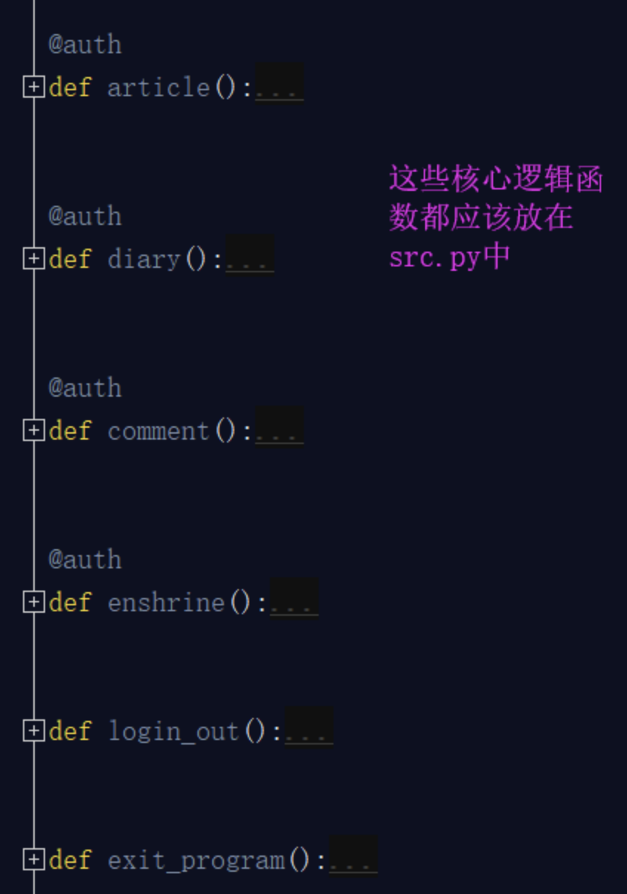

**start.py**:项目启动文件。你的项目需要有专门的文件启动，而不是在你的核心逻辑部分进行启动的，有人对这个可能不太理解，我为什么还要设置一个单独的启动文件呢？你看你生活中使用的所有电器基本都一个单独的启动按钮，汽车，热水器，电视，等等等等，那么为什么他们会单独设置一个启动按钮，而不是在一堆线路板或者内部随便找一个地方开启呢？ 目的就是放在显眼的位置，方便开启。你想想你的项目这么多py文件，如果src文件也有很多，那么到底哪个文件启动整个项目，你还得一个一个去寻找，太麻烦了，这样我把它单独拿出来，就是方便开启整个项目。

那么我们写的项目开启整个项目的代码就是下面这段：

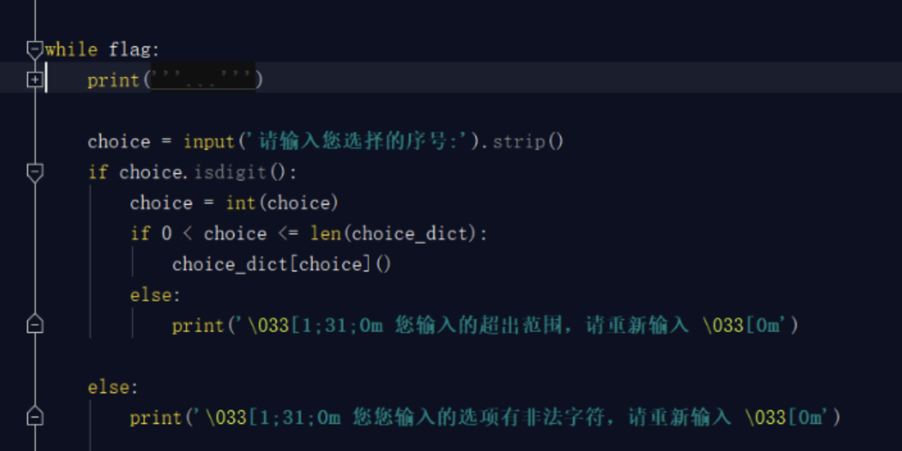

你把这些放置到一个文件中也可以，但是没有必要，我们只需要一个命令或者一个开启指令就行，就好比我们开启电视只需要让人很快的找到那个按钮即可，对于按钮后面的一些复杂的线路板，我们并不关心，所以我们要将上面这个段代码整合成一个函数，开启项目的''按钮''就是此函数的执行即可。


这个按钮要放到启动文件start.py里面。

除了以上这几个py文件之外还有几个文件，也是非常重要的：

**类似于register文件**：这个文件文件名不固定，register只是我们项目中用到的注册表，但是这种文件就是存储数据的文件，类似于**文本数据库**，那么我们一些项目中的数据有的是从数据库中获取的，有些数据就是这种文本数据库中获取的，总之，你的项目中有时会遇到将一些数据存储在文件中，与程序交互的情况，所以我们要单独设置这样的文件。

**log文件**：log文件顾名思义就是存储log日志的文件。日志我们一会就会讲到，日志主要是供开发人员使用。比如你项目中出现一些bug问题，比如开发人员对服务器做的一些操作都会记录到日志中，以便开发者浏览，查询。

至此，我们将这个作业原来的两个文件，合理的划分成了6个文件，但是还是有问题的，如果我们的项目很大，你的每一个部分相应的你一个文件存不下的，比如你的src主逻辑文件，函数很多，你是不是得分成：src1.py src2.py？

你的文本数据库register这个只是一个注册表，如果你还有个人信息表，记录表呢？ 如果是这样，你的整个项目也是非常凌乱的：

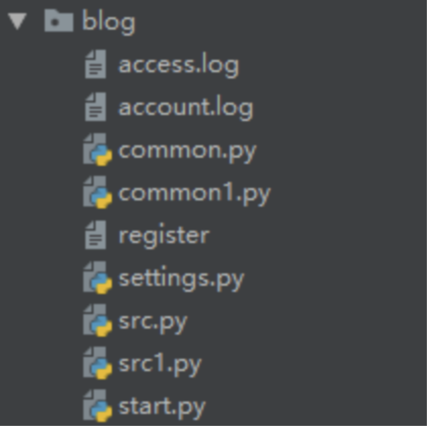

**3. 划分具体目录**

上面看着就非常乱了，那么如何整改呢？ 其实非常简单，原来你就是30件衣服放在一个衣柜里，那么你就得分类装，放外套的地方，放内衣的地方，放佩饰的地方等等，但是突然你的衣服编程300件了，那一个衣柜放不下，我就整多个柜子，分别放置不同的衣物。所以我们这可以整多个文件夹，分别管理不同的物品，那么标准版本的目录结构就来了：

**为什么要设计项目目录结构？**

"设计项目目录结构"，就和"代码编码风格"一样，属于个人风格问题。对于这种风格上的规范，一直都存在两种态度:

1. 一类同学认为，这种个人风格问题"无关紧要"。理由是能让程序work就好，风格问题根本不是问题。
2. 另一类同学认为，规范化能更好的控制程序结构，让程序具有更高的可读性。

我是比较偏向于后者的，因为我是前一类同学思想行为下的直接受害者。我曾经维护过一个非常不好读的项目，其实现的逻辑并不复杂，但是却耗费了我非常长的时间去理解它想表达的意思。从此我个人对于提高项目可读性、可维护性的要求就很高了。"项目目录结构"其实也是属于"可读性和可维护性"的范畴，我们设计一个层次清晰的目录结构，就是为了达到以下两点:

1. 可读性高: 不熟悉这个项目的代码的人，一眼就能看懂目录结构，知道程序启动脚本是哪个，测试目录在哪儿，配置文件在哪儿等等。从而非常快速的了解这个项目。
2. 可维护性高: 定义好组织规则后，维护者就能很明确地知道，新增的哪个文件和代码应该放在什么目录之下。这个好处是，随着时间的推移，代码/配置的规模增加，项目结构不会混乱，仍然能够组织良好。

所以，我认为，保持一个层次清晰的目录结构是有必要的。更何况组织一个良好的工程目录，其实是一件很简单的事儿。


上面那个图片就是较好的目录结构。

#### 按照项目目录结构,规范博客园系统

接下来，我就带领大家把具体的代码写入对应的文件中，并且将此项目启动起来，一定要跟着我的步骤一步一步去执行：

1. **配置start.py文件**

我们首先要配置启动文件，启动文件很简答就是将项目的启动执行放置start.py文件中，运行start.py文件可以成功启动项目即可。 那么项目的启动就是这个指令run() 我们把这个run()放置此文件中不就行了？


这样你能执行这个项目么？肯定是不可以呀，你的starts.py根本就找不到run这个变量，肯定是会报错的。

NameError: name 'run' is not defined 本文件肯定是找不到run这个变量也就是函数名的，不过这个难不倒我们，我们刚学了模块， 另个一文件的内容我们可以引用过来。但是你发现import run 或者 from src import run 都是报错的。为什么呢？ 骚年，遇到报错不要慌！我们说过你的模块之所以可以引用，那是因为你的模块肯定在这个三个地方：内存，内置，sys.path里面，那么core在内存中肯定是没有的，也不是内置，而且sys.path也不可能有，因为sys.path只会将你当前的目录（bin）加载到内存，所以你刚才那么引用肯定是有问题的，那么如何解决？内存，内置你是左右不了的，你只能将core的路径添加到sys.path中，这样就可以了。

```python
import sys
sys.path.append(r'D:\lnh.python\py project\teaching_show\blog\core')
from src import run
run()

```

这样虽然解决了，但是你不觉得有问题么？你现在从这个start文件需要引用src文件，那么你需要手动的将src的工作目录添加到sys.path中，那么有没有可能你会引用到其他的文件？比如你的项目中可能需要引用conf，lib等其他py文件，那么在每次引用之前，或者是开启项目时，全部把他们添加到sys.path中么？

```python
sys.path.append(r'D:\lnh.python\py project\teaching_show\blog\core')
sys.path.append(r'D:\lnh.python\py project\teaching_show\blog\conf')
sys.path.append(r'D:\lnh.python\py project\teaching_show\blog\db')
sys.path.append(r'D:\lnh.python\py project\teaching_show\blog\lib')

```

这样是不是太麻烦了？ 我们应该怎么做？我们应该把项目的工作路径添加到sys.path中，用一个例子说明：你想找张三，李四，王五，赵六等人，这些人全部都在一栋楼比如在汇德商厦，那么我就告诉你汇德商厦的位置：北京昌平区沙河镇汇德商厦。 你到了汇德商厦你在找具体这些人就可以了。所以我们只要将这个blog项目的工作目录添加到sys.path中，这样无论这个项目中的任意一个文件引用项目中哪个文件，就都可以找到了。所以：

```Python
import sys
sys.path.append(r'D:\lnh.python\py project\teaching_show\blog')
from core.src import run
run()

```

上面还是差一点点，你这样写你的blog的路径就写死了，你的项目不可能只在你的电脑上，项目是共同开发的，你的项目肯定会出现在别人电脑上，那么你的路径就是问题了，在你的电脑上你的blog项目的路径是上面所写的，如果移植到别人电脑上，他的路径不可能与你的路径相同， 这样就会报错了，所以我们这个路径要动态获取，不能写死，所以这样就解决了：

```python
import sys
import os
# sys.path.append(r'D:\lnh.python\py project\teaching_show\blog')
print(os.path.dirname(__file__))
# 获取本文件的绝对路径  # D:/lnh.python/py project/teaching_show/blog/bin
print(os.path.dirname(os.path.dirname(__file__)))
# 获取父级目录也就是blog的绝对路径  # D:/lnh.python/py project/teaching_show/blog
BATH_DIR = os.path.dirname(os.path.dirname(__file__))
sys.path.append(BATH_DIR)
from core.src import run
run()

```

那么还差一个小问题，这个starts文件可以当做脚本文件进行直接启动，如果是作为模块，被别人引用的话，按照这么写，也是可以启动整个程序的，这样合理么？这样是不合理的，作为启动文件，是不可以被别人引用启动的，所以我们此时要想到 __name__了：

```python
import sys
import os
# sys.path.append(r'D:\lnh.python\py project\teaching_show\blog')
# print(os.path.dirname(__file__))
# 获取本文件的绝对路径  # D:/lnh.python/py project/teaching_show/blog/bin
# print(os.path.dirname(os.path.dirname(__file__)))
# 获取父级目录也就是blog的绝对路径  # D:/lnh.python/py project/teaching_show/blog
BATH_DIR = os.path.dirname(os.path.dirname(__file__))
sys.path.append(BATH_DIR)
from core.src import run

if __name__ == '__main__':
    run()

```

这样，我们的starts启动文件就已经配置成功了。以后只要我们通过starts文件启动整个程序，它会先将整个项目的工作目录添加到sys.path中，然后在启动程序，这样我整个项目里面的任何的py文件想引用项目中的其他py文件，都是你可以的了。

1. **配置settings.py文件。**

接下来，我们就会将我们项目中的静态路径，数据库的连接设置等等文件放置在settings文件中。

我们看一下，你的主逻辑src中有这样几个变量：

```python
status_dic = {
    'username': None,
    'status': False,
}
flag = True
register_path = r'D:\lnh.python\py project\teaching_show\blog\register'

```

我们是不是应该把这几个变量都放置在settings文件中呢？不是！setttings文件叫做配置文件，其实也叫做配置静态文件，什么叫静态？ 静态就是一般不会轻易改变的，但是对于上面的代码status_dic ，flag这两个变量，由于在使用这个系统时会时长变化，所以不建议将这个两个变量放置在settings配置文件中，只需要将register_path放置进去就可以。

```python
register_path = r'D:\lnh.python\py project\teaching_show\blog\register'

```

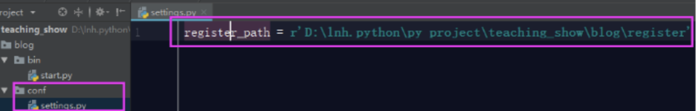

但是你将这个变量放置在settings.py之后，你的程序启动起来是有问题，为什么？

```python
with open(register_path, encoding='utf-8') as f1:
NameError: name 'register_path' is not defined

```

因为主逻辑src中找不到register_path这个路径了，所以会报错，那么我们解决方式就是在src主逻辑中引用settings.py文件中的register_path就可以了。


这里引发一个问题：为什么你这样写就可以直接引用settings文件呢？我们在starts文件中已经说了，刚已启动blog文件时，我们手动将blog的路径添加到sys.path中了，这就意味着，我在整个项目中的任何py文件，都可以引用到blog项目目录下面的任何目录：bin,conf,core,db,lib,log这几个，所以，刚才我们引用settings文件才是可以的。

1. **配置common.py文件**

接下来，我们要配置我们的公共组件文件，在我们这个项目中，装饰器就是公共组件的工具，我们要把装饰器这个工具配置到common.py文件中。先把装饰器代码剪切到common.py文件中。这样直接粘过来，是有各种问题的：


所以我们要在common.py文件中引入src文件的这两个变量。

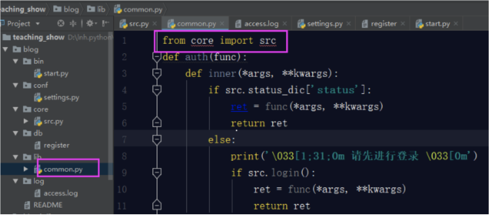

可是你的src文件中使用了auth装饰器，此时你的auth装饰器已经移动位置了，所以你要在src文件中引用auth装饰器，这样才可以使用上


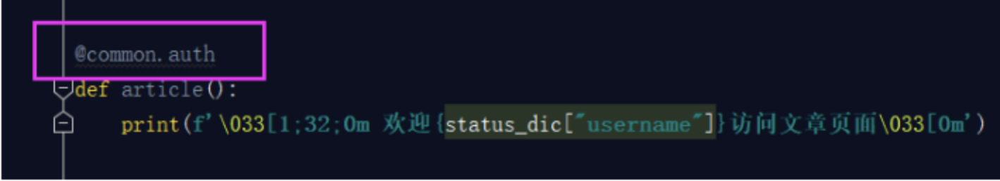

OK，这样你就算是将你之前写的模拟博客园登录的作业按照规范化目录结构合理的完善完成了，最后还有一个关于README文档的书写。

#### 关于README的内容

**这个我觉得是每个项目都应该有的一个文件**，目的是能简要描述该项目的信息，让读者快速了解这个项目。

它需要说明以下几个事项:

1. 软件定位，软件的基本功能。
2. 运行代码的方法: 安装环境、启动命令等。
3. 简要的使用说明。
4. 代码目录结构说明，更详细点可以说明软件的基本原理。
5. 常见问题说明。

我觉得有以上几点是比较好的一个`README`。在软件开发初期，由于开发过程中以上内容可能不明确或者发生变化，并不是一定要在一开始就将所有信息都补全。但是在项目完结的时候，是需要撰写这样的一个文档的。

可以参考Redis源码中[Readme](https://github.com/antirez/redis#what-is-redis)的写法，这里面简洁但是清晰的描述了Redis功能和源码结构。


## 第七章 面向对象


## 进程和多线程

### 多进程

- 程序:是一个指令的集合
- 进程：正在执行的程序；或者说：当你运行一个进程，你就启动了一个进程 
  - 编写完成的代码，没有运行时，称为程序，正在运行的代码，称为进程
  - 程序是死的（静态的），进程是活的（动态的）
- 操作系统轮流让各个任务交替执行，由于CPU的执行速度太快了，我们感觉所有任务就像在同时执行
- 多进程中，每个进程中的所有数据（包括全局变量）都各拥有一份，互不影响。
- 程序开始运行时，首先会创建一个主进程
- 在主进程（父进程）下，我们可以创建新的进程（子进程），子进程依赖于主进程，如果主进程结束，程序会退出。

#### multiprocessing


- python提供了飞航好用的多进程包multiprocessing，借助这个包，可以轻松完成从单进程到并发执行的转换

- multiprocessing模块提供了一个Process类来创建一个进程对象

  ```python
  from multiprocessing import Process
  def run(name):
      print('子进程正在运行，name= %s'%(name))
  if __name__ == '__main__':
      print('父进程启动')
      p = Process(target = run,args = ('test',))
      #target表示调用对象，args表示调用对象的位置参数元组
      #注意：元组中只有一个元素时结尾要加逗号
      print('子进程将要执行')
      p.start()
      print(p.name)
      p.join()
      print('子进程结束')
  
  ```

- ``` python
  if __name__ == '__main__':说明
  '''
  一个python的文件有两种使用的方法，第一是直接作为程序执行，第二是import到其他python程序中被调用（模块重用）执行。
  因此 if __name__ == '__main__':的作用就是控制这两种情况执行代码的过程，__name__是内置变量，用于表示当前模块的名字
  在 if __name__ == '__main__': 下的代码只有在文件作为程序直接执行才会被执行，而import到其他程序中是不会被中的
  在windows上，子进程会自动import启动它的这个文件，而在import的时候是会执行这些语句的。
  如果不加 if __name__ == '__main__': 的话就会无限递归创建子进程
  所以必须把创建子进程的部分用 if判断保护起来
  import的时候__name__不是__main__,就不会递归运行了
  
  
  '''
  
  ```

- Process(target,name,args)

- 参数介绍

  - target表示调用对象，即子进程要执行的任务
  - args表示调用对象的位置参数元组，args = （1，）
  - name为子进程的名称

- Process类常用用法：

  - p.start():启动进程，并调用该子进程中的p.run()
  - p.run():进程启动时运行的方法，正是它去调用target指定的函数，我们自定义类的类中一定要实现该方法
  - p.terminate(): 强行终止进程p，不会进行任何清理操作
  - p.is_alive():如果p仍然运行，返回True，用在判断进程是否还在运行
  - p.join([timeout]):主进程等待p终止，timeout是可选的超时时间

- Process类常用属性：

  - name:当前进程实例别名，默认为Process-N，N为从1开始递增的整数
  - pid：当前进程实例的PID值

- 全局变量在多个进程中不共享：进程之间的数据是独立的，默认情况下互不影响

  ```python
  from multiprocessing import Process
  num = 1
  def run1():
      global num
      num += 5
      print('子进程1运行中，num = %d'%(num))
  def run2():
      global num
      num += 10
      print('子进程2运行中，num = %d'%(num))
  if __name__ == '__main__':
      print('父进程启动')
      p1 = Process(target= run1)
      p2 = Process(target= run2)
      print('子进程将要执行')
      p1.start()
      p2.start()
      p1.join()
      p2.join()
      print('子进程结束')
  
  ```

- 创建新的进程还可以使用类的方式，可以自定义一个类，继承Process类，每次实例化这个类的时候，就等同于实例化一个进程对象

  ```python
  import multiprocessing
  import time
  class ClockProcess(multiprocessing.Process):
      def run(self):
          n = 5
          while n > 0:
              print(n)
              time.sleep(1)
              n -= 1
  if __name__ == '__main__':
      p = ClockProcess()
      p.start()
      p.join()
  
  ```

#### 进程池

- 进程池:用来创建多个进程

- 当需要创建的子进程数量不多时，可以直接利用multiprocessing中的Process动态生成多个进程，但如果是上百个甚至是上千个目标，手动去创建进程的工作量巨大，此时就可以用到multiprocessing模块提供的Pool

- 初始化Pool时，可以指定一个最大进程数，当有新的请求提交到Pool中时，如果池还没有满，那么就会创建一个新的进程用来执行该请求；但如果池中的进程数已经达到指定的最大值，那么该请求就会等待，直到池中有进程结束，才会创建新的进程来执行

  ```python
  from multiprocessing import Pool
  import random,time
  def work(num):
      print(random.random()*num)
      time.sleep(3)
  if __name__ == '__main__':
      po = Pool(3) #定义一个进程池，最大进程数为3，默认大小为CPU核数
      for i in range(10):
          po.apply_async(work,(i,)) # apply_async选择要调用的目标，每次循环会用空出来的子进程去调用目标
      po.close() # 进程池关闭之后不会再接受新的请求
      po.join() # 等待po中所有子进程结束，必须放在close后面
  # 在多进程中，主进程一般用来等待，真正的任务都在子进程中执行
  
  ```

  

- multiprocessing.Pool常用函数解析：

  - apply_async(func[,args[,kwds]]): 使用非阻塞方式调用func（并行执行，阻塞方式必须等待上一个进程退出才能执行下一个进程），args为传递给func的参数列表，kwds为传递给func的关键字参数列表；
  - apply(func[,arg[,kwds]]) ：使用阻塞方式调用func
  - close(): 关闭Pool，使其不再接受新的任务;
  - join(): 主进程阻塞，等待子进程的退出，必须在close或terminate之后使用

### 进程间通信 -Queue

- 多进程之间，默认是不共享数据的

- 通过Queue（队列Q）可以实现进程间的数据传递

- Q本身是一个消息队列

- 如何添加消息（入队操作）:

  ```python
  from multiprocessing import Queue
  q = Queue(3)
  q.put('消息1')
  q.put('消息2')
  q.put('消息3')
  print(q.full())
  
  ```

- 可以使用multiprocessing模块的Queue实现多进程之间的数据传递

- 初始化Queue（）对象时（例如：q = Queue()）,括号中没有指定最大可接收的消息数量，或数量为负值，那么就代表可接收的消息数量没有上限

- Queue.qsize(): 返回当前队列包含的消息数量

- Queue.empty(): 如果队列为空，返回True，反之False

- Queue.full(): 如果队列满了，返回True，反之False

- Queue.get([block,[,timeout]): 获取队列中的一条消息，然后将其从队列中移除，block默认值为True

  - 如果block使⽤默认值， 且没有设置timeout（单位秒） ， 消息列队如果为
    空， 此时程序将被阻塞（停在读取状态） ， 直到从消息列队读到消息为⽌，
    如果设置了timeout， 则会等待timeout秒， 若还没读取到任何消息， 则抛
    出"Queue.Empty"异常 
  - 如果block值为False， 消息列队如果为空， 则会⽴刻抛
    出“Queue.Empty”异常

- •Queue.get_nowait()： 相当Queue.get(False)

- Queue.put(item,[block[, timeout]])： 将item消息写⼊队列， block默认值
  为True

  - 如果block使⽤默认值， 且没有设置timeout（单位秒） ， 消息列队如果已
    经没有空间可写⼊， 此时程序将被阻塞（停在写⼊状态） ， 直到从消息列队
    腾出空间为⽌， 如果设置了True和timeout， 则会等待timeout秒， 若还没空间， 则抛
    出"Queue.Full"异常
  - 如果block值为False， 消息列队如果没有空间可写⼊， 则会⽴刻抛
    出"Queue.Full"异常

  Queue.put_nowait(item)： 相当Queue.put(item, False)； 

- ```python
  from multiprocessing import Queue,Process
  import time
  
  def write(q):
      for value in ['a','b','c']:
          print('开始写入：',value)
          q.put(value)
          time.sleep(1)
  
  
  def read(q):
      while True:
          if not q.empty():
              print('读取到的是：',q.get())
              time.sleep(1)
          else:
              break
  
  if __name__  == '__main__':
      q = Queue()
      pw = Process(target=write,args=(q,))
      pr = Process(target=read, args=(q,))
      pw.start()
      pw.join() #等待接收完毕
      pr.start()
      pr.join()
      print('接收完毕')
  
  ```

- 进程池创建的进程之间通信：如果要使用Pool创建进程，就需要使用multiprocessing.Manager()中的Queue(),而不是multiprocessing.Queue()

- 否则会得到一条如下的错误信息：

  ```python
  RuntimeError: Queue objects should only be shared between processes
   through inheritance.
  
  ```

- ```python
  from multiprocessing import Manager,Pool
  import time
  
  
  def write(q):
      for i in 'welcome':
          print('开始写入',i)
          q.put(i)
  
  def reader(q):
      time.sleep(3)
      for i in range(q.qsize()):
          print('得到消息',q.get())
  
  if __name__ == '__main__':
      print('主进程启动')
      q = Manager().Queue()
      po = Pool()
      po.apply_async(write, (q,))
      po.apply_async(reader, (q,))
      po.close()
      po.join()
  
  ```

### 多线程

- 是操作系统能够进行运算调度的最小单位
- 他包含在进程中
- 是进程中的实际运作单位
- 进程是线程的容器
- 线程：实现多任务的另一种方式
- 一个进程中，也经常需要同时做多件事，就需要同时运行多个’子任务‘，这些子任务，就是线程
- 线程又被称为轻量级进程(lightweight process),是更小的执行单元
  - 一个进程可拥有多个并行的(concurrent)线程，当中每一个线程，共享当前进程的资源
  - 一个进程中的线程共享相同的内存单元/内存地址空间➡可以访问相同的变量和对象，而且它们从同一堆中分配对象➡通信、数据交换、同步操作
  - 由于线程的通信是在同一地址空间上进行的，所以不需要额外的通信机制，这就使得通信更简单而且信息传递的速度也更快

#### 进程和线程的区别

- 进程是系统进行资源分配和调度的一个独立单位

- 进程在执行过程中拥有独立的内存单元，而多个线程共享内存，从而极大的提高了程序的运行效率

- 一个程序至少有一个进程，一个进程至少有一个线程

- 线程是进程的一个实体，是CPU调度和分配的基本单位，它是比进程更小的能独立运行的基本单位

- 线程自己基本上不拥有系统资源，只拥有一点在运行中必不可少的资源，但是它可与同属一个进程的其他线程共享进程所拥有的全部资源

- 线程的划分尺度小于进程（资源比进程少）,使得多进程程序的并发性高

- 线程不能独立执行，必须依存在进程中

- 线程和进程在使用上各有优缺点:线程执行开销小，但不利于资源的管理和保护；而进程正相反

- 一般来讲：我们把进程用来分配资源，线程用来具体执行（CPU调度）

  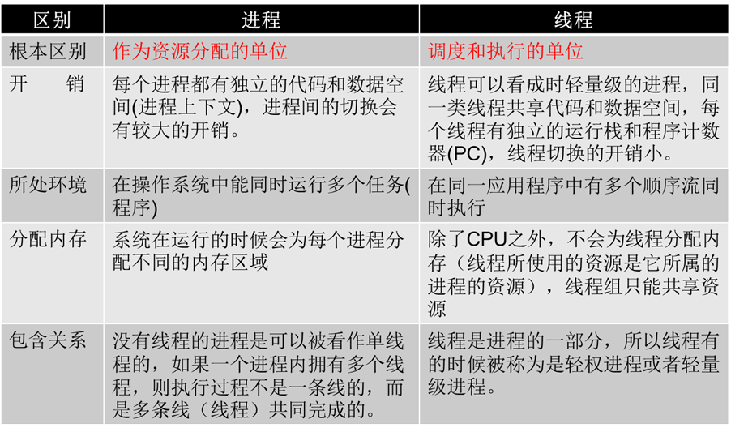

- python的thread模块是比较底层的模块，在各个操作系统中表现形式不同（低级模块）

- python的threading模块是对thread做了一些包装的，可以更加方便的被使用（高级模块）

- thread有一些缺点，在threading得到了弥补，所以我们直接学习threading

  ```python
  import threading
  if __name__ == '__main__':
      #任何进程默认会启动一个线程，这个线程称为主线程，主线程可以启动新的子线程
      #current_thread():范围当前线程的实例
      #.name：当前线程的名称
      print('主线程%s启动'%(threading.current_thread().name))
  
  ```

  ```python
  import threading,time
  
  def saySorry():
      print('子线程程%s启动'%(threading.current_thread().name))
      time.sleep(1)
      print('亲爱的，我错了，我能吃饭了吗？')
  
  if __name__ == '__main__':
      print('主进程%s启动'%(threading.current_thread().name))
      for i in range(5):
          t = threading.Thread(target=saySorry)
          t.start()
  
  ```

#### 查看当前线程数量

```python
import threading
import time

def sing():
    for i in range(3):
        print('正在唱歌。。。%d'%i)
        time.sleep(1)

def dangce():
    for i in range(2):
        print('正在跳舞。。。%d'%i)
        time.sleep(1)

if __name__ == '__main__':
    print('开始：%s'%time.time())
    t1 = threading.Thread(target=sing)
    t2 = threading.Thread(target=dangce)
    t1.start()
    t2.start()

    while True:
        length = len(threading.enumerate())
        # threading.unumerate(): 返回当前运行中的Thread对象列表
        print('当前线程数为：%d'%length)
        if length <= 1:
            break
        time.sleep(1)

```

- 创建多线程的两种方式：

  - 第一：通过 threading.Thread 直接在线程中运行函数；

  - 第二：通过继承 threading.Thread 类来创建线程

  - 这种方法只需要重载 threading.Thread 类的 run 方法，然后调用 start()开启线程就可以了

  - ```python
    import threading
    class MyThread(threading.Thread):
        def run(self):
            for i in range(5):
                print(i)
    if __name__ == "__main__":
        t1 = MyThread()
        t2 = MyThread()
        t1.start()
        t2.start()
    
    
    ```

- ```python
  import threading
  import time
  class MyThread(threading.Thread):
      def run(self):
          for i in range(3):
              time.sleep(1)
              msq = "I`m" + self.name + "@" + str(i)
              #name属性中保存了当前线程的名字
              print(msq)
  if __name__ == "__main__":
      t = MyThread()
      t.start()
  
  
  ```

#### 线程的五种状态

- 1、新状态：线程对象已经创建，还没有在其上调用start()方法。
- 2、可运行状态：当线程有资格运行，但调度程序还没有把它选定为运行线程时线程所处的状态。当start()方法调用时，线程首先进入可运行状态。在线程运行之后或者从阻塞、等待或睡眠状态回来后，也返回到可运行状态。
- 3、运行状态：线程调度程序从可运行池中选择一个线程作为当前线程时线程所处的状态。这也是线程进入运行状态的唯一一种方式。
- 4、等待/阻塞/睡眠状态：这是线程有资格运行时它所处的状态。实际上这个三状态组合为一种，其共同点是：线程仍旧是活的（可运行的），但是当前没有条件运行。但是如果某件事件出现，他可能返回到可运行状态。
- 5、死亡态：当线程的run()方法完成时就认为它死去。这个线程对象也许是活的，但是，它已经不是一个单独执行的线程。线程一旦死亡，就不能复生。如果在一个死去的线程上调用start()方法，会抛出java.lang.IllegalThreadStateException异常。

#### 线程共享全局变量

- 在⼀个进程内的所有线程共享全局变量， 多线程之间的数据共享（这点要⽐多进程要好）

- 缺点就是， 可能造成多个线程同时修改一个变量（即线程⾮安全），可能造成混乱

- ```python
  import threading
  import time
  
  num = 100
  def work1():
      global num
      for i in range(3):
          num += 1
      print("---in work1,num is %d" %num)
  def work2():
      global num
      print("---in work2,num is %d" %num)
      print("---线程创建之前 num is %d" %num)
  t1 = threading.Thread(target=work1)
  t1.start()
  time.sleep(1)
  #延时一会保证线程1中的任务做完
  t2 = threading.Thread(target=work2)
  t2.start()
  
  ```

- ```python
  import threading,time
  def work1(nums):
      nums.append(44)
      print('-----in work1-----' ,nums)
  def work2(nums):
      time.sleep(1)
      #延时一会保证另一线程执行
      print('-----in work2-----', nums)
  
  g_nums = [11,22,33]
  t1 = threading.Thread(target=work1,args=(g_nums,))
  t1.start()
  t2 = threading.Thread(target=work2,args=(g_nums,))
  t2.start()
  
  ```

#### 执行10000000次的bug

- ```python
  import threading
  num = 0
  def test1():
      global num
      for i in range(100):#一百万错误
  	    num += 1
  def test2():
      global num
      for i in range(100):#一百万错误
  	    num += 1
  p1 = threading.Thread(target=test1)
  p1.start()
  p2 = threading.Thread(target=test2)
  p2.start()
  print("---num = %d---" %num)
  
  ```

### 线程同步

- 当多个线程⼏乎同时修改某⼀个共享数据的时候， 需要进⾏同步控制 
- 线程同步能够保证多个线程安全访问竞争资源， 最简单的同步机制是引⼊互
  斥锁 
- 互斥锁保证了每次只有⼀个线程进⾏写⼊操作，从⽽保证了多线程情况下数据的正确性（原子性）
- 互斥锁为资源引入一个状态：锁定/非锁定。某个线程要更改共享数据时，先将其锁定，此时资源的状态为“锁定”，其他线程不能更改；直到该线程释放资源，将资源的状态变成“非锁定”，其他的线程才能再次锁定该资源。互斥锁保证了每次只有一个线程进行写入操作，从而保证了多线程情况下数据的正确性。
- threading模块中定义了Lock类， 可以⽅便的处理锁定 


## 网络编程

### 网络基础

#### ip地址


- 如何在网络中唯一标识一台计算机？-----------ip地址

- 同一台计算机上的多个程序如何共同网络而不冲突？-----网络端口

- 不同的计算机通信怎么才能互相理解？ -------使用相同的协议

- IP地址：用来在网络中标记一台电脑的一串数字，比如192.168.1.1（c类）；在同一网络上是唯一的（用来标记唯一的一台电脑）

- 每一个IP地址包括两部分：网络地址和主机地址

- 主机号0，255两个数不能使用（网络号，广播地址）

  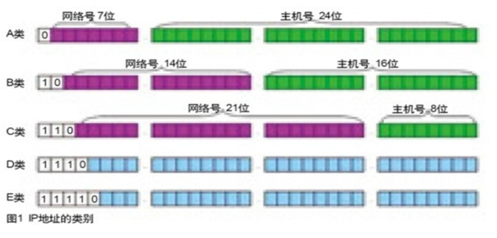

- A类IP地址由1字节的网络地址和3字节的主机地址组成，网络地址的最高位必须是’0‘，地址范围1.0.0.1—126.255.255.254 可用的A类网络有126个，每个网络能容纳1677214个主机

- B类IP地址由2个字节的⽹络地址和2个字节的主机地址组成， ⽹络地址的最⾼位必须是“10”，地址范围128.1.0.1-191.255.255.254 可⽤的B类⽹络有16384个， 每个⽹络能容纳65534主机

- C类IP地址由3字节的⽹络地址和1字节的主机地址组成， ⽹络地址的最⾼位必须是“110”范围192.0.1.1-223.255.255.254  C类⽹络可达2097152个， 每个⽹络能容纳254个主机

- D类IP地址第⼀个字节以“1110”开始， 它是⼀个专⻔保留的地址。它并不指向特定的⽹络， ⽬前这⼀类地址被⽤在多点⼴播（一对多） 中多点⼴播地址⽤来⼀次寻址⼀组计算机 地址范围224.0.0.1-239.255.255.254

- E类IP地址以“1111”开始， 为将来使⽤保留 E类地址保留， 仅作实验和开发用

- 私有IP:本地局域网上的IP,专门为组织机构内部使用

- 在这么多网络IP中，国际规定有一部分IP地址是用于我们的局域网使用，属于私网IP,不在公网中使用，它们的范围是：

  - 10.0.0.0~10.255.255.255
  - 172.16.0.0~172.31.255.255
  - 192.168.0.0~192.168.255.255
  - 私有IP：局域网通信，内部访问，不能在外网公用。私有IP禁止出现在internet中，来自于私有IP的流量全部都会阻止并丢掉
  - 公有IP：全球访问

- IP地址 127.0.0.1 用于回路测试

  - 测试当前计算机的网络通信协议
  - 如：127.0.0.1可以代表本机IP地址，用 http://127.0.0.1 就可以测试本机配置的web服务器
  - 常用来ping：127.0.0.1来看本地ip/tcp正不正常，如能ping通即可正常使用

- 子网掩码：是我们测量两个IP是否属于同一个网段的工具

  - 子网掩码不能单独存在，他必须结合IP地址一起使用
  - 子网掩码只有一个作用，就是将某个IP地址划分为网络地址和主机地址两部分
  - 子网掩码的设定必须遵循一定的规则：
    - 与IP地址相同，子网掩码的长度也是32位
    - 左边是网络位，用二进制数字’1‘表示
    - 右边是主机位，用二进制数字’2‘表示
  - 假设IP地址位’192.168.1.1‘ 子网掩码为’255.255.255.0'  其中‘1’有24个，代表于此相对应的IP地址左边24位是网络号；‘0’有8个，代表与此相对应的IP地址右边是主机号

#### 端口号

- 端口号：用来标记区分进程

- 一台拥有IP地址的主机可以提供许多服务，比如HTTP（万维网服务）、FTP(文件传输)、SMTP(电子邮件) 等，这些服务完全可以通过一个IP地址来实现。那么主机是怎样区分不同的网络服务呢

- 显然不能只靠IP地址，因为IP地址与网络服务的关系是一对多的关系。实际上是通过‘ip地址+端口号‘来区分不同的服务的。

  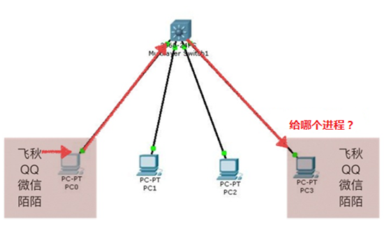

- 端口号是一个数字，只有整数，范围是从0到65535 （分为知名和动态两种）

- 知名端口是众所周知的端口号（用来做固定事情），范围从0到1023

  - 80端口分配给HTTP服务（网站）
  - 21端口分配给FTP服务（文件下载）
  - 可以理解为，一些常用的功能使用的号码是固定的

- 动态端口的范围是从1024到65535

  之所以称为动态端口 ，是因为它一般不固定分配某种服务，而是动态分配。动态分配是指当一个系统进程或应用程序进程需要网络通信时，它向主机申请一个端口，主机从可用端口号中分配一个供它使用

#### 协议


- 协议：约定好的规范

- 早期的计算机网络，都是由各厂商自己规定一套协议，IBM、Apple和Microsoft都有各自的网络协议，互不兼容（语言、方言、阿帕网）

  为了能把全世界的所有不同类型的计算机都连接起来，就必须规定一套全球通用的协议，为了实现互联网这个目标，互联网协议簇（Internet Protocol Suite）就是通用协议标准。

  因为互联网协议包含了上百种协议标准，但是最重要的两个协议是TCP/IP/协议，所以，大家把互联网的协议总称TCP/IP协议 （大家都遵循的最基本网络通信协议）

- 是完成进程之间通信的规范

- 根据TCP/IP协议簇功能的不同，将他们分为了几种层次（TCP/IP协议簇层次划分）（重点记住）

  - 写代码按四层划分
    - 网络接口层（链路层）
    - 网络层
    - 传输层
    - 应用层
  - 理论上是由七层组曾
    - 物理层
    - 数据链路层
    - 网络层
    - 传输层
    - 会话层
    - 表示层
    - 应用层

  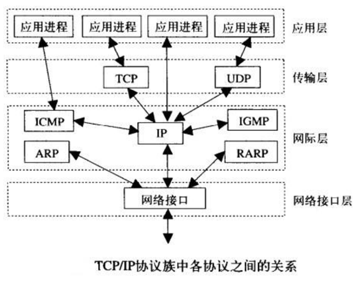

- 在早期，不同的公司都推出了属于自己的私有网络协议，相互之间不能兼容

- 于是，ISO（国际标准化组织）站出来：干脆这样，我给大家制定一个通用的网络通信协议，该协议是国际标准

- 于是ISO博览众家之长，制定了’一堆‘详细的，复杂的，繁琐的，精确的网络通信协议

- 不过这堆协议太复杂了，为了理清思路，便于学习，将他们分为了7类（也就是分了7层），不同层代表不同的供能，并把这些协议归到相应的层里面去

- 国际标准出来了，接下来就是要软件/硬件厂商去实现了。但实际上各厂商并没有完整实现7层协议，因为7层协议栈追求全能、完善、导致它太过复杂，实现起来太难了

- 于是，实际使用时，按4层划分（5层划分非官方）

- 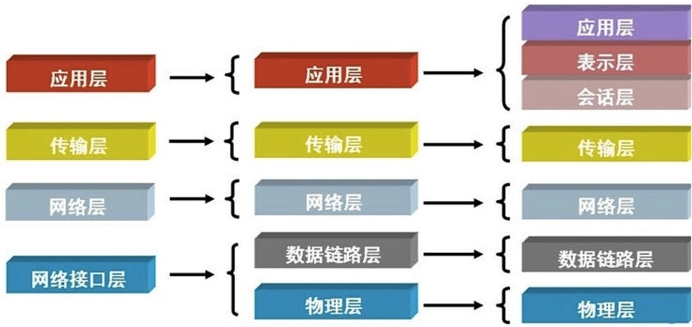

- OSI七层协议，是英文Open System Interconnect的缩写，中文翻译开放系统互联

- TCP/IP定义了电子设备如何接入因特网，以及数据如何在它们之间传输的标准

- 4层的层级结构中，每一层都呼叫它的下一层所提供的网络来完成自己的需求

- 其中的应用层关注的是应用程序的细节，而不是数据在网络中的传输活动

  其他三层主要处理所有的通信细节，对应用程序一无所知：

  - 应用层：应用程序间沟通的层，不同的文件系统有不同的文件命名原则和不同的文本行表示方法等，不同的系统之间传输文件还有各种不兼容问题，这些都将由应用层来处理
  - 传输层：在此层中，它提供了节点间的数据传送服务，如传输控制协议（TCP）、用户数据报协议（UDP）等，这一层负责传送数据，并且确定数据已被送达并接收
  - 网络层：负责提供基本的数据包传送功能，让每一块数据包都能够到达目的主机。网络层接收由更低层发来的数据包，并把该数据包发送到更高层，相反，IP层也把从TCP或UDP层接收来的数据包传送到更低层
  - 网络接口层：对实际的网络媒体的管理，定义如何使用实际网络来传送数据（处理机械的、电气的和过程的接口）

### Socket编程

#### 简介

- Socket：通过网络完成进程间通信的方式（区别于一台计算机之间进程通信）

- Socket的英文愿义是’插孔’。通常也称作‘套接字’

  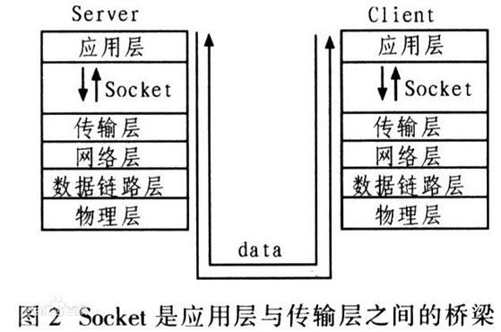

- Socket本质是编程接口（API）：Socket是对TCP/IP协议的封装，Socket只是个编程接口不是协议，通过Socket我们才能使用TCP/IP协议簇（程序员层面）

- TCP/IP也要提供可供程序员做网络开发所用的接口，这就是Socket编程接口：HTTP是轿车，提供了封装或者显示数据的具体形式；Socket是发动机，提供了网络通信的能力

- 最重要的是，Socket是面向客户/服务器模型而设计的，针对客户和服务器程序提供不同的Socket系统调用

- 套接字之间的连接过程可分为三个步骤：服务器监听，客户端请求，连接确认

- 创建Socket：

  ```python
  import socket
  #导入套接字模块
  s = socket.socket(socket.AF_INET, socket.SOCK_STREAM)
  #s此时是一个socket对象，拥有发送和接收网络数据的功能
  
  
  ```

  - 该函数带有两个参数（参数必须写）

    - AF_INET（ipv4协议⽤于 Internet 进程间通信）

    - 套接字类型， 可以是 SOCK_STREAM（流式套接字， ⽤于
      TCP 协议） 或者 SOCK_DGRAM（数据报套接字， ⽤于 UDP 协
      议） 

      - TCP慢但是稳定不会丢数据

      - UDP快但是可能会丢数据（黑客攻击）

  - 确定了IP地址端口号（ipv4协议），TCP或UDP协议之后，计算机之间可以进行通信

#### UDP和TCP

- UDP --- User Data Protocol，用户数据报协议，是⼀个⽆连接的简单的⾯向数据报的传输层协议。 UDP不提供可靠性， 它只是把应⽤程序传给IP层的数据报发送出去， 但是并不能保证它们能到达⽬的地。 由于UDP在传输数据报前不⽤在客户和服务器之间建⽴⼀个连接， 且没有超时重发等机制，故而传输速度很快

- UDP⼀般⽤于多点通信和实时的数据业务， ⽐如：

  - 语⾳⼴播
    视频
    QQ
    TFTP(简单⽂件传送）

  - 可以理解为写信

- TCP（Transmission Control Protocol，传输控制协议）是面向连接的协议，也就是说，在收发数据前，必须和对方建立可靠的连接

- 一个TCP连接必须要经过三次“对话”才能建立起来，其中的过程非常复杂，只简单的描述下这三次对话的简单过程：

  - 主机A向主机B发出连接请求数据包：“我想给你发数据，可以吗？”，这是第一次对话

  - 主机B向主机A发送同意连接和要求同步（同步就是两台主机一个在发送，一个在接收，协调工作）的数据包：“可以，你什么时候发？”，这是第二次对话

  - 主机A再发出一个数据包确认主机B的要求同步：“我现在就发，你接着吧！”，这是第三次对话

  - 三次“对话”的目的是使数据包的发送和接收同步，经过三次“对话”之后，主机A才向主机B正式发送数据
  - 可以理解为打电话，先建立通道

- TCP与UDP的区别：
  - 基于连接与无连接
  - 对系统资源的要求（TCP较多，UDP少）
  - UDP程序结构较为简单
  - 流模式与数据报模式
  - TCP保证数据正确性，UDP可能丢包，TCP保证数据顺序，UDP不保证

##### UDP编程

- 发送数据：为看到效果先安装‘网络调试助手’

  ```python
  from socket import *
  s = socket(AF_INET, SOCK_DGRAM) #创建套接字
  addr = ('192.168.1.17', 8080) #准备接收方地址
  data = input("请输入：")
  s.sendto(data.encode(),addr)
  #发送数据时，python3需要将字符串转成byte
  #encode(‘utf-8’)# 用utf-8对数据进行编码，获得bytes类型对象
  #decode（）反过来
  s.close()
  
  ```

- 发送数据给飞秋

  飞秋使用 2425端口

  发送普通数据，飞秋不会响应，必须发送特殊格式的内容

  1:123123:吴彦祖:吴彦祖-pc:32:haha
   飞秋有自己的应用层协议

  - 1表示版本

  - 后边的数字发送的时间，随便写

  - 32代表发送消息

  - 飞秋炸弹：循环不延时发消息（可能会造成卡死）

    注意：IP和端口在网络通信中缺一不可，用到的协议也要匹配，例如飞秋用的是udp协议，使用TCP协议发数据是无效的

    udp理解为写信（只有收件人地址），TCP理解为打电话（先拨号建立通路，需要通路稳定）

- 接收数据

  ```python
  from socket import *
  s = socket(AF_INET, SOCK_DGRAM) #创建套接字
  s.bind(('', 8788))
  addr = ('192.168.1.17', 8080) #准备接收方地址
  data = input("请输入：")
  s.sendto(data.encode(),addr)
  #等待接收数据
  redata = s.recvfrom(1024)
  #1024表示本次接收的最大字节数
  print(redata)
  s.close()
  
  ```

  

- 绑定信息：

  如果信息没有绑定，每发送一次信息，系统会随机分配一个端口

  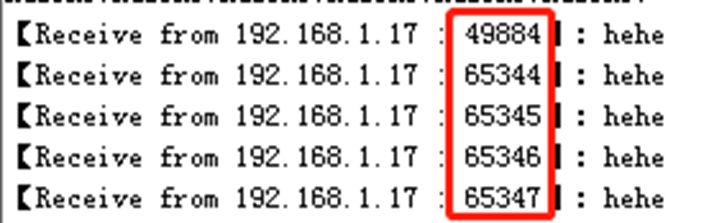

- 还要避免同一台计算机上的不同进程端口号相同的问题

  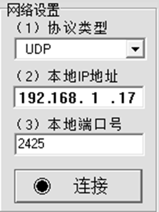

  

- 绑定信息：让一个进程可以使用固定的端口

- 一般情况下，发送方不绑定端口，接收方会绑定

  ```python
  from socket import *
  s = socket(AF_INET, SOCK_DGRAM) #创建套接字
  s.bind(('', 8788))   #绑定一个端口，ip地址和端⼝号，ip⼀般不⽤写
  addr = ('192.168.1.17', 8080)   #准备接收方地址
  data = input("请输入：")
  s.sendto(data.encode(),addr)
  redata = s.recvfrom(1024) #1024表示本次接收的最⼤字节数
  print(redata)
  s.close()
  
  ```

- echo服务器：echo服务是一种非常有用的用于调试和检验的工具，这个协议的作用也十分简单，接收到什么原封发回

  ```python
  from socket import *
  #创建套接字
  udpSocket = socket(AF_INET,SOCK_DGRAM)
  #绑定本地信息，不使用随机分配的端口
  binAddr = ('',7088)
  udpSocket.bind(binAddr)
  num = 0
  while True:
      #接收对方发送的数据
      recvData = udpSocket.recvfrom(1024)
      print(recvData)
      #将接收到的数据发回给对方
      udpSocket.sendto(recvData[0],recvData[1])
      num += 1
      print('已将接收到的第%d个数据返回给对方,'%num)
  udpSocket.close()
  
  ```

- 聊天室

  ```python
  from socket import *
  import time
  #1创建套接字
  udpSocket = socket(AF_INET, SOCK_DGRAM)
  bindAddr = ("",7088)
  udpSocket.bind(bindAddr)#绑定
  while True:
      #接收对方发送的数据
      recvData = udpSocket.recvfrom(1024)
      print('【%s】 %s.%s' %(time.ctime(),recvData[1],recvData[0].decode("GB2312")))
      a = input("请输入：")
      udpSocket.sendto(a.encode('GB2312'),('192.168.1.17',8080))
  #5关闭套接字
  udpSocket.close()
  
  ```

- udp网络通信过程：（类似于发快递）

  - 应用层编写数据（你好），然后向下层传递
  - 传输层在数据前面加上端口号（包括发送端口和目的端口）
  - 网络层继续在前面加上IP地址（包括原IP和目的IP）
  - 链路层再在前面加上MAC地址（MAC:硬件地址，用于定义网络设备的位置）

  此时数据变成了：MAC地址 IP地址 端口号 数据内容

  之后通过网络传输给另一台计算机的链路层开始逐步解析判断

- 练习：使用多线程完成一个全双工的聊天程序

  - 全双工（Full Duplex）是通讯传输的一个术语。通信允许数据在两个方向上同时传输（电话）
  - 单工只是允许甲方向乙方传送信息，而乙方不能向甲方传送（收音机）
  - 半双工：甲方发消息时乙方只能收不能发（对讲机）

#### 字符集

- ASCII

  英文字符集 1个字节

- ISO8859-1

  西欧字符集 1个字节

- BIG5

  台湾的大五码，表示繁体汉字 2个字节

- GB2312

  大陆使用最早、最广的简体中文字符集 2个字节

- GBK

  GB2312的扩展，可以表示繁体中文 2个字节

- GB18030

  最新GBK的扩展，可以表示汉字、维吾尔文、藏文等中华民族字符 2个字节

- Unicode

  国际通用字符集 2个字节

#### TFTP客户端

- TFTP（Trivial File Transfer Protocol,简单⽂件传输协议）是TCP/IP协议簇中的⼀个⽤来在客户端与服务器之间进⾏简单⽂件传输的协议
  - 使用TFTP这个协议，就可以实现简单文件的下载
- 特点：
  - 简单
  - 占⽤资源小
  - 适合传递小文件
  - 适合在局域网进行传递
  - 端口号为69
  - 基于UDP实现


## 数据库

### 数据库的相关概念

#### 数据


- 数据：是描述事物的一种符号
  - 数据就是数值，是指对客观事件（客观事物）进行观察的结果
  - 是对客观事物的性质，状态以及相互关系等进行记载的符号或这些符号的组合
  - 它是可以进行记录并可以借鉴别的符号，是对客观事物的逻辑归纳
- 表现形式多样：文本、图形、音视频（都是二进制）
  - 数据有很多种，最简单的就是数字
  - 数据也可以是文字、图像、声音等
  - 

#### 数据库（DataBase/DB）

- 数据库（DataBase，简称DB）:存放数据的仓库（文件夹）

  - 数据按照一定的格式存放在计算机中，可为用户共享
  - 方便存储、快速查找

- 数据库管理系统（DataBase Management System 简称DBMS）

  - 科学的组织和存储数据
  - 是一种操纵和管理数据库的大型软件，用于建立、使用和维护数据库
  - 它对数据库进行统一的管理和控制，以保证那个数据库的安全性和完整性
  - 用户通过DBMS访问数据库中的数据，数据库管理员也通过DBMS进行数据库的维护工作
  - 有oracle、MySQL、SQL Server等等
    - mysql主要用于大型门户，例如搜狗、新浪等，它主要的优势就是开放源代码，因为开放源代码这个数据库是免费的，他现在是甲骨文公司的产品。（官网下载，有些大公司会做二次封装用自己的）
    - oracle主要用于银行、铁路、飞机场等。该数据库功能强大（规避很多风险），软件费用高。也是甲骨文公司的产品
    - sql server是微软公司的产品，主要应用于大中型企业，如联想、方正等（使用较少）

- 数据库应用程序（DBAS）

  - 在数据库管理系统的基础上，使用数据库管理系统的语法，直接面对最终稿用户的应用程序
  - 图书管理系统、人事管理系统等等

- 数据库管理员（DBA）

  - 数据库管理系统的操作者

- 最终用户

- 数据库应用程序的使用者

- 数据库系统（DBS）

  - 数据库 + 数据库管理系统 + 数据库应用程序 + 数据库管理员 + 最终用户

    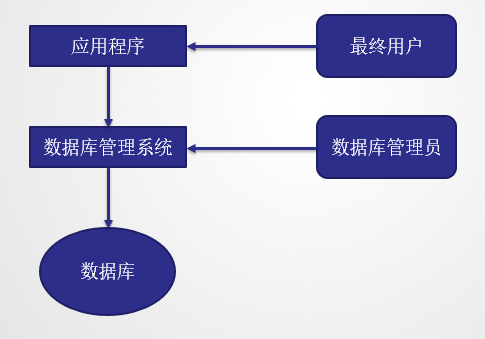

#### 数据库的好处

- 程序稳定性：任意一台服务器所在的机器崩溃了都不会影响数据和另外的服务（备份）
- 数据一致性：所有的数据都存储在一起，所有的程序操作的数据都是统一的，就不会出现数据不一致的现象
- 并发:数据库可以良好的支持并发，所有的程序操作数据库都是通过网络，而数据库本身支持并发的网络操作，不需要我们自己写socket
- 效率：使用数据库对数据进行增删改查的效率要高出我们自己处理文件很多

#### 总结

- 数据库服务器：一台计算机运行数据库管理软件
- 数据库管理软件：管理-数据库
- 数据库：即文件夹，用来组织文件/表
- 表：即文件，用来存放多行内容/多条记录

### MySQL

- MySQL:是一个应用广泛、免费、开源的关系型数据库管理系统
  - 关系型数据库需要有表结构
    - 关系型数据库最典型的数据结构是表，由二维表及其之间的联系所组成的一个数据组织
  - 优点：
    - 易于维护：都是使用表结构，格式一致
    - 使用方便：SQL语言通用，可用于复杂查询
    - 复杂操作：支持SQL、可用于一个表以及多个表之间非常复杂的查询
  - 缺点：
    - 读写性能比较差，尤其是海量数据的高效率读写
    - 固定的表结构，灵活度稍欠
    - 高并发读写需求，传统关系型数据库来说，硬盘I/O是一个很大的瓶颈

### MySQL操作

- 登录管理员用户：

  ```mysql
  mysql -uroot -p 
  
  ```

- 远程登录MySQL服务器：

  ```mysql
  mysql -uroot -p123 -h+ip地址
  
  ```

- 查看当前用户：

  ```mysql
  select user();
  
  ```

- 退出：

  ```mysql
  exit;
  
  ```

- 给当前账户设置密码（必须以管理员登录）：

  ```mysql
  set password = password('123')
  
  ```

- 创建一个其他用户：

  ```mysql
  mysql> create user 'shang'@'192.168.10.%'   IDENTIFIED BY '123'; #指定网段密码
  mysql> create user 'shang'@'192.168.10.5'  # 指示某机器可以连接
  mysql> create user 'shang'@'%'   #指示所有机器都可以连接
  
  
  ```

- 给一个用户授权：

  ```mysql
  grant 权限类型 on 数据库名称.*(或表名) to 'shang'@'%';
  
  - all 所有权限
  - select 查
  - select，insert 查和写
  
  mysql> flush privileges;    # 刷新使授权立即生效（万一没有立即生效）
  
  
  
  ```

- 创建账号并授权

  ```mysql
  grant all on 数据库名称 .* to 'alex'@'%' identified by '123'
  
  
  ```

  

### SQL

- SQL:结构化查询语言，是一种特殊的编程语言（4代）

  - 是用于访问和处理数据库的标准化的计算机语言
  - 用于存取数据以及查询、更新、管理关系数据库系统
  - 1986年10月，美国国家标准协会（AESC）对SQL进行规范后，以此作为关系式数据库管理系统的标准语言
  - 不过各种通行的数据库系统在其实实践过程中都对SQL规范做了某些编改和扩充。所以实际上不同数据库系统之间的SQL不能完全相互通用
  - 针对不同的数据库，如hivesq, mysql, sqlserver, oracle等，sql语法会有所不同，但是总体上大同小异

- SQL的作用：使我们有能力访问数据库，需要在数据库上执行的大部分工作都由 SQL 语句完成

  - SQL 面向数据库执行查询
  - SQL 可从数据库取回数据
  - SQL 可在数据库中插入新的记录
  - SQL 可更新数据库中的数据
  - SQL 可从数据库删除记录
  - SQL 可创建新数据库
  - SQL 可在数据库中创建新表
  - SQL 可在数据库中创建存储过程
  - SQL 可在数据库中创建视图
  - SQL 可以设置表、存储过程和视图的权限

- SQL语言的5个部分（重要性从高到低）：

  - 数据查询语言（DQL:Data Query Language）：select

  - 其语句，也称为“数据检索语句”，用以从表中获得数据，确定数据怎样在应用程序给出

  - 数据操作语言（DML：Data Manipulation Language）：inster,updata,delete

  - 其语句包括动词INSERT，UPDATE和DELETE。它们分别用于添加，修改和删除表中的行。也称为动作查询语言

  - 数据定义语言（DDL）：create,alter,drop

  - 在数据库中创建新表或删除表；为表加入索引等

  - 数据控制语言（DCL）：grant,revoke

  - 它的语句确定单个用户和用户组对数据库对象的访问

  - 事务处理语言（TPL）：

  - 它的语句能确保被DML语句影响的表的所有行及时得以更新

  - 前三个部分必须掌握，后两个部分可以现用现查

  - 同时注意：**SQL** **对大小写不敏感**

    

- 数据库操作（DDL）:

  - 创建数据库：
    - CREATE DATABASE 数据库名称；
      - CREATE DATABASE test101 CHARSET=utf8;
  - 删除数据库：
    - DROP DATABASE 数据库名称；
  - 切换数据库：
    - USE 数据库名称 ;

  - 显示所有数据库：
    - USE 数据库名称;

  - 查看当前选择的数据库
    - 

  - -- 代表注释

- 表的概念：

  - 在操作数据时，多部份数据应以表的形式存储

  - 例如一个学生管理系统：在一个数据库中将信息分类；学生信息、成绩、考勤记录、教师信息等 分别存放在不同的表中

  - 创建表：

    ```mysql
    CREATE TABLE t_person(    
    id INT PRIMARY KEY,         int代表数据类型
    NAME VARCHAR(32)         字段名 数据类型
    )
    
    
    ```

    数据类型（常用）：

    数字：int , decimal（小数）

    字符串：varchar，char

    日期：datatime（日期加时分秒）

- char与varchar:

  - char与varchar后面接的数据大小为存储的字符数，而不是字节数（MySQL4.1之后）
  - char定义的是固定长度，长度范围为0-255，存储时，如果字符数没有达到定义的位数，会在后面用空格补全存入数据库中
  - varchar是变长长度，长度范围为0-65535，存储时，如果字符没有达到定义的位数，也不会在后面补空格

- 显示所有的表：

  - SHOW TABLES;

- 修改表（列）：

  - ALTER TABLE t_person ADD age INT;

  - 格式：

    - alter table 表名 add（增加列）列名 类型
      - ALTER TABLE t_person ADD age INT;

    - change（修改列名和数据类型）
      - ALTER TABLE t_person CHANGE age age_num VARCHAR(10);

    - drop（删除列）
      - ALTER TABLE t_person DROP ageNum;

    - modify（修改列的数据类型）
      - ALTER TABLE t_person MODIFY age VARCHAR(10);

- 查看表结构：

  DESC t_person;

- 删除表： 

  DROP TABLE t_person;

- 更改表名称：

  RENAME TABLE t_person TO t_user;

- 查看表的创建语句：

  SHOW CREATE TABLE t_person;

- 在表中放数据：

  - 查询表的信息（后面详细讲）
    - SELECT * FROM t_person;
    - select代表查询 * 代表查询表中所有信息 from 在哪查
  - 增加数据
    - INSERT INTO t_person VALUES('刘备'，'蜀国')；
    - 注意：在表中增加的数据，必须与表中的列对应
    - 另一种写法：INSERT INTO t_person(NAME,country) VALUES('曹操','魏国')
    - 当列数比较多时，可以用上面的方法指定列名选择性增加，顺序必须一一对应
    - 连续添加：INSERT INTO t_person VALUE('孙权','吴国'),('小乔','吴国')；
    - 后面的括号可以有任意个

- 修改数据：

  - UPDATE t_person SET NAME = '大乔' WHERE country = '蜀国'

    - update代表更新后面表中的值，把name改变为‘大乔’

    - where代表从contry = ‘蜀国’的更新

    - 更好的方式是我们在表中添加一个列叫做‘id’，每一行都有不同的id，之后通过id去修改相应的数据

  - 删除数据：

    - DELETE FROM t_person WHERE id = 1
    - 如果不加where,   DELETE FROM t_person;会删除所有表中的内容

- 数据的备份与恢复：

  - 数据库中的数据是非常宝贵的，尤其是已经上线的项目
  - 在维护和操作时，一定要先备份一份，之后再去操作数据库

- 数据库可能会遭遇各种各样的不测从而导致数据丢失，大概分为以下几种：

  - 硬件故障
  - 软件故障
  - 自然灾害
  - 黑客攻击
  - 误操作（占比最大）

- 数据备份

  - 1，在MySQL的bin目录中打开命令窗口（bin目录中才有复制的命令）

  - 2，输入：

    ```mysql
    mysqldump –uroot –p test101 > C :\t1.sql  （如果有警告可以忽略）
    
    ```

- 数据恢复

  - 连接MySQL，创建数据库

  - 在MySQL的bin目录中打开命令窗口

  - 输入：

    ```mysql
    mysql –uroot –p 数据库名 < d:\t1.sql
    
    
    ```

    

### 数据类型

#### 整数

- MySQL支持所有标准SQL数值数据类型：

  - 关键字INT是INTEGER的同义词，m表示该数据类型指定的显示宽度，指定能够显示的数值中数字的个数。比如说，定义：year int(4),声明一个只显示4位数字宽度表示年的字段

  - 显示宽度和数据类型的取值范围是无关的（int unsigned）

    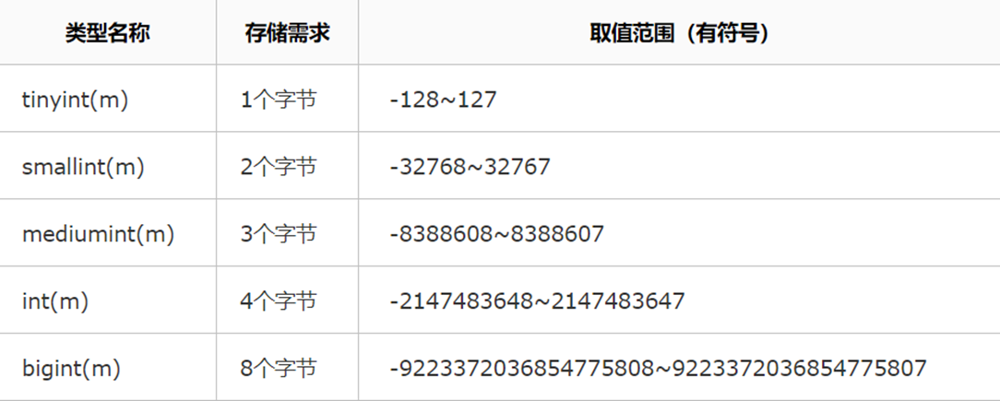

#### 小数

- 关键字DEC是DECIMAL的同义词

- MySQL中使用浮点数和定点数来表示小数。它们都可以用（m，n）来表示，其中m称为精度，表示总共的位数；n称为标度，是表示小数的位数（四舍五入）

  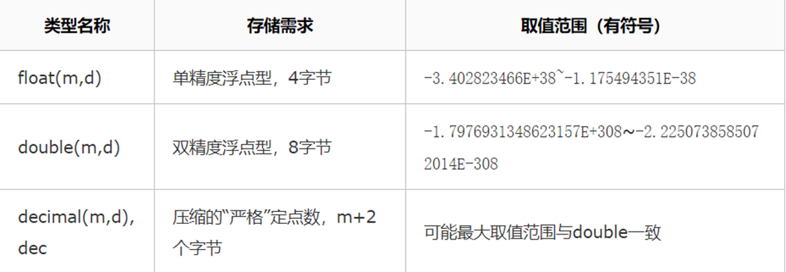

#### 日期

- date 20190101（格式要求严格，差一位都不行）

- 如果定义了timestamp 不能为空置，默认为当前时间（不常用）

- 插入值时 values （now（））代表当前时间

  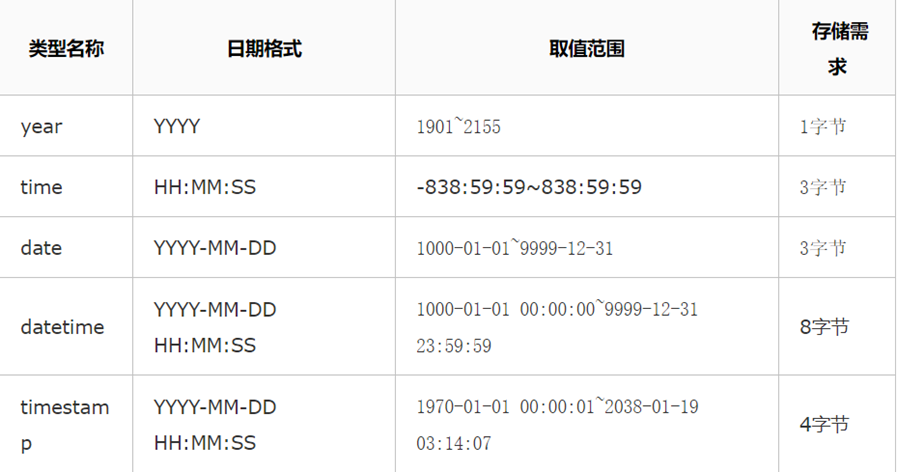

  ```mysql
  create table t_5(
      dt datetime not null
      default current_timestamp
  on update current_timestamp)
  
  ```

#### 字符串

- char(18) 最多255个字符
  - 定长储存，浪费空间，范围小，节省时间
  - 不足时位数补空格（查询时不显示空格 ）
- varchar(18) 最多7=65535个字符
  - 变长存储，节省空间，范围大，存取速度慢
- char适合：身份证号/手机号/QQ号用户名密码等经常做查询的
- varchar适合：评论，朋友圈，微博等查询频率不高的

#### 枚举/集合

- enum 单选行为（枚举）
  - 例如建表时定义字段
    - 性别enum（‘男’，‘女’）
- set 多选行为（集合）
  - 例如建表时定义字段
    - 爱好 set（‘游泳’，‘篮球’，‘下棋’，‘音乐’，‘旅游’）
    - insert时会自动去重和去掉不存在的

### 主键

- 表中每一行都应该具有可以标识自己的一列（或一组列）
- 而这个承担标识作用的列称为主键。
  - 如果没有主键，数据的管理将会十分混乱。比如会存在多条一摸一样的记录，删除和修改特定行十分困难
- 任何列都可以作为主键，主要它满足以下条件：
  - 任何两行都不具有相同的主键值（唯一）
  - 每个行都必须具有一个主键值（不能为空）
  - 主键列的值不允许进行修改和更新

#### 设置主键

```mysql
-- 创建数据库
CREATE DATABASE test2;
-- 显示数据库列表
SHOW DATABASES;
--使用数据库
USE test2; 
-- 创建表之后设置主键：
CREATE TABLE t1(
   id INT NOT NULL,
   NAME CHAR(20)
);
ALTER TABLE t1 ADD PRIMARY KEY (id);


```

```mysql
-- 创建时就带有主键的
CREATE TABLE t2(
   id int primary key,
   name char(20)
); 


```

```mysql
-- 自动更新的主键
CREATE TABLE t_user(
id INT PRIMARY KEY AUTO_INCREMENT,
-- id  你自己起的字段名字。
-- int  数据类型，整型。
-- primary key 定义这个字段为主键。
-- auto_increment 定义这个字段为自动增长，即如果INSERT时不赋值，则自动加1
uname VARCHAR(32) )；
-- 添加信息
INSERT INTO t_user(uname) VALUES('吕布')
-- 查看
SELECT * FROM t_user;


```

### select查询


```mysql
select查询： 
CREATE TABLE t_user(
id INT PRIMARY KEY AUTO_INCREMENT,
uname VARCHAR(32),
age INT,
country VARCHAR(10)
);
INSERT INTO t_user(uname) VALUES('吕布')
...
-- 查询一个表中的所有数据(所有列)
SELECT * FROM t_user;
-- 查询某一列
SELECT uname FROM t_user;

-- 查询某几列
SELECT uname,country,age FROM t_user;
修改select后面字段的顺序可以修改显示结果的顺序

-- 查询某几列，并且所有人年龄增加50（使用算数表达式）
SELECT uname,country,age+50 FROM t_user;

-- 修改列名的显示（起别名）注意不要用关键字，as可以省略
SELECT age+50 AS '年龄' FROM t_user;

-- 查询时去除重复项（国家会重复）
SELECT DISTINCT country FROM t_user;

distinct：作用范围是后面所有字段的组合（可以有多个字段）
SELECT DISTINCT country，uname FROM t_user;
-- 查询每个国家都有谁，注意：distinct后面的字段用逗号分隔，逗号两边不能有空格


```

### 排序

- SELECT DISTINCT country,uname FROM t_user ORDER BY country;

- 按国家排序

  

- SELECT DISTINCT country,uname,age FROM t_user ORDER BY country,age;

- 按国家和年龄排序（默认从低到高）

  

- SELECT DISTINCT country,uname,age FROM t_user ORDER BY country,age DESC;

- 排列顺序从高到低

  

- SELECT DISTINCT country,uname,age FROM t_user ORDER BY country,age ASC;

- 排列顺序从低到高（默认）

### 按条件查询

#### 限制查询条件

- 查出所有年龄超过20岁的人
  - SELECT uname,age FROM t_user WHERE age>20;
- 查出某个国家所有年龄超过20的人
  - SELECT uname,age FROM t_user WHERE age>20 AND country='魏国';

- 查出年龄为21或者67的人
  - SELECT uname FROM t_user WHERE age=21 OR age=67;

#### 设置查询条件

- like
  - WHERE 子句中可以使用等号 **=** 来设定获取数据的条件， country='魏国’
  - 但是有时候我们需要获取含有某个字符的所有记录，这时我们就需要在 WHERE 子句中使用 LIKE 子句
  - SELECT uname,age FROM t_user WHERE age>20 AND uname LIKE ‘吕%';
  - SELECT uname,age FROM t_user WHERE age>20 AND uname LIKE ‘%乔';
  - SQL LIKE 子句中使用百分号 **%**字符来表示任意字符，如果没有使用百分号 **%**, LIKE 子句与等号 **=** 的效果是一样的


### 分页

- 在查询时可以只检索前几条或者中间某几行数据（数据量很大时，几百万条）

- SELECT * FROM t_user LIMIT 0,3;

- limit 后面的第一个数字设置从哪里开始检索（偏移量，从0开始）

- limit 后面的第二个数字是设置显示多少条
- 问题：查询第11-15条怎么写

### 聚合函数和内置函数

#### 聚合函数：


- 为了快速得到统计数据（多条数据的统计结果），提供了5个聚合函数

- count():查询表中某项数据一共包含了多少条（统计数据）

  ```mysql
  --查询表中共包含多少条数据（会检索所有列）
  SELECT COUNT(*) FROM t_user ;
  --查询表中一共有多少个人（只会检索一列）
  SELECT COUNT(uname) FROM t_user ;
  
  推荐使用第二种写法，可以提高效率
  
  ```

```mysql
max(列)：求此列的最大值
SELECT MAX(age) FROM t_user ;

min(列)：求此列的最小值
SELECT MIN(age) FROM t_user ;

sum(列)：求此列的和
SELECT SUM(age) FROM t_user ;

avg(列)：求此列的平均值
SELECT AVG(age) FROM t_user ;

查出总人数、最大年龄、最小年龄、年龄的总和、平均年龄
SELECT COUNT(uname),MAX(age),MIN(age),SUM(age),AVG(age) FROM t_user ;

```


#### 内置函数（了解即可）

- 字符串函数：

  ```mysql
  ascii（str）查看字符的ASCII码值,str是空时返回0
  SELECT ASCII('a')
  
  char(数字)查看ASCII码值对应的字符
  SELECT CHAR(97)
  
  concat（str1,str2,...）拼接字符串
  SELECT CONCAT(12,34,'ab')
  SELECT uname,CONCAT(age,'岁') FROM t_user;
  
  length（str）字符串中包含的字符个数
  SELECT LENGTH('abc')
  
  ```

  

- 截取字符串：

  ```mysql
  left（str，len）截取字符串左端的len个字符
  SELECT LEFT('qwertyui',3)
  
  right（str,len）截取字符串右端的len个字符
  SELECT RIGHT('qwertyui',3)
  
  substring(str,pos,len) 指定位置截取：截取字符串str的位置pos起的len个字符（从1开始）
  SELECT SUBSTRING('qwertyuio',2,3)
  
  SELECT SUBSTRING(uname,1,1) FROM t_user; 
  截取所有人物的姓
  
  SELECT DISTINCT SUBSTRING(uname,1,1) FROM t_user;
  同时去除重复项
  
  ```

  

- 去除空格：

  ```mysql
  ltrim（str）：返回删除了左空格的字符串
  SELECT LTRIM('  abc  ')
  
  rtrim（str）：返回删除了右空格的字符串
  SELECT RTRIM('   abc   ')
  
  trim（方向 remstr from str）：返回从某侧删除remstr后的字符串str
  方向词包括both（两侧）、leading（左）、trailing（右）
  SELECT TRIM(‘  abc  ’)  --删除两侧空格
  SELECT TRIM(BOTH ‘x’ FROM ‘xxxabcxxx’) --删除两侧特定字符
  SELECT TRIM(LEADING 'x' FROM 'xxxabcxxx')
  SELECT TRIM(TRAILING 'x' FROM 'xxxabcxxx')
  
  ```

  

- 字符串函数：

  ```mysql
  space（n）：返回由n个空格组成的字符串
  
  replace（str,from_str,to_str）:替换字符串SELECT REPLACE('123abc123','123','def')
  
  lower(str)  upper(str):大小写转换
  SELECT LOWER('aBcD')
  SELECT UPPER('aBcD')
  
  ```

##### 数学函数：

```mysql
abs(n):求绝对值
SELECT ABS(-30)

mod(m,n):求m%n的余数
SELECT MOD(3,2)

floor（n）:表示向下取整
SELECT FLOOR(5.6)

ceiling（n）:表示向上取整
SELECT CEILING(5.6)

round(n): 表示将值 n 四舍五入为整数，无小数位
SELECT ROUND(5.6)

round(n,d): 表示将值 n 四舍五入为小数点后 D 位的数值，D为小数点后小数位数
若要保留 n 值小数点左边的 D 位，可将 D 设为负值
SELECT ROUND(345.6789,2)

pow(x,y):求x的y次幂
SELECT POW(2,3)

PI()：获取圆周率
SELECT PI( )

rand（）：获取一个0.0-1.0之间的随机数
SELECT RAND( )

其他：还有其他很多三角函数，使用时查询即可


```

##### 时间和日期函数:

```mysql
获取当前日期
SELECT CURRENT_DATE()

获取当前时间
SELECT CURRENT_TIME()

获取当前日期和时间
SELECT NOW()

举例
UPDATE t_user SET birthday = NOW() WHERE uname = '吕布'


```

- 时间和日期格式化

  ```mysql
  date_format(data,format)
  SELECT DATE_FORMAT('2018-8-8','%Y年%m月%d日')
  SELECT DATE_FORMAT(CURRENT_DATE(),'%y年%m月%d日')
  UPDATE t_user SET brithday=DATE_FORMAT(CURRENT_DATE(),'%y年%m月%d日') WHERE uname = '吕布'
  format参数可用的值如下：
  %Y  年份，返回4 位整数
  %y  年份，返回2 位整数
  %m  月，返回0-12的整数
  %d  日期，返回0-31之间的整数
  %H  小时 (00..23)
  %h  小时 (01..12)
  %i  分钟(00..59)
  %s  秒 (00..59)
  
  
  ```

  


### 分页查询和过滤

- 分组：将表中数据分为若干小组，例如分为男人和女人，不同国籍等等

  ```mysql
  语法格式：group by
  查看每个国家有多少人
  SELECT COUNT(*) FROM t_user GROUP BY country;
  绿色部分通过COUNT() 函数返回指定列的行数（有多少条数据）
  蓝色部分通过国家去分组，显示每个国家有多少人
  
  查看每个国家的平均年龄
  SELECT AVG(age) FROM t_user GROUP BY country;
  
  查看每个国家的总人数，年龄总和，平均年龄，最高年龄，最低年龄
  SELECT country,COUNT(uname),SUM(age),AVG(age),MAX(age),MIN(age) FROM t_user GROUP BY country;
  
  查看每个国家的总人数，年龄总和，平均年龄，最高年龄，最低年龄，但是排除某个国家
  SELECT country,COUNT(uname),SUM(age),AVG(age),MAX(age),MIN(age) FROM t_user WHERE country!='吴国' GROUP BY country;
  
  列出每个国家小于20岁的人
  SELECT country,uname FROM t_user WHERE age<20 GROUP BY country;
  
  
  
  ```

- 过滤：

  ```mysql
  SELECT 列名 FROM 表名 WHERE 过滤条件
  
  使用where，可以用来过滤单行，如果想要过滤分组或者聚合之后的数据，要加having
  
  显示每个国家的平均年龄，但是仅显示那些总年龄超过100的国家
  SELECT country,AVG(age) FROM t_user WHERE SUM(age)>100 GROUP BY country;
  上面的写法报错，where在聚合前先筛选记录，但此时表中并没有sum（age）这条记录
  
  having在聚合后对组记录进行筛选
  SELECT country,AVG(age) FROM t_user GROUP BY country HAVING SUM(age)>100;
  注意顺序：having放在分组之后，因为作用的对象不同。WHERE 子句作用于表和视图，HAVING 子句作用于组
  
  
  ```

  - having和where：

    ```mysql
    WHERE 在分组和聚合计算之前进行选取（它控制哪些行进入聚合计算），因此，WHERE 子句不能包含聚合函数
    
    HAVING 在分组和聚合之后选取分组以后的行 （求平均年龄大于20的国家）
    而且HAVING 子句总是包含聚集函数
    （严格来讲，你可以写不使用聚集的 HAVING 子句， 但同样的条件用WHERE更有效）
    
    综上所述：
    having要跟在group by之后，对分组查询的结果进行过滤（过滤分组）
    where要出现在group by之前，执行表中所有数据来进行过滤（过滤行）
    另外，having可以用聚合函数，并支持所有where子句操作符
    
    
    ```

  - where子句操作符：

    ```mysql
    <,>,=,!=,>=,<=,and,not,or,like
    
    其中 <,>,=,!=,>=,<=属于比较运算符
    and，not，or属于逻辑运算符
    SELECT uname FROM t_user WHERE age>10 AND age<30;
    
    between操作符稍显特殊，它需要两个操作符
    SELECT * FROM book WHERE number BETWEEN 2 AND 4
    在使用BETWEEN时，必须指定两个值来限定范围，这两个值必须用AND关键字分隔。 BETWEEN匹配范围中所有的值，包括指定的开始值和结束值
    
    
    空值检查SELECT * FROM book WHERE number IS NOT NULL上述语句返回number不为空的行IS NULL 空值判断
    
    IN操作符：用来指定条件范围，范围中的每个条件都可以进行匹配。 IN取合法值的由逗号分隔的清单，全都括在圆括号中。
    SELECT * FROM book WHERE number IN (2,4)
    IN操作符有两个优点：第一：在使用长的合法选项清单时， IN操作符的语法更清楚且更直观。如WHERE number IN (1,3,5,7,9)。第二：IN是可以包含其他SELECT语句，使得能够更动态地建立WHERE子句
    
    
    NOT操作符：只有一个功能，那就是否定它之后所跟的任何条件：WHERE number NOT IN (1,3,5,7,9)SELECT * FROM book WHERE number NOT BETWEEN 2 AND 4复杂的子句中， NOT非常有用。例如，在与IN操作符联合使用时， NOT使找出与条件列表不匹配的行非常简单。MySQL支持使用NOT对IN 、BETWEEN、like等子句取反。
    
    
    
    ```

### 表的约束

- 表的约束：保证数据的完整性和安全性

- 例如id必须有值或者填写性别时只能是男或女，不能写入其他数据

- 主键约束（primary key）：要求主键列数据唯一，并且不能为空

  - 主键约束时数据库中最重要的一种约束
  - 在关系中，主键值不能为空，也不允许出现重复（非空且唯一）
  - 一个表中只允许一个主键
  - 主键是表中能够唯一确定一个行数据的字段

  ```mysql
  CREATE TABLE t_user(  
    id INT NOT NULL,
    PRIMARY KEY (id)
  );
  
  主键字段可以是单字段或多字段的组合
  上面的例子中：first_name,last_name都有可能重复，但多列组合是唯一的，但是每一个单独的列依然可以有重复的值
  当一个列不足以用来表示一条记录的唯一性的时候，就需要设置多个列为复合主键，来标识一条记录的唯一性
  一般情况下，主键的字段长度和字段数目要越少越好 
  
  SQL语句：
  
  CREATE TABLE t_user(  
    first_name VARCHAR(32) NOT NULL,
    last_name VARCHAR(32) NOT NULL,
    PRIMARY KEY(first_name,last_name)
  );
  
  
  
  ```

  

- 唯一约束（unique）：要求该列唯一，允许为空

  ```mysql
  CREATE TABLE t_user(  
    id INT PRIMARY KEY AUTO_INCREMENT,    自增必须是唯一非空数字
    uname VARCHAR(32) UNIQUE 
  );
  或者
  CREATE TABLE t_user(  
    id INT PRIMARY KEY AUTO_INCREMENT,
    uname VARCHAR(32),
    UNIQUE KEY(uname)
  );
  
  
  ```

  

- 非空约束（not null）：某类内容不能为空

- 外键约束（foreign key）：用于两表间建立关系

  - 关系型数据库中的一个表有若干个属性（列），若其中某一个属性组能唯一标识一条记录，该属性组就可以成为一个主键

    比如学生表（学号，姓名，性别，班级）

    其中每个学生的学号是唯一的，学号就是一个主键

    课程表（课程编号，课程名，学分）

    其中课程编号是唯一的，课程编号就是一个主键

    成绩表（学号，课程编号，成绩，班级）

    成绩表中单一一个属性无法唯一标识一条记录，学号和课程号的组合才可以唯一标识一条记录，所以学号和课程号的属性组是一个主键

  - 成绩表中的学号不是成绩表中的主键，但它和学生表中的学号相对应，并且学生表中的学号是学生表的主键，则可以设置成绩表中的学号是学生表的外键

    同理 成绩表中的课程号课程表的外键

  - 外键具有保持数据完整性和一致性的机制，目前MySQL只在InnoDB引擎下支持

  - （ENGINE = INNODB）

  - 外键是表中的一个列，其值必须在另一个表的主键或者唯一键中列出

  - 作为主键的表称为主表，作为外键的表称为依赖表

  - 外键会参照主表的主键或唯一键

- 外键的作用有两点：

  - 1.对子表（外键所在的表）的作用，子表在进行写操作的时候，如果外键字段在父表中找不到对应的匹配，操作就会失败
  - 2.对父表的最用:对父表的主键字段进行删和改时，如果对应的主键在子表中被引用，操作就会失败

- 以下情况创建外键会失败：

  - 外键的引用类型不一样，如主键是int外键是char
  - 找不到主表中引用的列
  - 主键和外键的字符编码不一样

### 存储引擎

- 存储引擎：存储数据的方式
  - 数据库存储引擎是数据库底层软件组件，数据库管理系统使用数据引擎进行创建、查询、更新和删除数据操作
  - 使用不同的存储引擎还可以获得特定的功能
  - InnoDB存储引擎提供了具有提交、回滚和崩溃恢复能力的事务安全，支持外键。但是比起Myisam存储引擎，InnoDB写的处理效率差一些并且会占用更多的磁盘空间。MySQL 5.5.5 之后，InnoDB 作为默认存储引擎
  - Myisam表不支持事务、也不支持外键，但访问速度快，对事务没有要求
  - 建表的时候可以指定引擎
    - create table t_p(...) engine = myisam;
    - alter table t_p engine = innodb;
  - 了解内容：查询当前数据库支持的搜索引擎 show engines

### 索引和视图

#### 索引

- 索引：当数据库中存在很多条记录，例如几十万条，查询速度就成了一个问题

  - 此时可以建立类似目录的数据库对象，实现快速查询，这就是索引
  - 例如在书中查询每个内容时，现在目录中查询，然后根据目录所示的页码找到查询内容，大大缩短了查询时间
  - 索引的作用：索引用于快速找出在某个列中有一特定值的行，不使用索引，MySQL必须从第一条记录开始读完整个表，直到找出相关的行，表越大，查询数据所花费的时间越多，如果表中查询的列有一个索引，MySQL能够快速到达一个位置去搜索数据文件，而不必查看所有数据，那么将会节省很大一部分时间

- 建立一个索引：

  ```mysql
  1，创建表时，主键会默认带有索引
  2，创建一个索引
  CREATE INDEX index_1 ON t_user(uname)
       创建一个索引    索引名  从  表名  在哪个字段
  
  CREATE TABLE mytable(  -- 创建表时直接指定
  ID INT NOT NULL,   
  username VARCHAR(16) NOT NULL,  
  INDEX index_1 (username)  
  ); 
  3，删除索引
  DROP INDEX index_1 ON t_user
  
  
  ```

#### 视图

- 视图：就是一条select语句执行后返回的结果集（显示结果是一个表）

  ```mysql
  例如之前的分组查询语句：
  -- 查看每个国家的总人数，年龄总和，平均年龄，最高年龄，最低年龄
  SELECT country,COUNT(uname),SUM(age),AVG(age),MAX(age),MIN(age) FROM t_user GROUP BY country;
  
  为上面的语句创建视图：
  CREATE VIEW v_user AS
  	SELECT country,COUNT(uname),SUM(age),AVG(age),MAX(age),MIN(age) FROM t_user 	GROUP BY country;
      SELECT * FROM v_user; --以后在使用上面的查询语句时只需要使用视图名
  
  在创建一个视图时，只存放视图的定义，也就是动态检索数据的查询语句，并不存放视图对应的数据，在用户使用视图时才去求相对应的数据，所以视图称为‘虚表’
  
  
  ```

- 视图的作用：专门进行某些查询

  - 方便操作：减少复杂的SQL语句，增强可读性

  - 更加安全：在外界访问你的数据时，经常不想让他访问所有数据

    这时候可以建立视图，在视图中写好查询语句，同时限制外界的访问权限只能通过你给定的视图去查询

  - 删除视图：

    ```mysql
    DROP VIEW v_user;
    
    
    ```

### 事务

- 事务：是一个操作序列，这些操作只能都做，或者都不做，是一个不可分割的工作单位

  - 在操作MySQL过程中，对于一般简单的业务逻辑或者中小型程序而言，无需考虑应用MySQL事务
  - 事务主要用于处理操作量大，复杂度高的数据
  - MySQL中，事务由单独单元中一个或多个SQL语句组成。在这个单元中，每个MySQL语句是相互依赖的。而整个单独单元作为一个不可分割得到整体，要么都做，或者都不做
  - 如果单元中某条SQL语句一旦执行失败或者产生错误，可以让整个单元回滚。所有受到影响的数据将返回到事务开始以前的状态（保证了数据的完整性）

- 在MySQL中只有使用了innodb数据库引擎的数据库或表才支持事务

- 事务语句：

  - 开启：begin 开启一个事务
  - 提交：commit 将事务中的SQL语句提交给数据库
  - 回滚：rollback 取消掉之前的所有操作（撤销事务）

  ```mysql
  CREATE TABLE t_person(
  id INT PRIMARY KEY AUTO_INCREMENT,
  sname VARCHAR(10),
  money INT
  ) TYPE=INNODB;创建一个InnoDB类型的数据表
  或者在创建表之后改变：ALTER TABLE t_person TYPE=INNODB；
  
  INSERT INTO t_person VALUES(1,'小明',1000);
  INSERT INTO t_person VALUES(2,'丽丽',2000);
  
  上面的代码中小明有1000块钱，丽丽有2000块钱
  接下来要实现小明给丽丽转账500元
  
  小明给丽丽转账500元
  BEGIN; -- 开始事物
  UPDATE t_person SET money=money-500 WHERE id=1;
  UPDATE t_person SET money=money+500 WHERE id=2;
  SELECT * FROM t_person; -- 查询结果是否有误
  COMMIT; -- 发现结果无误，提交事物，提交后数据库中数据会修改
  
  创建事务的一般过程是：开始事务、创建事务、应用SELECT语句查询数据、提交事务
  BEGIN; -- 开始事物
  UPDATE t_person SET money=money-500 WHERE id=1;
  UPDATE t_person SET money=money+600 WHERE id=2;
  SELECT * FROM t_person; -- 查询结有误果是否
  ROLLBACK; -- 结果有误，回滚事物，取消所有操作
  
  
  
  ```

  - 总结：我们可以声明一个事务的开始，在确认提交或者指明放弃前的所有操作，都先在一个叫事务日志的临时环境中进行操作。待操作完成，确保了数据一致性之后，那么我们可以手动提交确认，也可以选择放弃以上操作。

    注意：一旦选择了提交，就不能再利用回滚来撤销更改了

  

### 关联关系的使用

- 表的关系：MySQL相互关联的表之间存在一对一，一对多（多对一），多对多的关系：

  - 1.一对一的关系：表1中的一条数据，对应表2中的一条数据

    - 这种关系即多个表具有相同的主键，A表中的一条数据对应B表中的一条数据。实际中用的并不多，因为完全可以将这总关系的合并为一张表（一夫一妻）

  - 2.一对多（多对一）的关系：表1中的一条数据对应表2中的多条数据

    - 其中表1的主键是表2的外键，（即表1的某字段作为主键，表2的相同字段绑定到表1的主键字段上）

    ```mysql
    CREATE TABLE stu(          -- 学生表
        stuId INT,  
        name VARCHAR(10) NOT NULL,  
        PRIMARY KEY(stuId)  
    ); 
    
    CREATE TABLE score_1(           -- 成绩表
        stuId INT,  
        score VARCHAR(32),      #一个学生有多门成绩
        FOREIGN KEY (stuId) REFERENCES stu(stuId)  
    ); 
    
    
    
    ```

  - 多对多的关系：

    - 比如：一个老师教很多学生的课，一个学生选了很多老师的课。那么，老师和学生之间就是多对多的关系
    - 多对多的关系要借助第3张表

    ```mysql
    1，首先创建老师表，设置id为主键
    CREATE TABLE teacher(  
        teacherId INT,  
        NAME VARCHAR(10) NOT NULL,  
        PRIMARY KEY(teacherId)  
    );
    
    
    2，然后创建学生表，同样设置id为主键
    CREATE TABLE stu(  
        stuId INT,  
        NAME VARCHAR(10) NOT NULL,  
        PRIMARY KEY(stuId)  
    );
    
    3，最后创建一个课程表，将前两张表关系起来
    CREATE TABLE score(
        scoresname  VARCHAR(32)
        stuId INT,  
        teacherId INT,  
        FOREIGN KEY (stuId) REFERENCES stu(stuId),  
        FOREIGN KEY (teacherId) REFERENCES teacher(teacherId)  
    ); 
    
    
    ```

- 关联查询

  ```mysql
  CREATE TABLE stu(          -- 学生表
      stuId INT,  
      name VARCHAR(10) NOT NULL,  
      PRIMARY KEY(stuId)  
  ); 
  INSERT INTO stu VALUES (1,'xiaoming');
  CREATE TABLE score(           -- 成绩表
      stuId INT,  
      score INT,  
      FOREIGN KEY (stuId) REFERENCES stu(stuId)  
  ); 
  INSERT INTO score VALUES(1,100);
  
  现在要查询所有学生姓名和对应的成绩：
  SELECT stu.name,score.score 
  FROM stu,score 
  WHERE stu.stuID=score.stuID;
  
  后面的限定条件表示有对应关系才做查询
  
  
  ```

  

### 子查询

### python连接数据库

### 模拟音乐播放器


## 附录 常见错误和单词

### 单词

### 错误

#### 1 缩进错误

#### 2 键错误


